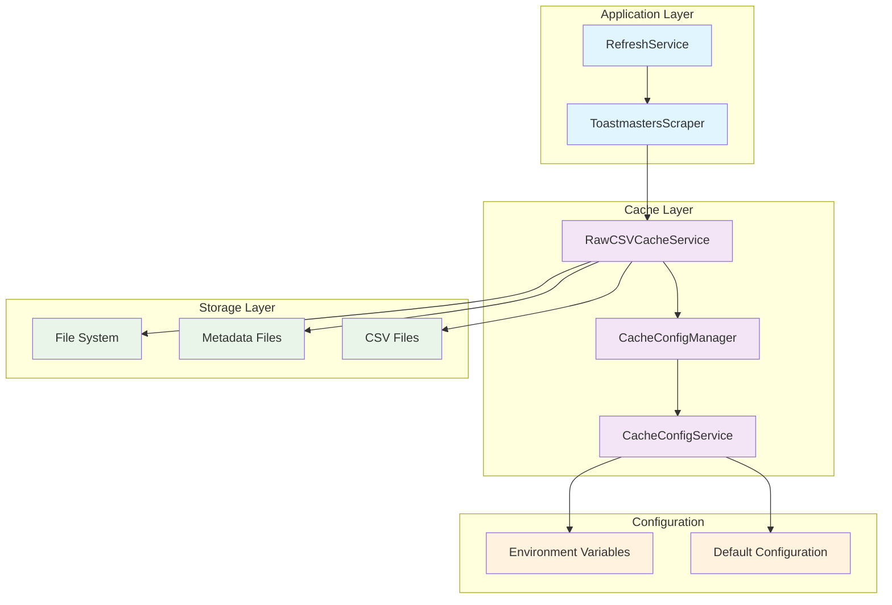

# Design Document

## Overview

The Raw CSV Cache System addresses performance inefficiencies in the current Toastmasters Statistics application by implementing intelligent caching of raw CSV files downloaded from the Toastmasters dashboard. The system provides cache-first lookup with automatic fallback to direct downloads, organized file storage by date and district, and comprehensive error handling to ensure reliability.

The design integrates seamlessly with existing services through dependency injection patterns, maintains all current API contracts, and provides configurable behavior suitable for single-user deployment scenarios. The system emphasizes operational simplicity, robust error handling, and comprehensive monitoring while preserving the existing snapshot-based data architecture.

## Architecture

The Raw CSV Cache System follows a layered architecture that integrates with existing services:



### Integration Points

The cache system integrates at the ToastmastersScraper level, intercepting CSV download requests and providing cached responses when available. This approach ensures:

- Zero changes to RefreshService or higher-level components
- Transparent caching that maintains existing API contracts
- Graceful fallback to direct downloads when cache operations fail
- Preservation of all existing error handling and retry logic

## Components and Interfaces

### RawCSVCacheService

The core service responsible for cache operations:

```typescript
export interface IRawCSVCacheService {
  // Core cache operations
  getCachedCSV(
    date: string,
    type: CSVType,
    districtId?: string
  ): Promise<string | null>
  setCachedCSV(
    date: string,
    type: CSVType,
    csvContent: string,
    districtId?: string
  ): Promise<void>
  hasCachedCSV(
    date: string,
    type: CSVType,
    districtId?: string
  ): Promise<boolean>

  // Metadata management
  getCacheMetadata(date: string): Promise<RawCSVCacheMetadata | null>
  updateCacheMetadata(
    date: string,
    metadata: Partial<RawCSVCacheMetadata>
  ): Promise<void>

  // Cache management
  clearCacheForDate(date: string): Promise<void>
  getCachedDates(): Promise<string[]>
  performCleanup(): Promise<CleanupResult>

  // Statistics and monitoring
  getCacheStatistics(): Promise<RawCSVCacheStatistics>
  getHealthStatus(): Promise<CacheHealthStatus>
}
```

### CSV Type Enumeration

Strongly-typed CSV file categorization:

```typescript
export enum CSVType {
  ALL_DISTRICTS = 'all-districts',
  DISTRICT_PERFORMANCE = 'district-performance',
  DIVISION_PERFORMANCE = 'division-performance',
  CLUB_PERFORMANCE = 'club-performance',
}
```

### Cache Configuration

Configurable behavior for different deployment environments:

```typescript
export interface RawCSVCacheConfig {
  cacheDir: string
  maxAgeDays: number
  enableCompression: boolean
  retentionPolicy: {
    maxFiles: number
    cleanupInterval: number
  }
  performanceThresholds: {
    maxReadTimeMs: number
    maxWriteTimeMs: number
    maxMemoryUsageMB: number
  }
  security: {
    validatePaths: boolean
    sanitizeInputs: boolean
    enforcePermissions: boolean
  }
}
```

### Integration with ToastmastersScraper

The scraper methods are enhanced with cache-first lookup:

```typescript
// Enhanced scraper methods (internal implementation changes only)
class ToastmastersScraper {
  constructor(private rawCSVCache?: IRawCSVCacheService) {}

  async getAllDistricts(dateString?: string): Promise<ScrapedRecord[]> {
    // 1. Check cache first
    // 2. If cache miss, download and cache
    // 3. Parse and return (existing logic unchanged)
  }

  async getDistrictPerformance(
    districtId: string,
    dateString?: string
  ): Promise<ScrapedRecord[]> {
    // Same cache-first pattern
  }

  // Similar pattern for getDivisionPerformance and getClubPerformance
}
```

## Data Models

### Cache Directory Structure

The cache organizes files in a hierarchical structure:

```
backend/cache/raw-csv/
├── 2026-01-06/                           # Date-based organization
│   ├── all-districts.csv                 # System-wide CSV
│   ├── district-42/                      # District-specific folder
│   │   ├── district-performance.csv      # District performance
│   │   ├── division-performance.csv      # Division performance
│   │   └── club-performance.csv          # Club performance
│   ├── district-15/
│   │   ├── district-performance.csv
│   │   ├── division-performance.csv
│   │   └── club-performance.csv
│   └── metadata.json                     # Cache metadata
└── 2026-01-05/
    ├── all-districts.csv
    ├── district-42/
    └── metadata.json
```

### Cache Metadata Structure

Comprehensive metadata tracking for each cached date:

```typescript
export interface RawCSVCacheMetadata {
  date: string // YYYY-MM-DD format
  timestamp: number // When cache was created
  programYear: string // e.g., "2024-2025"
  csvFiles: {
    // Track cached files
    allDistricts: boolean
    districts: {
      [districtId: string]: {
        districtPerformance: boolean
        divisionPerformance: boolean
        clubPerformance: boolean
      }
    }
  }
  downloadStats: {
    totalDownloads: number
    cacheHits: number
    cacheMisses: number
    lastAccessed: number
  }
  integrity: {
    checksums: { [filename: string]: string }
    totalSize: number
    fileCount: number
  }
  source: 'scraper'
  cacheVersion: number
}
```

### Cache Statistics

Monitoring and observability data:

```typescript
export interface RawCSVCacheStatistics {
  totalCachedDates: number
  totalCachedFiles: number
  totalCacheSize: number
  hitRatio: number
  missRatio: number
  averageFileSize: number
  oldestCacheDate: string | null
  newestCacheDate: string | null
  diskUsage: {
    used: number
    available: number
    percentUsed: number
  }
  performance: {
    averageReadTime: number
    averageWriteTime: number
    slowestOperations: Array<{
      operation: string
      duration: number
      timestamp: string
    }>
  }
}
```

## Correctness Properties

_A property is a characteristic or behavior that should hold true across all valid executions of a system-essentially, a formal statement about what the system should do. Properties serve as the bridge between human-readable specifications and machine-verifiable correctness guarantees._

Based on the prework analysis, the following correctness properties ensure the Raw CSV Cache System operates reliably:

### Property 1: Cache Directory Organization

_For any_ date string in YYYY-MM-DD format, when storing CSV files, the cache directory structure should follow the pattern `cache-dir/YYYY-MM-DD/` for date organization and `cache-dir/YYYY-MM-DD/district-{id}/` for district-specific files.
**Validates: Requirements 1.1, 1.2, 1.3**

### Property 2: Metadata Consistency

_For any_ cached date, a metadata.json file should exist at the date directory level and accurately reflect all cached CSV files for that date.
**Validates: Requirements 1.4, 5.2**

### Property 3: File Naming Consistency

_For any_ CSV type and storage operation, the filename should follow the consistent pattern based on the CSV type (e.g., "all-districts.csv", "district-performance.csv").
**Validates: Requirements 1.5, 4.1, 4.2, 4.3, 4.4**

### Property 4: Cache-First Lookup

_For any_ CSV request with date and type parameters, if cached data exists, it should be returned without triggering a download operation.
**Validates: Requirements 2.1, 2.2**

### Property 5: Cache Miss Handling

_For any_ CSV request where cached data does not exist, the system should download from the external service, cache the result, and return the downloaded content.
**Validates: Requirements 2.3**

### Property 6: API Contract Preservation

_For any_ existing ToastmastersScraper method call, the return type and data structure should remain identical regardless of whether data comes from cache or direct download.
**Validates: Requirements 2.4, 6.1, 6.2**

### Property 7: Graceful Fallback

_For any_ cache operation failure, the system should log the error and successfully complete the operation using direct download.
**Validates: Requirements 2.5, 8.3**

### Property 8: Service Method Completeness

_For any_ required cache operation (get, set, check existence, metadata management, cleanup), the RawCSVCacheService should provide corresponding methods.
**Validates: Requirements 3.1, 3.2, 3.3, 3.4, 3.5, 3.6**

### Property 9: CSV Type Validation

_For any_ cache operation, invalid CSV type parameters should be rejected with appropriate error messages.
**Validates: Requirements 4.5**

### Property 10: Metadata Tracking

_For any_ cache operation, appropriate metadata should be recorded including timestamps, program year, source information, and cache version.
**Validates: Requirements 5.1, 5.4, 5.5, 5.6**

### Property 11: Statistics Accuracy

_For any_ sequence of cache operations, the download statistics (hits, misses, total downloads) should accurately reflect the actual operations performed.
**Validates: Requirements 5.3, 13.2**

### Property 12: Configuration Flexibility

_For any_ valid configuration parameter (cache directory, compression, monitoring settings), the system should respect the configured value in its operations.
**Validates: Requirements 7.1, 7.3, 7.4**

### Property 13: Error Recovery

_For any_ corrupted cache file, the system should detect the corruption, remove the invalid file, and re-download the data.
**Validates: Requirements 8.1, 9.4**

### Property 14: Integrity Validation

_For any_ cached CSV file retrieval, basic integrity checks should be performed before returning the content.
**Validates: Requirements 8.4, 9.1, 9.2, 9.3**

### Property 15: Atomic Operations

_For any_ cache write operation, the file should either be completely written or not exist at all (no partial files).
**Validates: Requirements 11.3**

### Property 16: Path Security

_For any_ date string or district ID used in file path construction, malicious path traversal attempts should be detected and rejected.
**Validates: Requirements 12.1, 12.2, 12.3**

### Property 17: Content Validation

_For any_ CSV content before caching, basic CSV structure validation should be performed to prevent storage of malicious or invalid content.
**Validates: Requirements 12.5**

### Property 18: Cache Preservation

_For any_ cache maintenance operation, all cached CSV files should be preserved as permanent historical artifacts.
**Validates: Requirements 10.1**

### Property 19: Logging Completeness

_For any_ cache operation, appropriate structured logs should be generated with sufficient context for monitoring and debugging.
**Validates: Requirements 13.1, 10.5, 9.5**

### Property 20: Backward Compatibility

_For any_ existing system functionality (RefreshService, snapshot creation, data processing), the behavior should remain unchanged after cache integration.
**Validates: Requirements 6.3, 14.1, 14.5**

## Error Handling

The system implements comprehensive error handling at multiple levels:

### Cache Operation Errors

- **File System Errors**: Disk full, permission denied, directory creation failures
- **Corruption Detection**: Invalid CSV structure, file size mismatches, checksum failures
- **Configuration Errors**: Invalid cache directory, missing permissions, configuration validation failures

### Integration Errors

- **Scraper Integration**: Cache service unavailable, dependency injection failures
- **Fallback Scenarios**: Cache read failures, cache write failures, partial cache states

### Security Errors

- **Path Traversal**: Malicious date strings, district ID injection attempts
- **Content Validation**: Invalid CSV content, oversized files, suspicious patterns

### Error Recovery Strategies

1. **Graceful Degradation**: Continue with direct downloads when cache fails
2. **Automatic Cleanup**: Remove corrupted files and retry operations
3. **Circuit Breaker**: Temporarily disable cache on repeated failures
4. **Comprehensive Logging**: Structured error logs for monitoring and debugging

## Testing Strategy

The testing strategy follows the dual approach specified in the testing steering document:

### Unit Testing

- **Service Methods**: Test all public methods of RawCSVCacheService
- **Configuration**: Test cache configuration validation and initialization
- **Error Scenarios**: Test error handling and recovery mechanisms
- **Security**: Test path validation and content sanitization
- **Utilities**: Test helper functions and internal logic

### Property-Based Testing

Each correctness property will be implemented as a property-based test with minimum 100 iterations:

```typescript
// Example property test structure
describe('Raw CSV Cache System Properties', () => {
  test('Property 1: Cache Directory Organization', async () => {
    // **Feature: raw-csv-cache-system, Property 1: Cache Directory Organization**
    await fc.assert(
      fc.asyncProperty(
        fc.date(), // Generate random dates
        fc.constantFrom(...Object.values(CSVType)), // Generate CSV types
        fc.option(fc.string()), // Optional district ID
        async (date, csvType, districtId) => {
          // Test cache directory organization property
        }
      ),
      { numRuns: 100 }
    )
  })

  // Similar structure for all 20 properties
})
```

### Integration Testing

- **Scraper Integration**: Test cache-first lookup with ToastmastersScraper
- **Service Container**: Test dependency injection and service lifecycle
- **Configuration Integration**: Test with CacheConfigService
- **End-to-End**: Test complete refresh workflows with caching

### Performance Testing

- **Large File Handling**: Test with CSV files of various sizes
- **Concurrent Access**: Test multiple simultaneous cache operations
- **Memory Usage**: Monitor memory consumption during operations
- **Disk I/O**: Measure file system operation performance

### Test Isolation Requirements

All tests must follow the testing steering document requirements:

- **Unique Resources**: Each test uses isolated cache directories
- **Complete Cleanup**: All created files and directories are removed
- **Concurrent Safety**: Tests can run safely in parallel
- **Environment Isolation**: Environment variables are scoped per test
