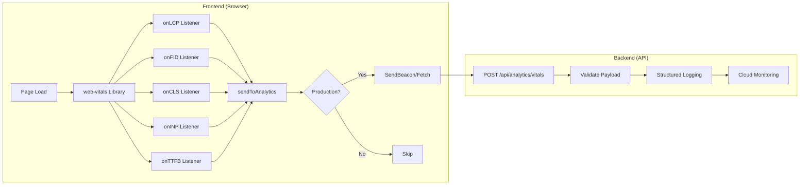

# Design Document: Real User Monitoring

## Overview

This design implements Real User Monitoring (RUM) using the web-vitals library to collect Core Web Vitals metrics from production users. The implementation consists of a frontend collection module that captures LCP, FID, CLS, INP, and TTFB metrics, and a backend endpoint that receives and logs these metrics for Cloud Monitoring integration.

The approach uses the SendBeacon API for reliable metric transmission during page unload, with a fetch fallback for browsers that don't support SendBeacon.

## Architecture



### Data Flow

1. User loads page in browser
2. web-vitals library captures Core Web Vitals as they occur
3. Each metric triggers the sendToAnalytics callback
4. If in production, metric is serialized and sent via SendBeacon
5. Backend receives POST request, validates payload
6. Metric is logged in structured format for Cloud Monitoring

## Components and Interfaces

### Frontend: webVitals.ts Module

```typescript
// frontend/src/utils/webVitals.ts

import type { Metric } from 'web-vitals'

export interface VitalsPayload {
  name: string
  value: number
  rating: 'good' | 'needs-improvement' | 'poor'
  delta: number
  id: string
  navigationType: string
}

function isProduction(): boolean {
  return (
    !window.location.hostname.includes('localhost') &&
    !window.location.hostname.includes('127.0.0.1')
  )
}

function sendToAnalytics(metric: Metric): void {
  if (!isProduction()) {
    return
  }

  const payload: VitalsPayload = {
    name: metric.name,
    value: metric.value,
    rating: metric.rating,
    delta: metric.delta,
    id: metric.id,
    navigationType: metric.navigationType ?? 'unknown',
  }

  const body = JSON.stringify(payload)

  if (navigator.sendBeacon) {
    navigator.sendBeacon('/api/analytics/vitals', body)
  } else {
    fetch('/api/analytics/vitals', {
      method: 'POST',
      body,
      headers: { 'Content-Type': 'application/json' },
      keepalive: true,
    }).catch(() => {
      // Silently fail - metrics are best-effort
    })
  }
}

export function initWebVitals(): void {
  import('web-vitals')
    .then(({ onLCP, onFID, onCLS, onINP, onTTFB }) => {
      onLCP(sendToAnalytics)
      onFID(sendToAnalytics)
      onCLS(sendToAnalytics)
      onINP(sendToAnalytics)
      onTTFB(sendToAnalytics)
    })
    .catch(() => {
      // Silently fail if web-vitals fails to load
    })
}
```

### Backend: Analytics Route

```typescript
// backend/src/routes/analytics.ts

import { Router } from 'express'
import { z } from 'zod'
import { logger } from '../utils/logger.js'

const vitalsPayloadSchema = z.object({
  name: z.enum(['LCP', 'FID', 'CLS', 'INP', 'TTFB']),
  value: z.number(),
  rating: z.enum(['good', 'needs-improvement', 'poor']),
  delta: z.number(),
  id: z.string(),
  navigationType: z.string(),
})

const router = Router()

router.post('/vitals', (req, res) => {
  const result = vitalsPayloadSchema.safeParse(req.body)

  if (!result.success) {
    res.status(400).json({
      error: {
        code: 'INVALID_PAYLOAD',
        message: 'Invalid vitals payload',
        details: result.error.issues,
      },
    })
    return
  }

  const metric = result.data

  // Structured logging for Cloud Monitoring
  logger.info('Web Vital', {
    metric: {
      name: `web_vital_${metric.name.toLowerCase()}`,
      value: metric.value,
      unit: metric.name === 'CLS' ? 'score' : 'milliseconds',
      labels: {
        rating: metric.rating,
        navigationType: metric.navigationType,
      },
    },
  })

  res.status(204).send()
})

export default router
```

## Data Models

### VitalsPayload Interface

```typescript
interface VitalsPayload {
  /** Metric name: LCP, FID, CLS, INP, or TTFB */
  name: 'LCP' | 'FID' | 'CLS' | 'INP' | 'TTFB'

  /** Metric value (milliseconds for timing, score for CLS) */
  value: number

  /** Performance rating based on thresholds */
  rating: 'good' | 'needs-improvement' | 'poor'

  /** Change since last report (for CLS) */
  delta: number

  /** Unique identifier for this metric instance */
  id: string

  /** Navigation type: navigate, reload, back_forward, prerender */
  navigationType: string
}
```

### SLO Thresholds Reference

| Metric | Good     | Needs Improvement | Poor     |
| ------ | -------- | ----------------- | -------- |
| LCP    | ≤ 2500ms | ≤ 4000ms          | > 4000ms |
| FID    | ≤ 100ms  | ≤ 300ms           | > 300ms  |
| CLS    | ≤ 0.1    | ≤ 0.25            | > 0.25   |
| INP    | ≤ 200ms  | ≤ 500ms           | > 500ms  |
| TTFB   | ≤ 800ms  | ≤ 1800ms          | > 1800ms |

## Correctness Properties

### Property 1: Metric Payload Round-Trip

_For any_ valid VitalsPayload object, serializing to JSON and deserializing SHALL produce an equivalent object with all fields preserved.

**Validates: Requirements 3.2, 3.3**

### Property 2: Production Environment Detection

_For any_ hostname containing 'localhost' or '127.0.0.1', the isProduction() function SHALL return false, and for all other hostnames SHALL return true.

**Validates: Requirements 5.1, 5.2, 5.3**

### Property 3: Payload Validation Completeness

_For any_ request body missing required fields (name, value, rating, delta, id, navigationType), the Vitals_Endpoint SHALL return HTTP 400.

**Validates: Requirements 4.3, 4.4**

## Error Handling

### Frontend Error Handling

- **web-vitals load failure**: Silently caught, no impact on application
- **SendBeacon failure**: Falls back to fetch with keepalive
- **Fetch failure**: Silently caught, metrics are best-effort
- **Invalid metric data**: web-vitals library handles internally

### Backend Error Handling

- **Invalid JSON**: Express JSON middleware returns 400
- **Missing fields**: Zod validation returns 400 with details
- **Invalid field values**: Zod validation returns 400 with details
- **Logging failure**: Caught and logged to stderr

## Testing Strategy

### Unit Tests

- `isProduction()` returns correct values for various hostnames
- `sendToAnalytics()` serializes payload correctly
- Backend validation rejects invalid payloads
- Backend validation accepts valid payloads

### Integration Tests

- Full flow from metric capture to backend logging
- SendBeacon fallback to fetch behavior
- Production environment detection

### Property-Based Tests

- **Property 1**: Payload round-trip with arbitrary valid payloads
- **Property 2**: Production detection with arbitrary hostnames
- **Property 3**: Validation with arbitrary request bodies

### Test Configuration

- Property-based tests: Minimum 100 iterations using fast-check
- Test framework: Vitest
- Frontend tests: jsdom environment
- Backend tests: Node environment
