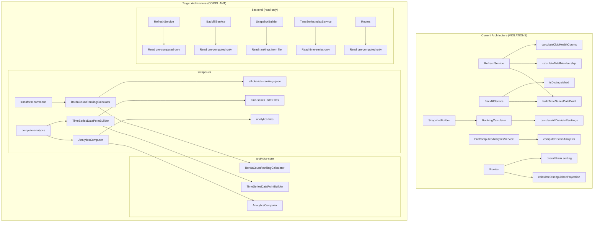

# Design Document: Backend Computation Removal

## Overview

This design removes all on-demand computation from the backend to enforce the data-computation-separation steering document. The backend currently violates the architectural mandate by performing computation in multiple services during snapshot creation, backfill operations, and API request handling.

### Critical Design Decision: Migrate, Don't Rewrite

The backend computation code has been hardened with bug fixes over time. **We MUST migrate this code to analytics-core, not rewrite it.** This ensures:

- All bug fixes are preserved
- No regression in computation accuracy
- Single source of truth in analytics-core

### Key Changes

1. **Move computation logic to analytics-core** - TimeSeriesDataPointBuilder, BordaCountRankingCalculator
2. **Extend scraper-cli** - Generate time-series indexes and rankings during pipeline
3. **Update backend services** - Remove computation, read pre-computed data only
4. **Update shared-contracts** - Add time-series types with Zod schemas

## Architecture



## Components and Interfaces

### 1. TimeSeriesDataPointBuilder (analytics-core)

Migrated from RefreshService. Computes time-series data points from district statistics.

```typescript
// packages/analytics-core/src/timeseries/TimeSeriesDataPointBuilder.ts

import type { TimeSeriesDataPoint, DistrictStatistics } from '@toastmasters/shared-contracts'

/**
 * Builds TimeSeriesDataPoint objects from district statistics.
 * Migrated from backend/src/services/RefreshService.ts
 * 
 * CRITICAL: This code is migrated, not rewritten, to preserve bug fixes.
 */
export class TimeSeriesDataPointBuilder {
  /**
   * Build a TimeSeriesDataPoint from district statistics
   */
  build(snapshotId: string, district: DistrictStatistics): TimeSeriesDataPoint {
    const membership = this.calculateTotalMembership(district)
    const payments = this.calculateTotalPayments(district)
    const dcpGoals = this.calculateTotalDCPGoals(district)
    const clubCounts = this.calculateClubHealthCounts(district)
    const distinguishedTotal = this.calculateDistinguishedTotal(district)

    return {
      date: district.asOfDate,
      snapshotId,
      membership,
      payments,
      dcpGoals,
      distinguishedTotal,
      clubCounts,
    }
  }

  // All private methods migrated from RefreshService
  private calculateTotalMembership(district: DistrictStatistics): number
  private calculateTotalPayments(district: DistrictStatistics): number
  private calculateTotalDCPGoals(district: DistrictStatistics): number
  private calculateClubHealthCounts(district: DistrictStatistics): TimeSeriesDataPoint['clubCounts']
  private calculateDistinguishedTotal(district: DistrictStatistics): number
  private isDistinguished(club: Record<string, unknown>): boolean
  private parseIntSafe(value: unknown): number
}

```

### 2. BordaCountRankingCalculator (analytics-core)

Migrated from backend RankingCalculator. Computes Borda count rankings for districts.

```typescript
// packages/analytics-core/src/rankings/BordaCountRankingCalculator.ts

import type { DistrictStatistics, AllDistrictsRankingsData } from '@toastmasters/shared-contracts'

/**
 * Computes Borda count rankings for districts.
 * Migrated from backend/src/services/RankingCalculator.ts
 * 
 * CRITICAL: This code is migrated, not rewritten, to preserve bug fixes.
 */
export class BordaCountRankingCalculator {
  private readonly RANKING_VERSION = '2.0'

  /**
   * Calculate rankings for all districts using Borda count system
   */
  calculateRankings(districts: DistrictStatistics[]): DistrictStatistics[]

  /**
   * Build AllDistrictsRankingsData from ranked districts
   */
  buildRankingsData(
    rankedDistricts: DistrictStatistics[],
    snapshotId: string
  ): AllDistrictsRankingsData

  getRankingVersion(): string

  // All private methods migrated from RankingCalculator
  private extractRankingMetrics(districts: DistrictStatistics[]): RankingMetrics[]
  private calculateCategoryRanking(metrics: RankingMetrics[], field: string): CategoryRanking[]
  private calculateAggregateRankings(...): AggregateRanking[]
  private applyRankingsToDistricts(...): DistrictStatistics[]
}
```

### 3. TimeSeriesIndexWriter (scraper-cli)

New service to write time-series index files during compute-analytics.

```typescript
// packages/scraper-cli/src/services/TimeSeriesIndexWriter.ts

import { TimeSeriesDataPointBuilder } from '@toastmasters/analytics-core'
import type { 
  TimeSeriesDataPoint, 
  ProgramYearIndexFile,
  TimeSeriesIndexMetadata 
} from '@toastmasters/shared-contracts'

export interface TimeSeriesIndexWriterConfig {
  cacheDir: string
  logger?: Logger
}

/**
 * Writes time-series index files during the compute-analytics pipeline.
 */
export class TimeSeriesIndexWriter {
  private readonly builder: TimeSeriesDataPointBuilder
  
  constructor(config: TimeSeriesIndexWriterConfig)

  /**
   * Write time-series data point to the appropriate program year index
   */
  async writeDataPoint(
    districtId: string,
    dataPoint: TimeSeriesDataPoint
  ): Promise<void>

  /**
   * Update index metadata for a district
   */
  async updateMetadata(districtId: string): Promise<void>

  // Program year calculation (migrated from TimeSeriesIndexService)
  getProgramYearForDate(dateStr: string): string
  getProgramYearStartDate(programYear: string): string
  getProgramYearEndDate(programYear: string): string
}
```

### 4. Updated AnalyticsComputeService (scraper-cli)

Extended to generate time-series indexes alongside analytics.

```typescript
// packages/scraper-cli/src/services/AnalyticsComputeService.ts

export class AnalyticsComputeService {
  private readonly timeSeriesWriter: TimeSeriesIndexWriter
  
  async computeDistrictAnalytics(
    date: string,
    districtId: string,
    options?: { force?: boolean }
  ): Promise<DistrictComputeResult> {
    // ... existing analytics computation ...
    
    // NEW: Write time-series data point
    const dataPoint = this.timeSeriesBuilder.build(snapshotId, snapshot)
    await this.timeSeriesWriter.writeDataPoint(districtId, dataPoint)
    
    return result
  }
}
```

### 5. Updated TransformService (scraper-cli)

Extended to compute rankings during transform.

```typescript
// packages/scraper-cli/src/services/TransformService.ts

import { BordaCountRankingCalculator } from '@toastmasters/analytics-core'

export class TransformService {
  private readonly rankingCalculator: BordaCountRankingCalculator

  async transform(options: TransformOptions): Promise<TransformResult> {
    // ... existing transformation ...
    
    // NEW: Compute and write rankings if all-districts data available
    if (allDistrictsData.length > 0) {
      const rankedDistricts = this.rankingCalculator.calculateRankings(districtStats)
      const rankingsData = this.rankingCalculator.buildRankingsData(rankedDistricts, snapshotId)
      await this.writeRankingsFile(date, rankingsData)
    }
    
    return result
  }
}
```

### 6. Read-Only TimeSeriesIndexService (backend)

Updated to only read pre-computed data.

```typescript
// backend/src/services/TimeSeriesIndexService.ts

export interface ITimeSeriesIndexService {
  // READ-ONLY methods
  getTrendData(districtId: string, startDate: string, endDate: string): Promise<TimeSeriesDataPoint[]>
  getProgramYearData(districtId: string, programYear: string): Promise<ProgramYearIndex | null>
  
  // REMOVED: appendDataPoint, rebuildIndex
}

export class TimeSeriesIndexService implements ITimeSeriesIndexService {
  // Only read methods - no computation
  async getTrendData(...): Promise<TimeSeriesDataPoint[]> {
    // Read from pre-computed files only
  }
  
  async getProgramYearData(...): Promise<ProgramYearIndex | null> {
    // Read from pre-computed files only
  }
}
```

## Data Models

### Time-Series Types (shared-contracts)

```typescript
// packages/shared-contracts/src/types/time-series.ts

/**
 * A single data point in the time-series index.
 * Contains aggregated metrics for a snapshot date.
 */
export interface TimeSeriesDataPoint {
  date: string           // YYYY-MM-DD
  snapshotId: string
  membership: number
  payments: number
  dcpGoals: number
  distinguishedTotal: number
  clubCounts: {
    total: number
    thriving: number
    vulnerable: number
    interventionRequired: number
  }
}

/**
 * Program year index file structure.
 * Partitioned by program year (July 1 - June 30).
 */
export interface ProgramYearIndexFile {
  districtId: string
  programYear: string    // e.g., "2023-2024"
  startDate: string      // e.g., "2023-07-01"
  endDate: string        // e.g., "2024-06-30"
  lastUpdated: string    // ISO timestamp
  dataPoints: TimeSeriesDataPoint[]
  summary: ProgramYearSummary
}

/**
 * Summary statistics for a program year.
 * Pre-computed by scraper-cli.
 */
export interface ProgramYearSummary {
  totalDataPoints: number
  membershipStart: number
  membershipEnd: number
  membershipPeak: number
  membershipLow: number
}

/**
 * Metadata for a district's time-series indexes.
 */
export interface TimeSeriesIndexMetadata {
  districtId: string
  lastUpdated: string
  availableProgramYears: string[]
  totalDataPoints: number
}
```

### File Structure

```
CACHE_DIR/
├── snapshots/{date}/
│   ├── district_{id}.json
│   ├── all-districts-rankings.json    # Generated by transform
│   ├── metadata.json
│   ├── manifest.json
│   └── analytics/
│       ├── district_{id}_analytics.json
│       ├── district_{id}_membership.json
│       ├── district_{id}_clubhealth.json
│       └── manifest.json
│
└── time-series/                        # Generated by compute-analytics
    └── district_{id}/
        ├── 2023-2024.json              # Program year index
        ├── 2024-2025.json
        └── index-metadata.json
```

## Correctness Properties

*A property is a characteristic or behavior that should hold true across all valid executions of a system—essentially, a formal statement about what the system should do. Properties serve as the bridge between human-readable specifications and machine-verifiable correctness guarantees.*


### Property 1: Time-Series Generation Completeness

*For any* district with snapshot data, running compute-analytics SHALL produce a time-series data point containing all required fields (date, snapshotId, membership, payments, dcpGoals, distinguishedTotal, clubCounts) in the correct program-year-partitioned index file.

**Validates: Requirements 4.1, 4.2, 4.3, 4.4**

### Property 2: Ranking Algorithm Equivalence

*For any* set of district statistics, the migrated BordaCountRankingCalculator in analytics-core SHALL produce identical rankings (clubsRank, paymentsRank, distinguishedRank, aggregateScore) as the original backend RankingCalculator.

**Validates: Requirements 5.3, 7.1, 7.2, 7.3, 7.4**

### Property 3: TimeSeriesDataPointBuilder Equivalence

*For any* district statistics input, the migrated TimeSeriesDataPointBuilder in analytics-core SHALL produce identical TimeSeriesDataPoint output (membership, payments, dcpGoals, distinguishedTotal, clubCounts) as the original RefreshService computation methods.

**Validates: Requirements 6.1, 6.2, 6.3, 6.4, 6.5, 6.6, 6.7, 6.8**

### Property 4: File Schema Validation

*For any* time-series index file generated by scraper-cli, the file SHALL validate against the TimeSeriesDataPoint and ProgramYearIndexFile Zod schemas defined in shared-contracts.

**Validates: Requirements 10.1, 10.2, 10.3, 10.4, 10.5, 13.1, 13.2, 13.3, 13.4, 13.5**

## Error Handling

### Scraper-CLI Errors

| Scenario | Handling | Recovery |
|----------|----------|----------|
| Snapshot not found | Log error, skip district | Continue with other districts |
| Time-series write failure | Log error, fail district | Retry on next run |
| Rankings computation failure | Log error, skip rankings | Snapshot created without rankings |
| Invalid district data | Log warning, use defaults | Continue processing |

### Backend Errors

| Scenario | HTTP Code | Error Code | Message |
|----------|-----------|------------|---------|
| Time-series data not found | 200 | N/A | Return empty array |
| Rankings file not found | 404 | RANKINGS_NOT_FOUND | Run scraper-cli transform |
| Schema version mismatch | 500 | SCHEMA_VERSION_MISMATCH | Re-run scraper-cli |
| Corrupted index file | 500 | CORRUPTED_FILE | Re-run compute-analytics |

## Testing Strategy

Per the testing steering document, property-based tests are a tool, not a default. We prefer unit tests with well-chosen examples unless there are mathematical invariants or complex input spaces.

### Analysis: Which Properties Warrant PBT?

| Property | PBT Warranted? | Rationale |
|----------|----------------|-----------|
| P1: Time-series completeness | No | File existence check, examples suffice |
| P2: Ranking equivalence | **Yes** | Algorithm equivalence across all inputs |
| P3: Builder equivalence | **Yes** | Algorithm equivalence across all inputs |
| P4: Schema validation | No | Schema validation, examples suffice |

### Unit Tests (Preferred Approach)

1. **TimeSeriesDataPointBuilder**
   - Build with complete district data
   - Build with missing clubPerformance
   - Build with edge case membership values
   - Verify all fields populated correctly

2. **BordaCountRankingCalculator**
   - Calculate rankings with 3 districts
   - Handle ties correctly
   - Handle empty district list
   - Verify Borda point calculation

3. **TimeSeriesIndexWriter**
   - Write to correct program year file
   - Update existing index file
   - Create new index file
   - Update metadata correctly

4. **Backend read-only services**
   - Return empty array when data missing
   - Read valid time-series data
   - Handle corrupted files gracefully

### Property-Based Tests (Where Warranted)

Only two properties warrant PBT due to algorithm equivalence requirements:

1. **Property 2: Ranking Algorithm Equivalence**
   - Input space: Arbitrary district statistics arrays
   - Property: Migrated calculator produces identical output to original
   - Rationale: Must verify algorithm preservation across all inputs

2. **Property 3: TimeSeriesDataPointBuilder Equivalence**
   - Input space: Arbitrary district statistics
   - Property: Migrated builder produces identical output to original
   - Rationale: Must verify algorithm preservation across all inputs

```typescript
// Property test configuration
const PROPERTY_TEST_CONFIG = {
  numRuns: 100,
  verbose: false,
}
```

### Integration Tests

1. **End-to-end compute-analytics** - Verify time-series files generated
2. **End-to-end transform** - Verify rankings file generated
3. **Backend serving** - Verify routes read pre-computed data correctly
