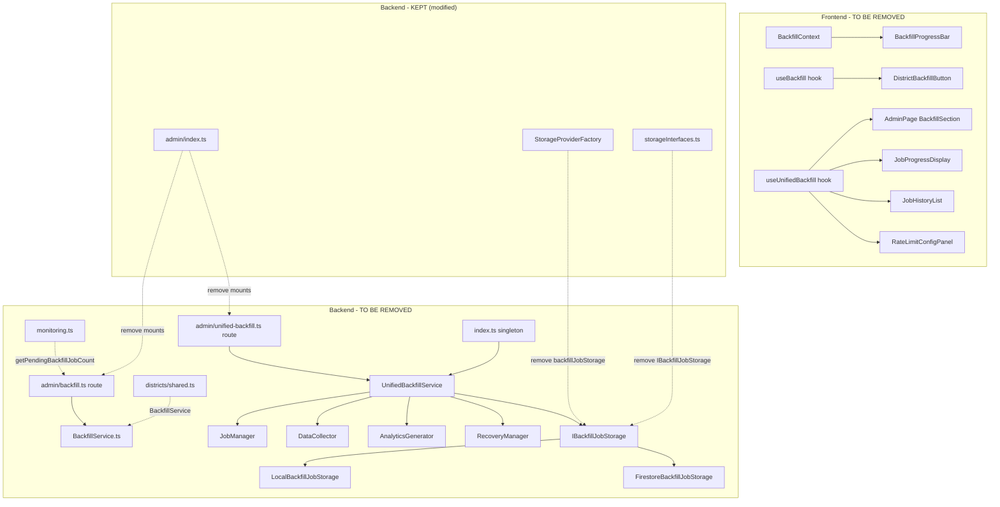

# Design Document: Remove Backend Backfill

## Overview

This feature is a large-scale code removal that eliminates all backfill capability from the backend and frontend. The backend currently contains two backfill systems (legacy and unified) that violate the project's core architectural principle: the backend is a read-only API server, and all data computation happens in scraper-cli.

The removal is purely subtractive — no new features are introduced. The design focuses on identifying every file, interface, import, and reference that must be deleted or modified, and defining the order of operations to keep the codebase compilable at each step.

### Design Rationale

The approach is organized into layers, working from the outermost references inward:

1. **Routes and entry points first** — remove the API surface and server startup hooks
2. **Services and business logic second** — remove the backfill orchestration code
3. **Types and storage third** — remove the data contracts and persistence
4. **Cross-cutting references fourth** — clean up monitoring, district routes, and test mocks
5. **Frontend fifth** — remove hooks, contexts, components, and page sections
6. **Documentation and OpenAPI last** — update specs and remove docs

This order minimizes intermediate compilation errors because each layer only depends on layers below it.

## Architecture

The current backfill architecture spans both backend and frontend:



After removal, the admin route index mounts only: snapshots, snapshot-management, district-config, monitoring, and process-separation routers. The StorageProviderFactory creates only snapshot, raw CSV, district config, and time-series index storage providers.

## Components and Interfaces

### Files to Delete (Complete Removal)

**Backend Routes:**

- `backend/src/routes/admin/backfill.ts`
- `backend/src/routes/admin/unified-backfill.ts`
- `backend/src/routes/admin/__tests__/backfill.test.ts`
- `backend/src/routes/admin/__tests__/unified-backfill.test.ts`

**Backend Services:**

- `backend/src/services/BackfillService.ts`
- `backend/src/services/UnifiedBackfillService.ts`
- `backend/src/services/backfill/` (entire directory, including `unified/` and all `__tests__/`)

**Backend Storage:**

- `backend/src/services/storage/LocalBackfillJobStorage.ts`
- `backend/src/services/storage/FirestoreBackfillJobStorage.ts`

**Backend Types:**

- `backend/src/types/backfillJob.ts`

**Backend Documentation:**

- `backend/docs/README-unified-backfill.md`
- `backend/docs/unified-backfill-api-reference.md`
- `backend/docs/unified-backfill-examples.md`
- `backend/docs/unified-backfill-quick-start.md`
- `backend/docs/unified-backfill-service.md`

**Backend Data:**

- `backend/data/cache/backfill-jobs/` (directory)

**Frontend Components:**

- `frontend/src/components/DistrictBackfillButton.tsx`
- `frontend/src/components/BackfillProgressBar.tsx`
- `frontend/src/components/JobProgressDisplay.tsx`
- `frontend/src/components/JobHistoryList.tsx`
- `frontend/src/components/RateLimitConfigPanel.tsx`

**Frontend Hooks:**

- `frontend/src/hooks/useBackfill.ts`
- `frontend/src/hooks/useUnifiedBackfill.ts`

**Frontend Contexts:**

- `frontend/src/contexts/BackfillContext.tsx`

### Files to Modify (Partial Changes)

**Backend:**

| File                                                                     | Change                                                                                                                                                                                                              |
| ------------------------------------------------------------------------ | ------------------------------------------------------------------------------------------------------------------------------------------------------------------------------------------------------------------- |
| `backend/src/routes/admin/index.ts`                                      | Remove `backfillRouter` and `unifiedBackfillRouter` imports and mounts                                                                                                                                              |
| `backend/src/index.ts`                                                   | Remove `UnifiedBackfillService` import, singleton functions, and recovery startup block                                                                                                                             |
| `backend/src/types/storageInterfaces.ts`                                 | Remove `IBackfillJobStorage`, `BackfillJob`, `BackfillJobStatus`, `BackfillJobType`, `JobConfig`, `JobProgress`, `JobCheckpoint`, `JobResult`, `RateLimitConfig`, `ListJobsOptions`, `DistrictProgress`, `JobError` |
| `backend/src/services/storage/StorageProviderFactory.ts`                 | Remove `backfillJobStorage` from `StorageProviders` interface, remove `LocalBackfillJobStorage` and `FirestoreBackfillJobStorage` imports, remove creation logic                                                    |
| `backend/src/routes/admin/monitoring.ts`                                 | Remove `getPendingBackfillJobCount` import, set `pendingOperations` to `0`                                                                                                                                          |
| `backend/src/routes/districts/shared.ts`                                 | Remove `BackfillService` import, `_backfillService` variable, and `getBackfillService` function                                                                                                                     |
| `backend/src/routes/districts/analyticsSummary.ts`                       | Replace backfill recommendation strings with scraper-cli guidance                                                                                                                                                   |
| `backend/src/routes/districts/analytics.ts`                              | Replace backfill recommendation strings with scraper-cli guidance                                                                                                                                                   |
| `backend/src/routes/__tests__/admin.integration.test.ts`                 | Remove `getUnifiedBackfillServiceInstance` mock                                                                                                                                                                     |
| `backend/src/routes/__tests__/admin.test.ts`                             | Remove `getUnifiedBackfillServiceInstance` mock                                                                                                                                                                     |
| `backend/src/routes/__tests__/admin.district-config.integration.test.ts` | Remove `getUnifiedBackfillServiceInstance` mock                                                                                                                                                                     |
| `backend/src/routes/districts/__tests__/analyticsSummary.test.ts`        | Update assertions for changed recommendation strings, remove `backfillJobType` assertions                                                                                                                           |
| `backend/openapi.yaml`                                                   | Remove all backfill endpoint definitions, update analytics descriptions                                                                                                                                             |
| `docs/openapi.yaml`                                                      | Remove backfill schemas, tags, error codes, update descriptions                                                                                                                                                     |

**Frontend:**

| File                                                                                    | Change                                                                                                    |
| --------------------------------------------------------------------------------------- | --------------------------------------------------------------------------------------------------------- |
| `frontend/src/App.tsx`                                                                  | Remove `BackfillProvider`, `useBackfillContext`, `BackfillProgressBar` imports and usage                  |
| `frontend/src/pages/AdminPage.tsx`                                                      | Remove `BackfillSection` component, `useUnifiedBackfill` imports, backfill-related state and UI           |
| `frontend/src/pages/DistrictDetailPage.tsx`                                             | Update empty state text and icon, remove backfill references                                              |
| `frontend/src/pages/LandingPage.tsx`                                                    | Update "backfill operation" text to "data collection"                                                     |
| `frontend/src/components/DistrictOverview.tsx`                                          | Update empty state text and action, remove backfill references                                            |
| `frontend/src/components/LeadershipInsights.tsx`                                        | Update "initiate a backfill" text                                                                         |
| `frontend/src/components/DCPGoalAnalysis.tsx`                                           | Update "initiate a backfill" text                                                                         |
| `frontend/src/components/ErrorDisplay.tsx`                                              | Keep `backfill` icon option in `EmptyState` for backward compatibility (or rename to a generic icon name) |
| `frontend/src/__tests__/test-utils.tsx`                                                 | Remove `BackfillProvider` import and wrapper                                                              |
| `frontend/src/pages/__tests__/AdminPage.test.tsx`                                       | Remove backfill section tests                                                                             |
| `frontend/src/pages/__tests__/LandingPage.test.tsx`                                     | Update assertion text                                                                                     |
| `frontend/src/pages/__tests__/DistrictDetailPage.GlobalRankings.test.tsx`               | Remove `BackfillContext` mock                                                                             |
| `frontend/src/pages/__tests__/DistrictDetailPage.TrendsTab.test.tsx`                    | Remove `BackfillProvider` import and wrapper                                                              |
| `frontend/src/pages/__tests__/DistrictDetailPage.AreaRecognition.integration.test.tsx`  | Remove `BackfillProvider` import and wrapper                                                              |
| `frontend/src/pages/__tests__/DistrictDetailPage.date-consistency.integration.test.tsx` | Remove `BackfillContext` mock                                                                             |

## Data Models

### Types Removed from `storageInterfaces.ts`

The following types are removed entirely (they exist only to support backfill job persistence):

```typescript
// ALL OF THESE ARE REMOVED:
type BackfillJobStatus =
  | 'pending'
  | 'running'
  | 'completed'
  | 'failed'
  | 'cancelled'
  | 'recovering'
type BackfillJobType = 'data-collection' | 'analytics-generation'

interface JobConfig {
  /* ... */
}
interface DistrictProgress {
  /* ... */
}
interface JobError {
  /* ... */
}
interface JobProgress {
  /* ... */
}
interface JobCheckpoint {
  /* ... */
}
interface JobResult {
  /* ... */
}
interface RateLimitConfig {
  /* ... */
}
interface BackfillJob {
  /* ... */
}
interface ListJobsOptions {
  /* ... */
}
interface IBackfillJobStorage {
  /* ... */
}
```

### Modified Interface: `StorageProviders`

```typescript
// BEFORE:
export interface StorageProviders {
  snapshotStorage: ISnapshotStorage
  rawCSVStorage: IRawCSVStorage
  districtConfigStorage: IDistrictConfigStorage
  timeSeriesIndexStorage: ITimeSeriesIndexStorage
  backfillJobStorage: IBackfillJobStorage // REMOVED
}

// AFTER:
export interface StorageProviders {
  snapshotStorage: ISnapshotStorage
  rawCSVStorage: IRawCSVStorage
  districtConfigStorage: IDistrictConfigStorage
  timeSeriesIndexStorage: ITimeSeriesIndexStorage
}
```

### Modified Interface: `SystemHealthMetrics`

```typescript
// The pendingOperations field remains but is hardcoded to 0
// since there are no longer any background operations in the backend
interface SystemHealthMetrics {
  // ... other fields unchanged ...
  pendingOperations: number // Always 0 after removal
}
```

### Removed from `backfillJob.ts` (entire file deleted)

All API request/response types for the unified backfill endpoints:

- `CreateJobRequest`
- `ResponseMetadata`
- `CreateJobResponse`
- `JobStatusResponse`
- `ListJobsResponse`
- `ItemBreakdown`
- `JobPreview`
- `JobPreviewResponse`
- `ErrorDetail`
- `ErrorResponse`

### OpenAPI Changes

**Removed from `backend/openapi.yaml`:**

- `/admin/backfill` (POST)
- `/admin/backfill/{jobId}` (GET, DELETE)
- `/admin/unified-backfill` (POST)
- `/admin/unified-backfill/jobs` (GET)
- `/admin/unified-backfill/preview` (POST)
- `/admin/unified-backfill/config/rate-limit` (GET, PUT)

**Removed from `docs/openapi.yaml`:**

- `Backfill` tag
- `BackfillRequest` schema
- `BackfillStatus` schema
- `BACKFILL_NOT_FOUND` and `BACKFILL_ERROR` error codes

**Updated in both specs:**

- Analytics endpoint descriptions: replace "Use the unified backfill service" with "Run scraper-cli compute-analytics"
- Snapshot descriptions: replace "backfill" references with "scraper-cli" references

## Correctness Properties

_A property is a characteristic or behavior that should hold true across all valid executions of a system — essentially, a formal statement about what the system should do. Properties serve as the bridge between human-readable specifications and machine-verifiable correctness guarantees._

This feature is a code removal. There are no new data transformations, parsers, or algorithms being introduced. The correctness concern is entirely about preserving existing non-backfill functionality while removing backfill code. As a result, the testable criteria are predominantly example-based verifications (compilation, test suite execution, specific endpoint behavior) rather than universal properties over ranges of inputs.

After prework analysis and reflection, the following consolidated verifications cover all testable acceptance criteria:

Property 1: Non-backfill storage providers remain functional
_For any_ valid environment configuration (local or GCP), the `StorageProviderFactory` shall produce a `StorageProviders` object containing functional `snapshotStorage`, `rawCSVStorage`, `districtConfigStorage`, and `timeSeriesIndexStorage` instances, with no `backfillJobStorage` property.
**Validates: Requirements 3.5**

Property 2: Monitoring health endpoint reports zero pending operations
_For any_ call to the system health endpoint, the `pendingOperations` field in the response shall be `0`, since the backend no longer runs any background operations.
**Validates: Requirements 5.1**

Property 3: Analytics error messages reference scraper-cli
_For any_ analytics endpoint response that returns an `ANALYTICS_NOT_AVAILABLE` error, the error details shall contain a recommendation referencing `scraper-cli` and shall not contain the word "backfill".
**Validates: Requirements 5.3, 6.2**

No additional property-based tests are warranted for this feature. The remaining acceptance criteria are verified through:

- TypeScript compilation (Requirements 1.5, 2.6, 3.6, 4.4, 5.5, 7.9, 9.1, 9.2)
- Existing test suite execution (Requirements 9.3, 9.4)
- File deletion verification (Requirements 1.2–1.4, 2.2–2.5, 3.1, 3.3, 3.4, 7.1–7.3, 8.1–8.3)

## Error Handling

This feature removes error handling code rather than adding it. Key considerations:

1. **Monitoring endpoint**: The `pendingOperations` field in `SystemHealthMetrics` is set to `0` rather than removed, preserving the response schema for any consumers.

2. **Analytics error messages**: The `ANALYTICS_NOT_AVAILABLE` error responses in `analyticsSummary.ts` and `analytics.ts` are updated to recommend `scraper-cli compute-analytics` instead of the unified backfill service. The `backfillJobType` field is removed from error details since it references a removed system.

3. **Missing data responses**: District routes that previously suggested "initiate a backfill" now suggest using the Admin Panel or scraper-cli for data collection. The error codes and HTTP status codes remain unchanged.

4. **Server startup**: The backfill recovery try/catch block is removed entirely. The server startup sequence no longer has a recovery step that could fail, simplifying the startup path.

5. **Test mocks**: Several integration test files mock `getUnifiedBackfillServiceInstance` from `backend/src/index.ts` to prevent side effects during testing. These mocks are removed since the function no longer exists.

## Testing Strategy

### Approach

This is a removal feature. The testing strategy focuses on verifying that nothing is broken rather than testing new behavior.

**Unit tests**: The existing test suites for non-backfill code (monitoring, district config, snapshots, analytics, etc.) serve as regression tests. These tests must continue to pass after the removal. Tests that reference backfill code are updated to remove those references.

**Property tests**: Not warranted for this feature per the testing steering document's guidance. This is a code removal with no new algorithms, data transformations, or complex input spaces. The three correctness properties identified above are best verified as example-based unit tests or integration tests, not property-based tests. Per the testing steering document: "When 3-5 specific examples fully cover the behavior, prefer the examples."

**Integration tests**: The existing admin integration tests (`admin.integration.test.ts`, `admin.test.ts`, `admin.district-config.integration.test.ts`) are updated to remove backfill mocks and continue to verify non-backfill admin functionality.

### Verification Checklist

1. `tsc --noEmit` passes in `backend/` with zero errors
2. `tsc --noEmit` passes in `frontend/` with zero errors
3. `vitest --run` passes in `backend/` with no failures from missing backfill references
4. `vitest --run` passes in `frontend/` with no failures from missing backfill references
5. `backend/openapi.yaml` contains no paths matching `/admin/backfill` or `/admin/unified-backfill`
6. `docs/openapi.yaml` contains no `BackfillRequest` or `BackfillStatus` schema definitions

### Test Files Modified

Tests that are updated (not deleted) to remove backfill references:

- `backend/src/routes/__tests__/admin.integration.test.ts` — remove mock
- `backend/src/routes/__tests__/admin.test.ts` — remove mock
- `backend/src/routes/__tests__/admin.district-config.integration.test.ts` — remove mock
- `backend/src/routes/districts/__tests__/analyticsSummary.test.ts` — update assertion strings
- `frontend/src/pages/__tests__/AdminPage.test.tsx` — remove backfill section tests
- `frontend/src/pages/__tests__/LandingPage.test.tsx` — update assertion text
- `frontend/src/pages/__tests__/DistrictDetailPage.GlobalRankings.test.tsx` — remove BackfillContext mock
- `frontend/src/pages/__tests__/DistrictDetailPage.TrendsTab.test.tsx` — remove BackfillProvider wrapper
- `frontend/src/pages/__tests__/DistrictDetailPage.AreaRecognition.integration.test.tsx` — remove BackfillProvider wrapper
- `frontend/src/pages/__tests__/DistrictDetailPage.date-consistency.integration.test.tsx` — remove BackfillContext mock
- `frontend/src/__tests__/test-utils.tsx` — remove BackfillProvider wrapper
- `frontend/src/components/__tests__/ErrorHandling.test.tsx` — update or keep backfill icon test (icon may be renamed)
