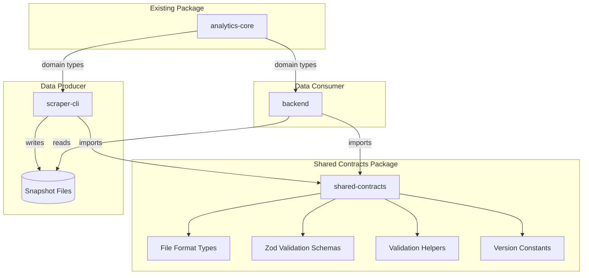
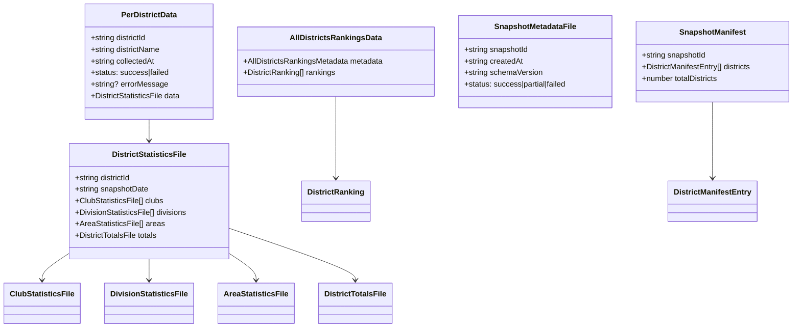

# Design Document: Shared Data Contracts

## Overview

This design establishes a shared contracts package (`@toastmasters/shared-contracts`) that serves as the single source of truth for all file format types exchanged between the scraper-cli (data producer) and backend (data consumer). The package provides TypeScript interfaces for compile-time verification and Zod schemas for runtime validation.

The key insight is that pre-computed files are the contract between scraper-cli and backend (per `data-computation-separation.md`). By centralizing these file format definitions, we ensure both sides agree on the exact structure at compile time, eliminating the current runtime failures caused by type mismatches.

## Architecture



### Package Responsibilities

| Package | Responsibility |
|---------|---------------|
| `@toastmasters/shared-contracts` | File format types (what gets written to disk) |
| `@toastmasters/analytics-core` | Domain types and computation logic |
| `@toastmasters/scraper-cli` | Data acquisition and file writing |
| `backend` | Data serving and API responses |

## Components and Interfaces

### File Format Types

The shared contracts package exports interfaces for each file type in the snapshot directory:

```typescript
// packages/shared-contracts/src/types/per-district-data.ts

import type { DistrictStatisticsFile } from './district-statistics-file.js'

/**
 * Wrapper structure for district JSON files.
 * File location: snapshots/{date}/district_{id}.json
 */
export interface PerDistrictData {
  /** District identifier (e.g., "42", "F") */
  districtId: string
  /** Display name (e.g., "District 42") */
  districtName: string
  /** ISO timestamp when data was collected */
  collectedAt: string
  /** Whether collection succeeded or failed */
  status: 'success' | 'failed'
  /** Error message if status is 'failed' */
  errorMessage?: string
  /** The actual district statistics data */
  data: DistrictStatisticsFile
}
```

```typescript
// packages/shared-contracts/src/types/district-statistics-file.ts

/**
 * District statistics as stored in files.
 * This matches the analytics-core DistrictStatistics structure.
 */
export interface DistrictStatisticsFile {
  districtId: string
  snapshotDate: string
  clubs: ClubStatisticsFile[]
  divisions: DivisionStatisticsFile[]
  areas: AreaStatisticsFile[]
  totals: DistrictTotalsFile
}

export interface ClubStatisticsFile {
  clubId: string
  clubName: string
  divisionId: string
  areaId: string
  membershipCount: number
  paymentsCount: number
  dcpGoals: number
  status: string
  charterDate?: string
  divisionName: string
  areaName: string
  octoberRenewals: number
  aprilRenewals: number
  newMembers: number
  membershipBase: number
  clubStatus?: string
}

export interface DivisionStatisticsFile {
  divisionId: string
  divisionName: string
  clubCount: number
  membershipTotal: number
  paymentsTotal: number
}

export interface AreaStatisticsFile {
  areaId: string
  areaName: string
  divisionId: string
  clubCount: number
  membershipTotal: number
  paymentsTotal: number
}

export interface DistrictTotalsFile {
  totalClubs: number
  totalMembership: number
  totalPayments: number
  distinguishedClubs: number
  selectDistinguishedClubs: number
  presidentDistinguishedClubs: number
}
```

```typescript
// packages/shared-contracts/src/types/all-districts-rankings.ts

/**
 * All districts rankings file structure.
 * File location: snapshots/{date}/all-districts-rankings.json
 */
export interface AllDistrictsRankingsData {
  metadata: AllDistrictsRankingsMetadata
  rankings: DistrictRanking[]
}

export interface AllDistrictsRankingsMetadata {
  /** Snapshot ID (date in YYYY-MM-DD format) */
  snapshotId: string
  /** ISO timestamp when rankings were calculated */
  calculatedAt: string
  /** Schema version for compatibility checking */
  schemaVersion: string
  /** Calculation version for business logic compatibility */
  calculationVersion: string
  /** Ranking algorithm version */
  rankingVersion: string
  /** Source CSV date */
  sourceCsvDate: string
  /** When the source CSV was fetched */
  csvFetchedAt: string
  /** Total number of districts in rankings */
  totalDistricts: number
  /** Whether data came from cache */
  fromCache: boolean
}

export interface DistrictRanking {
  districtId: string
  districtName: string
  region: string
  paidClubs: number
  paidClubBase: number
  clubGrowthPercent: number
  totalPayments: number
  paymentBase: number
  paymentGrowthPercent: number
  activeClubs: number
  distinguishedClubs: number
  selectDistinguished: number
  presidentsDistinguished: number
  distinguishedPercent: number
  clubsRank: number
  paymentsRank: number
  distinguishedRank: number
  aggregateScore: number
}
```

```typescript
// packages/shared-contracts/src/types/snapshot-metadata.ts

/**
 * Snapshot metadata file structure.
 * File location: snapshots/{date}/metadata.json
 */
export interface SnapshotMetadataFile {
  /** Snapshot ID (date in YYYY-MM-DD format) */
  snapshotId: string
  /** ISO timestamp when snapshot was created */
  createdAt: string
  /** Schema version for data structure compatibility */
  schemaVersion: string
  /** Calculation version for business logic compatibility */
  calculationVersion: string
  /** Status of the snapshot */
  status: 'success' | 'partial' | 'failed'
  /** Districts that were configured for processing */
  configuredDistricts: string[]
  /** Districts that were successfully processed */
  successfulDistricts: string[]
  /** Districts that failed processing */
  failedDistricts: string[]
  /** Error messages (empty array for success) */
  errors: string[]
  /** Processing duration in milliseconds */
  processingDuration: number
  /** Source of the snapshot */
  source: string
  /** Date the data represents */
  dataAsOfDate: string
  
  // Optional closing period fields
  /** Whether this is closing period data */
  isClosingPeriodData?: boolean
  /** Actual collection date */
  collectionDate?: string
  /** Logical date for the snapshot */
  logicalDate?: string
}
```

```typescript
// packages/shared-contracts/src/types/snapshot-manifest.ts

/**
 * Snapshot manifest file structure.
 * File location: snapshots/{date}/manifest.json
 */
export interface SnapshotManifest {
  /** Snapshot ID (date in YYYY-MM-DD format) */
  snapshotId: string
  /** ISO timestamp when manifest was created */
  createdAt: string
  /** List of district entries */
  districts: DistrictManifestEntry[]
  /** Total number of districts */
  totalDistricts: number
  /** Number of successful districts */
  successfulDistricts: number
  /** Number of failed districts */
  failedDistricts: number
  /** All districts rankings file info (optional) */
  allDistrictsRankings?: {
    filename: string
    size: number
    status: 'present' | 'missing'
  }
}

export interface DistrictManifestEntry {
  districtId: string
  fileName: string
  status: 'success' | 'failed'
  fileSize: number
  lastModified: string
  errorMessage?: string
}
```

### Zod Validation Schemas

```typescript
// packages/shared-contracts/src/schemas/per-district-data.schema.ts

import { z } from 'zod'

export const ClubStatisticsFileSchema = z.object({
  clubId: z.string(),
  clubName: z.string(),
  divisionId: z.string(),
  areaId: z.string(),
  membershipCount: z.number(),
  paymentsCount: z.number(),
  dcpGoals: z.number(),
  status: z.string(),
  charterDate: z.string().optional(),
  divisionName: z.string(),
  areaName: z.string(),
  octoberRenewals: z.number(),
  aprilRenewals: z.number(),
  newMembers: z.number(),
  membershipBase: z.number(),
  clubStatus: z.string().optional(),
})

export const DivisionStatisticsFileSchema = z.object({
  divisionId: z.string(),
  divisionName: z.string(),
  clubCount: z.number(),
  membershipTotal: z.number(),
  paymentsTotal: z.number(),
})

export const AreaStatisticsFileSchema = z.object({
  areaId: z.string(),
  areaName: z.string(),
  divisionId: z.string(),
  clubCount: z.number(),
  membershipTotal: z.number(),
  paymentsTotal: z.number(),
})

export const DistrictTotalsFileSchema = z.object({
  totalClubs: z.number(),
  totalMembership: z.number(),
  totalPayments: z.number(),
  distinguishedClubs: z.number(),
  selectDistinguishedClubs: z.number(),
  presidentDistinguishedClubs: z.number(),
})

export const DistrictStatisticsFileSchema = z.object({
  districtId: z.string(),
  snapshotDate: z.string(),
  clubs: z.array(ClubStatisticsFileSchema),
  divisions: z.array(DivisionStatisticsFileSchema),
  areas: z.array(AreaStatisticsFileSchema),
  totals: DistrictTotalsFileSchema,
})

export const PerDistrictDataSchema = z.object({
  districtId: z.string(),
  districtName: z.string(),
  collectedAt: z.string(),
  status: z.enum(['success', 'failed']),
  errorMessage: z.string().optional(),
  data: DistrictStatisticsFileSchema,
})
```

```typescript
// packages/shared-contracts/src/schemas/all-districts-rankings.schema.ts

import { z } from 'zod'

export const DistrictRankingSchema = z.object({
  districtId: z.string(),
  districtName: z.string(),
  region: z.string(),
  paidClubs: z.number(),
  paidClubBase: z.number(),
  clubGrowthPercent: z.number(),
  totalPayments: z.number(),
  paymentBase: z.number(),
  paymentGrowthPercent: z.number(),
  activeClubs: z.number(),
  distinguishedClubs: z.number(),
  selectDistinguished: z.number(),
  presidentsDistinguished: z.number(),
  distinguishedPercent: z.number(),
  clubsRank: z.number(),
  paymentsRank: z.number(),
  distinguishedRank: z.number(),
  aggregateScore: z.number(),
})

export const AllDistrictsRankingsMetadataSchema = z.object({
  snapshotId: z.string(),
  calculatedAt: z.string(),
  schemaVersion: z.string(),
  calculationVersion: z.string(),
  rankingVersion: z.string(),
  sourceCsvDate: z.string(),
  csvFetchedAt: z.string(),
  totalDistricts: z.number(),
  fromCache: z.boolean(),
})

export const AllDistrictsRankingsDataSchema = z.object({
  metadata: AllDistrictsRankingsMetadataSchema,
  rankings: z.array(DistrictRankingSchema),
})
```

```typescript
// packages/shared-contracts/src/schemas/snapshot-metadata.schema.ts

import { z } from 'zod'

export const SnapshotMetadataFileSchema = z.object({
  snapshotId: z.string(),
  createdAt: z.string(),
  schemaVersion: z.string(),
  calculationVersion: z.string(),
  status: z.enum(['success', 'partial', 'failed']),
  configuredDistricts: z.array(z.string()),
  successfulDistricts: z.array(z.string()),
  failedDistricts: z.array(z.string()),
  errors: z.array(z.string()),
  processingDuration: z.number(),
  source: z.string(),
  dataAsOfDate: z.string(),
  isClosingPeriodData: z.boolean().optional(),
  collectionDate: z.string().optional(),
  logicalDate: z.string().optional(),
})
```

```typescript
// packages/shared-contracts/src/schemas/snapshot-manifest.schema.ts

import { z } from 'zod'

export const DistrictManifestEntrySchema = z.object({
  districtId: z.string(),
  fileName: z.string(),
  status: z.enum(['success', 'failed']),
  fileSize: z.number(),
  lastModified: z.string(),
  errorMessage: z.string().optional(),
})

export const SnapshotManifestSchema = z.object({
  snapshotId: z.string(),
  createdAt: z.string(),
  districts: z.array(DistrictManifestEntrySchema),
  totalDistricts: z.number(),
  successfulDistricts: z.number(),
  failedDistricts: z.number(),
  allDistrictsRankings: z.object({
    filename: z.string(),
    size: z.number(),
    status: z.enum(['present', 'missing']),
  }).optional(),
})
```

### Validation Helpers

```typescript
// packages/shared-contracts/src/validation/validators.ts

import { z } from 'zod'
import { PerDistrictDataSchema } from '../schemas/per-district-data.schema.js'
import { AllDistrictsRankingsDataSchema } from '../schemas/all-districts-rankings.schema.js'
import { SnapshotMetadataFileSchema } from '../schemas/snapshot-metadata.schema.js'
import { SnapshotManifestSchema } from '../schemas/snapshot-manifest.schema.js'
import type { PerDistrictData } from '../types/per-district-data.js'
import type { AllDistrictsRankingsData } from '../types/all-districts-rankings.js'
import type { SnapshotMetadataFile } from '../types/snapshot-metadata.js'
import type { SnapshotManifest } from '../types/snapshot-manifest.js'

export interface ValidationResult<T> {
  success: boolean
  data?: T
  error?: string
}

export function validatePerDistrictData(data: unknown): ValidationResult<PerDistrictData> {
  const result = PerDistrictDataSchema.safeParse(data)
  if (result.success) {
    return { success: true, data: result.data }
  }
  return { 
    success: false, 
    error: `PerDistrictData validation failed: ${result.error.message}` 
  }
}

export function validateAllDistrictsRankings(data: unknown): ValidationResult<AllDistrictsRankingsData> {
  const result = AllDistrictsRankingsDataSchema.safeParse(data)
  if (result.success) {
    return { success: true, data: result.data }
  }
  return { 
    success: false, 
    error: `AllDistrictsRankingsData validation failed: ${result.error.message}` 
  }
}

export function validateSnapshotMetadata(data: unknown): ValidationResult<SnapshotMetadataFile> {
  const result = SnapshotMetadataFileSchema.safeParse(data)
  if (result.success) {
    return { success: true, data: result.data }
  }
  return { 
    success: false, 
    error: `SnapshotMetadataFile validation failed: ${result.error.message}` 
  }
}

export function validateSnapshotManifest(data: unknown): ValidationResult<SnapshotManifest> {
  const result = SnapshotManifestSchema.safeParse(data)
  if (result.success) {
    return { success: true, data: result.data }
  }
  return { 
    success: false, 
    error: `SnapshotManifest validation failed: ${result.error.message}` 
  }
}
```

### Version Constants

```typescript
// packages/shared-contracts/src/version.ts

/**
 * Schema version for file format compatibility.
 * Increment major version for breaking changes.
 */
export const SCHEMA_VERSION = '1.0.0'

/**
 * Calculation version for business logic compatibility.
 * Increment when computation algorithms change.
 */
export const CALCULATION_VERSION = '1.0.0'

/**
 * Ranking algorithm version.
 * Increment when ranking calculations change.
 */
export const RANKING_VERSION = '2.0'

/**
 * Check if a file's schema version is compatible with current version.
 */
export function isSchemaCompatible(fileVersion: string): boolean {
  const [fileMajor] = fileVersion.split('.')
  const [currentMajor] = SCHEMA_VERSION.split('.')
  return fileMajor === currentMajor
}
```

### Package Entry Point

```typescript
// packages/shared-contracts/src/index.ts

// Version constants
export {
  SCHEMA_VERSION,
  CALCULATION_VERSION,
  RANKING_VERSION,
  isSchemaCompatible,
} from './version.js'

// File format types
export type {
  PerDistrictData,
} from './types/per-district-data.js'

export type {
  DistrictStatisticsFile,
  ClubStatisticsFile,
  DivisionStatisticsFile,
  AreaStatisticsFile,
  DistrictTotalsFile,
} from './types/district-statistics-file.js'

export type {
  AllDistrictsRankingsData,
  AllDistrictsRankingsMetadata,
  DistrictRanking,
} from './types/all-districts-rankings.js'

export type {
  SnapshotMetadataFile,
} from './types/snapshot-metadata.js'

export type {
  SnapshotManifest,
  DistrictManifestEntry,
} from './types/snapshot-manifest.js'

// Zod schemas
export {
  PerDistrictDataSchema,
  DistrictStatisticsFileSchema,
  ClubStatisticsFileSchema,
  DivisionStatisticsFileSchema,
  AreaStatisticsFileSchema,
  DistrictTotalsFileSchema,
} from './schemas/per-district-data.schema.js'

export {
  AllDistrictsRankingsDataSchema,
  AllDistrictsRankingsMetadataSchema,
  DistrictRankingSchema,
} from './schemas/all-districts-rankings.schema.js'

export {
  SnapshotMetadataFileSchema,
} from './schemas/snapshot-metadata.schema.js'

export {
  SnapshotManifestSchema,
  DistrictManifestEntrySchema,
} from './schemas/snapshot-manifest.schema.js'

// Validation helpers
export {
  validatePerDistrictData,
  validateAllDistrictsRankings,
  validateSnapshotMetadata,
  validateSnapshotManifest,
  type ValidationResult,
} from './validation/validators.js'
```

## Data Models

### File Structure Mapping

| File | Type | Schema |
|------|------|--------|
| `district_{id}.json` | `PerDistrictData` | `PerDistrictDataSchema` |
| `all-districts-rankings.json` | `AllDistrictsRankingsData` | `AllDistrictsRankingsDataSchema` |
| `metadata.json` | `SnapshotMetadataFile` | `SnapshotMetadataFileSchema` |
| `manifest.json` | `SnapshotManifest` | `SnapshotManifestSchema` |

### Type Relationship Diagram



## Correctness Properties

*A property is a characteristic or behavior that should hold true across all valid executions of a system—essentially, a formal statement about what the system should do. Properties serve as the bridge between human-readable specifications and machine-verifiable correctness guarantees.*

### Property Testing Decision Framework Compliance

Per testing steering Section 7.3, each property test must pass the decision framework:

| Question | Property 1 (Schema-Type) | Property 2 (Round-Trip) |
|----------|-------------------------|------------------------|
| 1. Clear universal property? | Yes: "valid objects accepted, invalid rejected" | Yes: "serialize then validate = original" |
| 2. Would 5 examples suffice? | No: 10+ fields, nested objects, arrays, optionals | No: complex nested structures |
| 3. Complex input space? | Yes: arbitrary JSON objects | Yes: same |
| 4. Mathematical/algebraic? | Yes: parser validation | Yes: encoding/decoding roundtrip (7.1.1) |

Per Section 7.4, this does not duplicate existing PBT coverage - the shared-contracts package is new.

### Property 1: Schema-Type Consistency

*For any* valid object conforming to a shared-contracts TypeScript interface (PerDistrictData, AllDistrictsRankingsData, SnapshotMetadataFile, SnapshotManifest), the corresponding Zod schema SHALL parse the object without errors. *For any* object missing required fields or with incorrect field types, the schema SHALL reject it with a validation error.

**Rationale**: Zod schemas are parsers with complex input spaces (7.1.2). The input space includes 10+ fields per type, nested objects, arrays, and optional fields - manual enumeration is impractical.

**Validates: Requirements 2.2, 2.3, 3.2, 3.3, 4.2, 4.3, 5.3, 6.3, 9.2**

### Property 2: Validation Round-Trip

*For any* valid file format object (PerDistrictData, AllDistrictsRankingsData, SnapshotMetadataFile, SnapshotManifest), serializing to JSON string and then parsing and validating SHALL return `success: true` with data structurally equivalent to the original object.

**Rationale**: This is a classic encoding/decoding roundtrip property (7.1.1). JSON serialization must preserve all data without loss or corruption across complex nested structures.

**Validates: Requirements 6.3, 6.4**

### Unit Test Coverage (Not Property Tests)

The following requirements are better served by unit tests with well-chosen examples per steering guidance (Section 7.2.4 - "Cases where examples are clearer"). These have bounded input spaces where 3-5 examples provide equivalent confidence:

**Version Compatibility (Requirements 10.5)**:
- Test `isSchemaCompatible("1.0.0")` returns `true` (same major)
- Test `isSchemaCompatible("1.5.0")` returns `true` (same major, different minor)
- Test `isSchemaCompatible("2.0.0")` returns `false` (different major)
- Test `isSchemaCompatible("0.9.0")` returns `false` (different major)

**Error Message Quality (Requirements 6.5)**:
- Test missing required field produces error mentioning field name
- Test wrong type produces error mentioning expected type
- Test nested validation error includes path to invalid field

## Error Handling

### Validation Errors

When validation fails, the system provides structured error information:

```typescript
interface ValidationResult<T> {
  success: false
  error: string  // Human-readable error message with field details
}
```

Error messages follow the pattern: `"{TypeName} validation failed: {ZodErrorMessage}"`

### Version Incompatibility

When reading files with incompatible schema versions:

1. Backend logs a warning with the file version and expected version
2. Backend returns a 500 error with message: "Schema version mismatch"
3. The error response includes details for debugging

### Missing Required Fields

Zod schemas enforce required fields. Missing fields result in validation errors that specify which field is missing.

## Testing Strategy

Per the testing steering document, we prefer the simplest test that provides confidence. Property tests are reserved for invariants and complex input spaces.

### Unit Tests (Primary)

Unit tests verify specific examples and edge cases:

**Version Compatibility**:
- Same major version returns compatible
- Different major version returns incompatible
- Edge cases: "0.x.x", malformed strings

**Error Message Quality**:
- Missing required field error includes field name
- Wrong type error includes expected type
- Nested validation error includes path

**Validation Helper Functions**:
- Success case returns `{ success: true, data: ... }`
- Failure case returns `{ success: false, error: "..." }`

**Type Exports**:
- All expected types are exported from index
- All expected schemas are exported from index

### Property-Based Tests (Targeted)

Property tests verify invariants across complex input spaces:

**Property 1: Schema-Type Consistency**
- Generate random valid objects using fast-check arbitraries
- Verify schema accepts all valid objects
- Verify schema rejects objects with missing/wrong fields
- Tag: **Feature: shared-data-contracts, Property 1: Schema-Type Consistency**

**Property 2: Validation Round-Trip**
- Generate random valid file format objects
- Serialize to JSON, parse, validate
- Verify structural equivalence
- Tag: **Feature: shared-data-contracts, Property 2: Validation Round-Trip**

### Integration Tests

Integration tests verify end-to-end contract compliance:

- Scraper-cli writes file → Backend reads file successfully
- Version constants are consistent across packages
- Real-world malformed data is caught by validation

### Test Configuration

- Property tests: minimum 100 iterations using fast-check
- Tests must be isolated and concurrent-safe per steering requirements
- No shared state between tests
