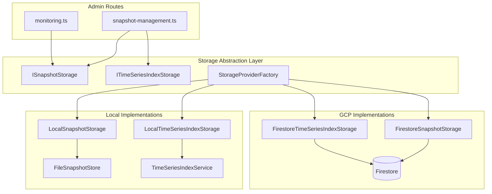

# Design Document: Snapshot Deletion Storage Abstraction

## Overview

This design addresses the broken snapshot deletion functionality in the admin panel and ensures compliance with the storage abstraction steering document. The current implementation uses direct filesystem operations (`fs.rm`, `fs.unlink`, `fs.readdir`) in route handlers, which only works with local storage and fails silently when running with Firestore storage in production.

The solution extends the existing storage abstraction layer with:

1. A `deleteSnapshot` method on `ISnapshotStorage` interface
2. Implementations for both `FirestoreSnapshotStorage` and `LocalSnapshotStorage`
3. A new `ITimeSeriesIndexStorage` interface for time-series index operations
4. Refactored admin routes that use storage abstractions instead of direct filesystem access

This design follows the established patterns in the codebase, particularly the `StorageProviderFactory` pattern for environment-based provider selection.

## Architecture

The architecture extends the existing storage abstraction layer with deletion capabilities and a new time-series index storage interface.



### Key Design Decisions

1. **Extend existing interface rather than create new one**: Adding `deleteSnapshot` to `ISnapshotStorage` maintains consistency with the existing pattern where all snapshot operations go through a single interface.

2. **New interface for time-series operations**: Creating `ITimeSeriesIndexStorage` separates concerns and allows independent evolution of time-series storage, which has different access patterns than snapshot storage.

3. **Cascading deletion in route layer**: The admin routes orchestrate cascading deletion by calling both `ISnapshotStorage.deleteSnapshot` and `ITimeSeriesIndexStorage.deleteSnapshotEntries`. This keeps storage implementations focused on their specific data.

4. **Graceful degradation for time-series cleanup**: If time-series cleanup fails, the snapshot deletion still succeeds. This prevents orphaned snapshots while logging cleanup failures for investigation.

## Components and Interfaces

### ISnapshotStorage Interface Extension

Add the `deleteSnapshot` method to the existing interface:

```typescript
interface ISnapshotStorage {
  // ... existing methods ...

  /**
   * Delete a snapshot and all its associated data
   *
   * Removes the snapshot document/directory and all district data.
   * Does NOT handle cascading deletion of time-series or analytics data.
   *
   * @param snapshotId - The snapshot ID (ISO date format: YYYY-MM-DD)
   * @returns true if snapshot was deleted, false if it didn't exist
   * @throws StorageOperationError on deletion failure
   */
  deleteSnapshot(snapshotId: string): Promise<boolean>
}
```

### ITimeSeriesIndexStorage Interface (New)

```typescript
/**
 * Storage abstraction for time-series index operations
 *
 * Enables environment-based selection between local filesystem
 * and Firestore storage for time-series data.
 */
interface ITimeSeriesIndexStorage {
  /**
   * Append a data point to the time-series index
   */
  appendDataPoint(
    districtId: string,
    dataPoint: TimeSeriesDataPoint
  ): Promise<void>

  /**
   * Get trend data for a date range
   */
  getTrendData(
    districtId: string,
    startDate: string,
    endDate: string
  ): Promise<TimeSeriesDataPoint[]>

  /**
   * Get all data for a program year
   */
  getProgramYearData(
    districtId: string,
    programYear: string
  ): Promise<ProgramYearIndex | null>

  /**
   * Delete all time-series entries for a specific snapshot
   *
   * Used during cascading deletion to remove data points
   * associated with a deleted snapshot.
   *
   * @param snapshotId - The snapshot ID to remove entries for
   * @returns Number of entries removed across all districts
   */
  deleteSnapshotEntries(snapshotId: string): Promise<number>

  /**
   * Check if the storage is ready for operations
   */
  isReady(): Promise<boolean>
}
```

### FirestoreSnapshotStorage.deleteSnapshot Implementation

```typescript
async deleteSnapshot(snapshotId: string): Promise<boolean> {
  const startTime = Date.now()
  this.validateSnapshotId(snapshotId)

  logger.info('Starting deleteSnapshot operation', {
    operation: 'deleteSnapshot',
    snapshot_id: snapshotId,
  })

  try {
    return await this.circuitBreaker.execute(
      async () => {
        const snapshotDocRef = this.getSnapshotDocRef(snapshotId)
        const docSnapshot = await snapshotDocRef.get()

        if (!docSnapshot.exists) {
          logger.info('Snapshot not found for deletion', {
            operation: 'deleteSnapshot',
            snapshot_id: snapshotId,
            duration_ms: Date.now() - startTime,
          })
          return false
        }

        // Delete all documents in the districts subcollection
        const districtsCollection = this.getDistrictsCollection(snapshotId)
        const districtsSnapshot = await districtsCollection.get()

        // Use batched deletes for efficiency (max 500 operations per batch)
        const batchSize = 500
        let deletedCount = 0

        for (let i = 0; i < districtsSnapshot.docs.length; i += batchSize) {
          const batch = this.firestore.batch()
          const chunk = districtsSnapshot.docs.slice(i, i + batchSize)

          for (const doc of chunk) {
            batch.delete(doc.ref)
            deletedCount++
          }

          await batch.commit()
        }

        // Delete the root snapshot document
        await snapshotDocRef.delete()

        logger.info('Successfully deleted snapshot', {
          operation: 'deleteSnapshot',
          snapshot_id: snapshotId,
          districts_deleted: deletedCount,
          duration_ms: Date.now() - startTime,
        })

        return true
      },
      { operation: 'deleteSnapshot', snapshotId }
    )
  } catch (error) {
    const errorMessage = error instanceof Error ? error.message : 'Unknown error'
    logger.error('Failed to delete snapshot', {
      operation: 'deleteSnapshot',
      snapshot_id: snapshotId,
      error: errorMessage,
      duration_ms: Date.now() - startTime,
    })

    throw new StorageOperationError(
      `Failed to delete snapshot ${snapshotId}: ${errorMessage}`,
      'deleteSnapshot',
      'firestore',
      this.isRetryableError(error),
      error instanceof Error ? error : undefined
    )
  }
}
```

### LocalSnapshotStorage.deleteSnapshot Implementation

```typescript
async deleteSnapshot(snapshotId: string): Promise<boolean> {
  return this.store.deleteSnapshot(snapshotId)
}
```

The actual implementation is delegated to `FileSnapshotStore`:

```typescript
// In FileSnapshotStore
async deleteSnapshot(snapshotId: string): Promise<boolean> {
  const startTime = Date.now()

  logger.info('Starting deleteSnapshot operation', {
    operation: 'deleteSnapshot',
    snapshot_id: snapshotId,
  })

  try {
    const snapshotDir = path.join(this.snapshotsDir, snapshotId)

    // Check if snapshot exists
    try {
      await fs.access(snapshotDir)
    } catch {
      logger.info('Snapshot not found for deletion', {
        operation: 'deleteSnapshot',
        snapshot_id: snapshotId,
        duration_ms: Date.now() - startTime,
      })
      return false
    }

    // Delete the entire snapshot directory
    await fs.rm(snapshotDir, { recursive: true, force: true })

    // Invalidate any cached data for this snapshot
    this.invalidateSnapshotCache(snapshotId)

    logger.info('Successfully deleted snapshot', {
      operation: 'deleteSnapshot',
      snapshot_id: snapshotId,
      duration_ms: Date.now() - startTime,
    })

    return true
  } catch (error) {
    const errorMessage = error instanceof Error ? error.message : 'Unknown error'
    logger.error('Failed to delete snapshot', {
      operation: 'deleteSnapshot',
      snapshot_id: snapshotId,
      error: errorMessage,
      duration_ms: Date.now() - startTime,
    })
    throw error
  }
}
```

### LocalTimeSeriesIndexStorage Implementation

```typescript
/**
 * Local filesystem implementation of ITimeSeriesIndexStorage
 *
 * Delegates to the existing TimeSeriesIndexService for all operations.
 */
class LocalTimeSeriesIndexStorage implements ITimeSeriesIndexStorage {
  private readonly service: TimeSeriesIndexService

  constructor(config: { cacheDir: string }) {
    this.service = new TimeSeriesIndexService(config)
  }

  async appendDataPoint(
    districtId: string,
    dataPoint: TimeSeriesDataPoint
  ): Promise<void> {
    return this.service.appendDataPoint(districtId, dataPoint)
  }

  async getTrendData(
    districtId: string,
    startDate: string,
    endDate: string
  ): Promise<TimeSeriesDataPoint[]> {
    return this.service.getTrendData(districtId, startDate, endDate)
  }

  async getProgramYearData(
    districtId: string,
    programYear: string
  ): Promise<ProgramYearIndex | null> {
    return this.service.getProgramYearData(districtId, programYear)
  }

  async deleteSnapshotEntries(snapshotId: string): Promise<number> {
    // Implementation reads all program year files, filters out entries
    // matching the snapshotId, and writes back the filtered data
    // Returns count of removed entries
  }

  async isReady(): Promise<boolean> {
    // Check if time-series directory exists and is accessible
  }
}
```

### FirestoreTimeSeriesIndexStorage Implementation

```typescript
/**
 * Firestore implementation of ITimeSeriesIndexStorage
 *
 * Stores time-series data in Firestore collections:
 * - time-series/{districtId}/program-years/{programYear}
 */
class FirestoreTimeSeriesIndexStorage implements ITimeSeriesIndexStorage {
  private readonly firestore: Firestore
  private readonly circuitBreaker: CircuitBreaker

  constructor(config: { projectId: string }) {
    this.firestore = new Firestore({ projectId: config.projectId })
    this.circuitBreaker = CircuitBreaker.createCacheCircuitBreaker(
      'firestore-timeseries'
    )
  }

  async deleteSnapshotEntries(snapshotId: string): Promise<number> {
    // Query all districts, find entries with matching snapshotId,
    // delete them using batched writes
    // Returns count of removed entries
  }

  // ... other method implementations
}
```

### Updated Admin Routes

The admin routes will be refactored to use storage abstractions:

```typescript
// snapshot-management.ts - BEFORE (violation)
import fs from 'fs/promises'
import path from 'path'

async function deleteSnapshotWithCascade(snapshotId: string, cacheDir: string) {
  const snapshotDir = path.join(cacheDir, 'snapshots', snapshotId)
  await fs.rm(snapshotDir, { recursive: true, force: true })
  // ... direct filesystem operations
}

// snapshot-management.ts - AFTER (compliant)
// NO fs import
// NO path import for data access

async function deleteSnapshotWithCascade(
  snapshotId: string,
  snapshotStorage: ISnapshotStorage,
  timeSeriesStorage: ITimeSeriesIndexStorage
): Promise<SnapshotDeletionResult> {
  const result: SnapshotDeletionResult = {
    snapshotId,
    success: false,
    deletedFiles: {
      snapshotDeleted: false,
      timeSeriesEntriesRemoved: 0,
    },
  }

  // Get district list before deletion for time-series cleanup
  const districtIds = await snapshotStorage.listDistrictsInSnapshot(snapshotId)

  // Delete time-series entries first (cascading cleanup)
  try {
    result.deletedFiles.timeSeriesEntriesRemoved =
      await timeSeriesStorage.deleteSnapshotEntries(snapshotId)
  } catch (error) {
    logger.warn('Failed to clean up time-series entries', {
      operation: 'deleteSnapshotWithCascade',
      snapshotId,
      error: error instanceof Error ? error.message : 'Unknown error',
    })
    // Continue with snapshot deletion even if time-series cleanup fails
  }

  // Delete the snapshot
  const deleted = await snapshotStorage.deleteSnapshot(snapshotId)
  result.deletedFiles.snapshotDeleted = deleted
  result.success = deleted

  return result
}
```

## Data Models

### SnapshotDeletionResult (Updated)

```typescript
interface SnapshotDeletionResult {
  snapshotId: string
  success: boolean
  error?: string
  deletedFiles: {
    /** Whether the snapshot was successfully deleted */
    snapshotDeleted: boolean
    /** Number of time-series index entries removed */
    timeSeriesEntriesRemoved: number
  }
}
```

### DeletionSummary (Updated)

```typescript
interface DeletionSummary {
  totalRequested: number
  successfulDeletions: number
  failedDeletions: number
  totalTimeSeriesEntriesRemoved: number
  results: SnapshotDeletionResult[]
}
```

### StorageProviders (Extended)

```typescript
interface StorageProviders {
  snapshotStorage: ISnapshotStorage
  rawCSVStorage: IRawCSVStorage
  districtConfigStorage: IDistrictConfigStorage
  timeSeriesIndexStorage: ITimeSeriesIndexStorage // NEW
}
```

## Correctness Properties

_A property is a characteristic or behavior that should hold true across all valid executions of a system—essentially, a formal statement about what the system should do._

### Property-Based Testing Evaluation

Per the Property-Based Testing Guidance steering document, property-based testing should be reserved for cases where it genuinely adds value. Evaluating the acceptance criteria:

**Criteria NOT warranting PBT:**

- Delete operations are simple CRUD operations where 3-5 examples provide equivalent confidence
- The input space (snapshot IDs as date strings) is simple and bounded
- The behaviors are straightforward and easily verified with specific examples
- No complex mathematical invariants or algebraic properties exist

**Conclusion:** This feature does NOT warrant property-based testing. Unit tests with well-chosen examples will provide sufficient confidence while being more maintainable and readable.

### Key Behaviors to Verify (via Unit Tests)

The following behaviors must be verified through unit tests with specific examples:

1. **Delete existing snapshot returns true** - Verify with a known snapshot ID
   - **Validates: Requirements 1.2, 2.1, 3.1**

2. **Delete non-existent snapshot returns false** - Verify with a non-existent ID
   - **Validates: Requirements 1.3, 2.4, 3.2**

3. **Deleted snapshot is not retrievable** - Write, delete, then verify read returns null
   - **Validates: Requirements 2.1, 2.2, 3.1**

4. **Time-series entries removed on deletion** - Create entries, delete snapshot, verify entries gone
   - **Validates: Requirements 4.2, 6.1, 6.5**

5. **Deletion results contain required fields** - Verify result structure
   - **Validates: Requirements 7.2**

6. **Cascading deletion continues on time-series failure** - Simulate failure, verify snapshot still deleted
   - **Validates: Requirements 6.4**

## Error Handling

### Storage Operation Errors

All storage operations that fail due to infrastructure issues (network errors, permission denied, etc.) SHALL throw `StorageOperationError` with:

- `message`: Human-readable error description
- `operation`: The operation that failed (e.g., 'deleteSnapshot')
- `provider`: The storage provider ('firestore' or 'local')
- `retryable`: Boolean indicating if the operation can be retried
- `cause`: The underlying error (optional)

### Cascading Deletion Failures

When cascading deletion fails (e.g., time-series cleanup fails but snapshot deletion succeeds):

1. Log the error with full context
2. Continue with the primary deletion operation
3. Report partial success in the result
4. Include error details in the response

### Circuit Breaker Integration

The `FirestoreSnapshotStorage` implementation integrates with the existing circuit breaker pattern:

- Operations are wrapped in `circuitBreaker.execute()`
- Transient failures trigger circuit breaker state changes
- When circuit is open, operations fail fast with appropriate errors

### Validation Errors

Invalid inputs (malformed snapshot IDs, etc.) result in `StorageOperationError` with `retryable: false`:

- Snapshot ID must match pattern `YYYY-MM-DD`
- Empty or non-string values are rejected

## Testing Strategy

### Testing Approach

Per the Property-Based Testing Guidance steering document, this feature uses **unit tests with well-chosen examples** rather than property-based tests. The behaviors are simple CRUD operations where examples provide equivalent confidence to property tests while being more maintainable.

### Test Categories

#### Unit Tests for Storage Implementations

**LocalSnapshotStorage / FileSnapshotStore:**

1. Delete existing snapshot - verify returns true and directory removed
2. Delete non-existent snapshot - verify returns false without error
3. Delete snapshot with districts - verify all district files removed
4. Delete snapshot with analytics - verify analytics-summary.json removed
5. Delete with invalid snapshot ID - verify validation error thrown

**FirestoreSnapshotStorage:**

1. Delete existing snapshot - verify returns true and document removed
2. Delete non-existent snapshot - verify returns false without error
3. Delete snapshot with districts subcollection - verify all district docs removed
4. Delete snapshot with >500 districts - verify batched deletion works
5. Delete during circuit breaker open - verify fail-fast behavior

**LocalTimeSeriesIndexStorage:**

1. Delete entries for existing snapshot - verify entries removed, count returned
2. Delete entries for non-existent snapshot - verify returns 0
3. Delete entries spanning multiple program years - verify all years updated

**FirestoreTimeSeriesIndexStorage:**

1. Delete entries for existing snapshot - verify entries removed, count returned
2. Delete entries for non-existent snapshot - verify returns 0

#### Integration Tests for Admin Routes

1. **DELETE /api/admin/snapshots** - Verify storage abstraction used, cascading deletion works
2. **DELETE /api/admin/snapshots/range** - Verify date filtering via listSnapshots
3. **DELETE /api/admin/snapshots/all** - Verify bulk deletion via storage abstraction
4. **Cascading failure handling** - Verify snapshot deleted even if time-series cleanup fails

#### Compliance Tests

1. **No fs import in snapshot-management.ts** - Static analysis / grep test
2. **No fs import in monitoring.ts** - Static analysis / grep test
3. **No path construction for data access** - Code review verification

### Test Isolation Requirements

Per the testing steering document:

- Each test uses unique, isolated resources (snapshot IDs with timestamps/random suffixes)
- Complete cleanup in afterEach hooks
- Tests must pass when run in parallel with `--run` flag
- No shared state between tests
- Use dependency injection for storage instances
