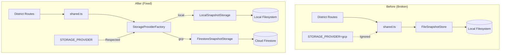
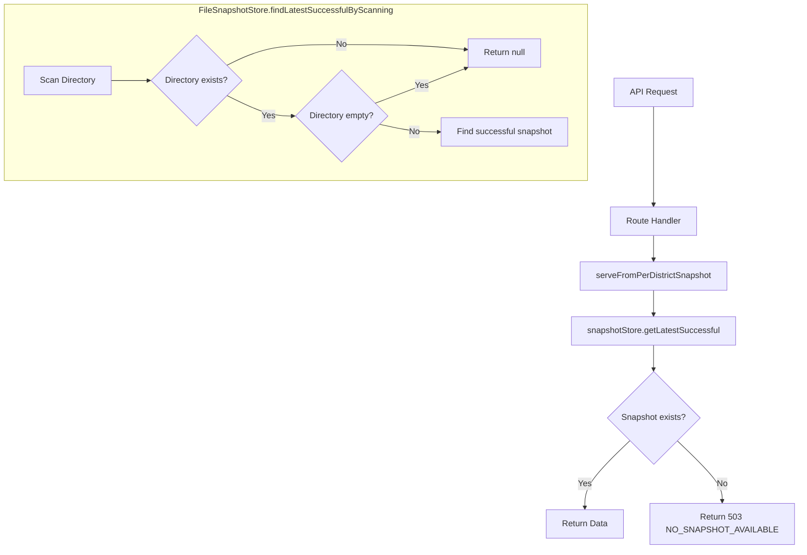

# Design Document: Storage Provider Integration Fix

## Overview

This design addresses the incomplete GCP storage migration in Toast-Stats by updating the `shared.ts` module to use the `StorageProviderFactory` instead of directly instantiating `FileSnapshotStore`. The fix ensures that the `STORAGE_PROVIDER` environment variable is respected across all route handlers, and that empty storage scenarios return proper 503 responses instead of 500 errors.

The changes are minimal and focused:

1. Replace direct `FileSnapshotStore` instantiation with `StorageProviderFactory.createFromEnvironment()`
2. Add graceful handling for missing/empty directories in `FileSnapshotStore.findLatestSuccessfulByScanning()`
3. Update documentation to reflect the completed migration

## Architecture

The existing storage abstraction layer is already well-designed. This fix simply ensures the route handlers use it correctly.



### Error Handling Flow for Empty Storage



## Components and Interfaces

### 1. Modified: shared.ts Storage Initialization

The key change is replacing direct `FileSnapshotStore` instantiation with `StorageProviderFactory`:

```typescript
// Before (broken):
import { FileSnapshotStore } from '../../services/SnapshotStore.js'

export const snapshotStore = new FileSnapshotStore({
  cacheDir: cacheDirectory,
  maxSnapshots: 100,
  maxAgeDays: 30,
})

// After (fixed):
import { StorageProviderFactory } from '../../services/storage/StorageProviderFactory.js'
import type { ISnapshotStorage } from '../../types/storageInterfaces.js'

// Create storage providers from environment configuration
const storageProviders = StorageProviderFactory.createFromEnvironment()

// Export the snapshot storage (respects STORAGE_PROVIDER env var)
export const snapshotStore: ISnapshotStorage = storageProviders.snapshotStorage

// Backward compatibility alias
export const perDistrictSnapshotStore = snapshotStore
```

### 2. Modified: FileSnapshotStore.findLatestSuccessfulByScanning

Add graceful handling for missing/empty directories:

```typescript
private async findLatestSuccessfulByScanning(): Promise<Snapshot | null> {
  const startTime = Date.now()

  logger.debug('Starting directory scan for latest successful snapshot', {
    operation: 'findLatestSuccessfulByScanning',
  })

  // Handle missing directory gracefully
  try {
    await fs.access(this.snapshotsDir)
  } catch (error) {
    if ((error as NodeJS.ErrnoException).code === 'ENOENT') {
      logger.debug('Snapshots directory does not exist, returning null', {
        operation: 'findLatestSuccessfulByScanning',
        snapshotsDir: this.snapshotsDir,
      })
      return null
    }
    throw error
  }

  // Existing directory scanning logic...
  const files = await fs.readdir(this.snapshotsDir)
  // ... rest of implementation
}
```

### 3. Service Initialization Updates

Update service initialization to use the storage provider:

```typescript
// Initialize services using storage provider from factory
const storageProviders = StorageProviderFactory.createFromEnvironment()
export const snapshotStore: ISnapshotStorage = storageProviders.snapshotStorage

// DistrictDataAggregator needs FileSnapshotStore for per-district operations
// The ISnapshotStorage interface includes all required methods
export const districtDataAggregator = createDistrictDataAggregator(
  snapshotStore as FileSnapshotStore
)

// RefreshService initialization (async)
_refreshService = new RefreshService(
  snapshotStore, // Now uses ISnapshotStorage from factory
  rawCSVCacheService,
  districtConfigService,
  _rankingCalculator
)
```

## Data Models

No changes to data models are required. The existing `Snapshot`, `SnapshotMetadata`, and `DistrictStatistics` types remain unchanged.

## Correctness Properties

_A property is a characteristic or behavior that should hold true across all valid executions of a system—essentially, a formal statement about what the system should do. Properties serve as the bridge between human-readable specifications and machine-verifiable correctness guarantees._

Based on the prework analysis, the following properties have been identified:

### Property 1: Storage Provider Selection

_For any_ value of the `STORAGE_PROVIDER` environment variable, the `StorageProviderFactory.createFromEnvironment()` method SHALL return the correct storage implementation:

- When `STORAGE_PROVIDER=gcp`: Returns `FirestoreSnapshotStorage`
- When `STORAGE_PROVIDER=local` or unset: Returns `LocalSnapshotStorage`

**Validates: Requirements 1.1, 1.2**

### Property 2: Empty Storage Returns Null

_For any_ storage provider implementation (LocalSnapshotStorage or FirestoreSnapshotStorage), when the storage is empty (no snapshots exist), calling `getLatestSuccessful()` SHALL return `null` instead of throwing an error.

**Validates: Requirements 2.3, 2.4, 3.1, 3.2**

### Property 3: HTTP 503 for Empty Storage

_For any_ district route handler, when no snapshot is available, the handler SHALL return HTTP 503 with error code `NO_SNAPSHOT_AVAILABLE` and SHALL NOT return HTTP 500.

**Validates: Requirements 2.1, 2.2, 6.4**

### Property 4: Consistent Error Response Structure

_For any_ district route handler returning `NO_SNAPSHOT_AVAILABLE`, the error response SHALL contain:

- `error.code`: "NO_SNAPSHOT_AVAILABLE"
- `error.message`: A descriptive message
- `error.details`: Instructions to run a refresh operation

**Validates: Requirements 6.1, 6.2, 6.3**

## Error Handling

### Empty Storage Scenarios

The system handles empty storage gracefully at multiple levels:

1. **FileSnapshotStore Level**: `findLatestSuccessfulByScanning()` returns `null` when:
   - The snapshots directory doesn't exist (ENOENT)
   - The snapshots directory is empty
   - No successful snapshots are found

2. **Route Handler Level**: `serveFromPerDistrictSnapshot()` returns 503 when:
   - `getLatestSuccessful()` returns `null`
   - Both per-district and old format snapshots are unavailable

3. **Error Response Format**:

```json
{
  "error": {
    "code": "NO_SNAPSHOT_AVAILABLE",
    "message": "No data snapshot available yet",
    "details": "Run a refresh operation to create the first snapshot"
  }
}
```

### Error Propagation

Storage errors are handled differently based on type:

- **Missing data (null returns)**: Propagate as 503 NO_SNAPSHOT_AVAILABLE
- **Storage operation failures**: Propagate as 500 with appropriate error details
- **Configuration errors**: Fail fast at startup with clear error messages

## Testing Strategy

### Unit Tests

Per the property-testing-guidance steering document, unit tests with well-chosen examples are preferred for this fix since the changes are focused and the input space is bounded.

**Test Cases for FileSnapshotStore:**

1. `findLatestSuccessfulByScanning` returns `null` when directory doesn't exist
2. `findLatestSuccessfulByScanning` returns `null` when directory is empty
3. `findLatestSuccessfulByScanning` returns snapshot when successful snapshots exist

**Test Cases for shared.ts Integration:**

1. Verify `snapshotStore` export uses `StorageProviderFactory`
2. Verify `perDistrictSnapshotStore` is an alias for `snapshotStore`
3. Verify services receive the correct storage provider

**Test Cases for Route Handlers:**

1. Return 503 with `NO_SNAPSHOT_AVAILABLE` when storage is empty
2. Return 200 with data when snapshot exists
3. Error response contains required fields (code, message, details)

### Integration Tests

1. **End-to-end with empty storage**: Start application with empty storage, verify 503 response
2. **End-to-end with GCP provider**: Set `STORAGE_PROVIDER=gcp`, verify Firestore is used
3. **End-to-end with local provider**: Set `STORAGE_PROVIDER=local`, verify filesystem is used

### Test Isolation

Per the testing steering document:

- Each test uses unique, isolated directories
- Tests clean up resources in afterEach hooks
- Tests do not depend on execution order
- All tests pass when run with `--run` (parallel mode)
