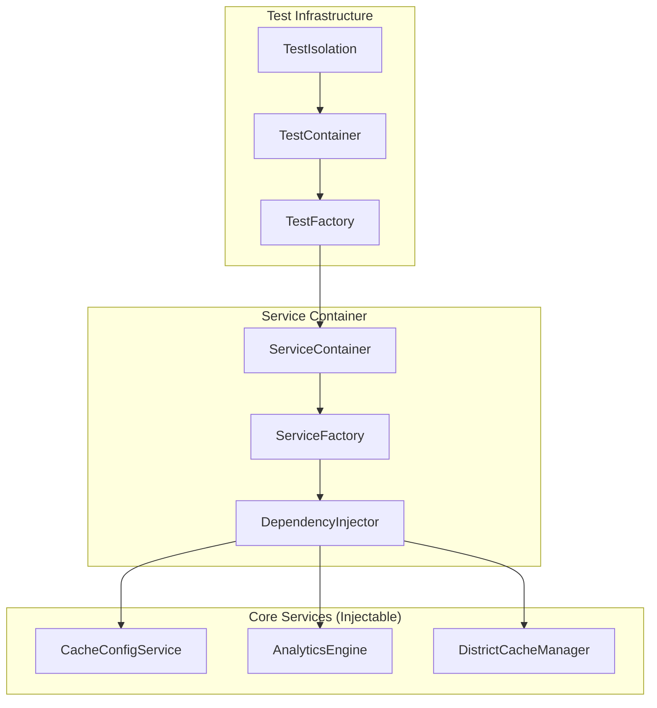
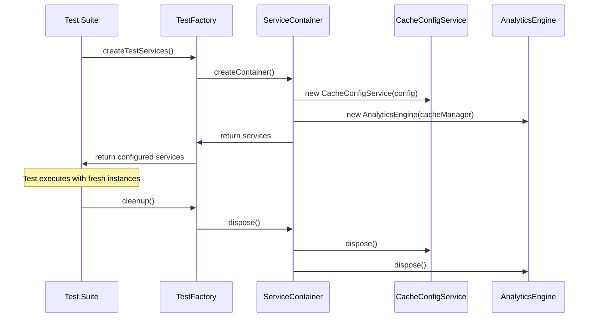

# Design Document

## Overview

This design implements comprehensive test infrastructure improvements to achieve 100% test reliability by aggressively migrating from singleton patterns to dependency injection. The solution addresses the core issues identified in the Test Resolution Report: singleton interference, race conditions, property test timeouts, and cache initialization problems.

The design focuses on architectural changes that eliminate the root causes of test instability rather than working around them. By implementing dependency injection, service containers, and proper test isolation patterns, we create a robust foundation for reliable testing.

## Architecture

### Service Container Architecture



### Dependency Injection Flow



## Components and Interfaces

### 1. Service Container System

#### ServiceContainer Interface

```typescript
interface ServiceContainer {
  register<T>(token: ServiceToken<T>, factory: ServiceFactory<T>): void
  resolve<T>(token: ServiceToken<T>): T
  dispose(): Promise<void>
}

interface ServiceFactory<T> {
  create(container: ServiceContainer): T
  dispose?(instance: T): Promise<void>
}

interface ServiceToken<T> {
  readonly name: string
  readonly type: new (...args: any[]) => T
}
```

#### Configuration Management

```typescript
interface ServiceConfiguration {
  cacheDirectory: string
  environment: 'test' | 'development' | 'production'
  logLevel: 'debug' | 'info' | 'warn' | 'error'
}

interface ConfigurationProvider {
  getConfiguration(): ServiceConfiguration
  updateConfiguration(updates: Partial<ServiceConfiguration>): void
}
```

### 2. Injectable Service Interfaces

#### CacheConfigService (Refactored)

```typescript
interface CacheConfiguration {
  baseDirectory: string
  isConfigured: boolean
  source: 'environment' | 'default' | 'test'
  validationStatus: CacheDirectoryValidation
}

interface ICacheConfigService {
  getCacheDirectory(): string
  getConfiguration(): CacheConfiguration
  initialize(): Promise<void>
  validateCacheDirectory(): Promise<void>
  isReady(): boolean
  dispose(): Promise<void>
}

class CacheConfigService implements ICacheConfigService {
  constructor(
    private config: ServiceConfiguration,
    private logger: ILogger
  ) {}

  // Remove static getInstance() method
  // Remove static resetInstance() method
  // Implement proper disposal
}
```

#### AnalyticsEngine (Refactored)

```typescript
interface IAnalyticsEngine {
  generateDistrictAnalytics(
    districtId: string,
    startDate?: string,
    endDate?: string
  ): Promise<DistrictAnalytics>
  getClubTrends(districtId: string, clubId: string): Promise<ClubTrend | null>
  clearCaches(): void
  dispose(): Promise<void>
}

class AnalyticsEngine implements IAnalyticsEngine {
  constructor(
    private cacheManager: IDistrictCacheManager,
    private logger: ILogger
  ) {}

  // Remove singleton pattern
  // Implement proper disposal
}
```

### 3. Test Infrastructure Components

#### TestServiceFactory

```typescript
interface TestServiceFactory {
  createCacheConfigService(
    config?: Partial<ServiceConfiguration>
  ): ICacheConfigService
  createAnalyticsEngine(cacheManager?: IDistrictCacheManager): IAnalyticsEngine
  createDistrictCacheManager(
    cacheConfig?: ICacheConfigService
  ): IDistrictCacheManager
  createTestContainer(): ServiceContainer
  cleanup(): Promise<void>
}
```

#### TestIsolationManager

```typescript
interface TestIsolationManager {
  setupTestEnvironment(): Promise<void>
  cleanupTestEnvironment(): Promise<void>
  createIsolatedDirectory(): Promise<string>
  removeIsolatedDirectory(path: string): Promise<void>
  resetEnvironmentVariables(): void
}
```

### 4. Property-Based Test Infrastructure

#### PropertyTestConfiguration

```typescript
interface PropertyTestConfiguration {
  iterations: number
  timeout: number
  seed?: number
  shrinkingEnabled: boolean
}

interface PropertyTestRunner {
  runProperty<T>(
    property: PropertyTest<T>,
    generator: Generator<T>,
    config: PropertyTestConfiguration
  ): Promise<PropertyTestResult<T>>
}

interface PropertyTestResult<T> {
  passed: boolean
  iterations: number
  counterExample?: T
  shrunkCounterExample?: T
  error?: Error
}
```

## Data Models

### Service Registration Model

```typescript
interface ServiceRegistration<T> {
  token: ServiceToken<T>
  factory: ServiceFactory<T>
  lifecycle: 'singleton' | 'transient' | 'scoped'
  dependencies: ServiceToken<any>[]
}

interface ServiceInstance<T> {
  instance: T
  created: Date
  disposed: boolean
  dependencies: ServiceInstance<any>[]
}
```

### Test Configuration Model

```typescript
interface TestConfiguration {
  isolation: {
    useIsolatedDirectories: boolean
    cleanupAfterEach: boolean
    resetEnvironmentVariables: boolean
  }
  propertyTesting: {
    defaultIterations: number
    defaultTimeout: number
    enableShrinking: boolean
  }
  services: {
    cacheDirectory: string
    logLevel: string
    mockExternalServices: boolean
  }
}
```

## Correctness Properties

_A property is a characteristic or behavior that should hold true across all valid executions of a system-essentially, a formal statement about what the system should do. Properties serve as the bridge between human-readable specifications and machine-verifiable correctness guarantees._

### Property 1: Singleton to Dependency Injection Migration

_For any_ core service (CacheConfigService, AnalyticsEngine), the refactored service should be instantiable through constructor injection and should not contain any static getInstance methods or static state
**Validates: Requirements 1.1, 1.2, 1.4**

### Property 2: Test Instance Isolation

_For any_ test execution, each test should receive fresh service instances that do not share state with other test instances
**Validates: Requirements 1.3**

### Property 3: Configuration Injection

_For any_ service requiring configuration, the service should receive configuration through constructor parameters rather than accessing global environment variables directly
**Validates: Requirements 1.5**

### Property 4: Concurrent Test Execution Safety

_For any_ set of tests running concurrently, resource conflicts and race conditions should not occur, and directory operations should be handled safely
**Validates: Requirements 2.1, 2.3**

### Property 5: Test Failure Diagnostics

_For any_ test failure, the failure should include clear diagnostic information about the root cause
**Validates: Requirements 2.5**

### Property 6: Property Test Performance and Determinism

_For any_ property-based test, the test should complete within 10 seconds and use deterministic generators that produce reproducible results with the same seed
**Validates: Requirements 3.1, 3.2**

### Property 7: Property Test Error Reporting

_For any_ failed property test, the failure should include the exact counterexample that caused the failure
**Validates: Requirements 3.3**

### Property 8: Property Test Configuration

_For any_ property test execution, the test should run with the configured number of iterations (3-5 for CI) and handle file operation timing issues gracefully
**Validates: Requirements 3.4, 3.5**

### Property 9: Cache Manager Initialization and Validation

_For any_ cache manager usage in tests, the manager should be properly initialized before use and should validate cache directory existence before operations
**Validates: Requirements 4.1, 4.4**

### Property 10: Test Resource Cleanup

_For any_ test completion, all test-specific cache entries and directories should be cleaned up
**Validates: Requirements 4.2**

### Property 11: Resource Isolation

_For any_ multiple tests using shared resources, conflicts should be prevented through proper isolation
**Validates: Requirements 4.3**

### Property 12: Cache Error Handling

_For any_ cache operation failure, the failure should provide meaningful error messages and recovery options
**Validates: Requirements 4.5**

### Property 13: Test Environment Configuration

_For any_ test execution, appropriate timeouts should be set for different test types and isolated environment configuration should be provided
**Validates: Requirements 5.2, 5.3**

### Property 14: Configuration Backward Compatibility

_For any_ test configuration change, existing tests should continue to work without modification
**Validates: Requirements 5.5**

### Property 15: Service Container Functionality

_For any_ service container usage, the container should manage dependencies correctly, provide factory methods for service creation, and resolve complex dependency graphs automatically
**Validates: Requirements 6.1, 6.2, 6.3**

### Property 16: Interface-Based Dependency Injection

_For any_ service injection, the service should be injectable through interfaces and allow easy substitution of mock implementations
**Validates: Requirements 6.4, 6.5**

### Property 17: Test Reliability Metrics

_For any_ test execution, reliability metrics and failure patterns should be tracked correctly
**Validates: Requirements 7.1**

### Property 18: Flaky Test Detection

_For any_ flaky test occurrence, the test should be properly identified and reported for investigation
**Validates: Requirements 7.2**

### Property 19: Performance Monitoring

_For any_ test performance degradation, alerts should be triggered to notify developers
**Validates: Requirements 7.3**

### Property 20: Failure Categorization

_For any_ test failure, the failure should be categorized by root cause for analysis
**Validates: Requirements 7.5**

### Property 21: Test Data Generation

_For any_ test data generation, string generators should be deterministic, factory methods should create valid objects, and utilities should provide proper test fixtures
**Validates: Requirements 8.1, 8.2, 8.4**

### Property 22: Generated Data Validation

_For any_ property test data generation, the generated data should be valid and realistic according to the specified constraints
**Validates: Requirements 8.3**

### Property 23: Test Data Compatibility

_For any_ test data changes, existing tests should maintain compatibility and continue to function
**Validates: Requirements 8.5**

## Error Handling

### Service Container Error Handling

- **Circular Dependency Detection**: The service container should detect and report circular dependencies during registration
- **Missing Dependency Resolution**: Clear error messages when required dependencies cannot be resolved
- **Service Disposal Errors**: Graceful handling of disposal errors with proper logging and cleanup continuation

### Test Infrastructure Error Handling

- **Resource Cleanup Failures**: Continue cleanup process even if individual resource cleanup fails
- **Directory Creation Conflicts**: Handle concurrent directory creation with proper error recovery
- **Configuration Validation**: Validate test configuration and provide clear error messages for invalid settings

### Property Test Error Handling

- **Timeout Handling**: Graceful timeout handling with partial results and diagnostic information
- **Generator Failures**: Proper error reporting when test data generators fail
- **Shrinking Failures**: Continue with original counterexample if shrinking fails

## Testing Strategy

### Dual Testing Approach

The testing strategy employs both unit tests and property-based tests as complementary approaches:

- **Unit Tests**: Verify specific examples, edge cases, and integration points
- **Property Tests**: Verify universal properties across all inputs using randomized testing

### Property-Based Testing Configuration

- **Testing Library**: Use `fast-check` for TypeScript property-based testing
- **Minimum Iterations**: 100 iterations per property test for thorough coverage
- **Test Tagging**: Each property test must reference its design document property using the format:
  ```typescript
  // Feature: test-infrastructure-stabilization, Property 1: Singleton to Dependency Injection Migration
  ```

### Unit Testing Focus Areas

- **Service Container Registration**: Test specific service registration scenarios
- **Configuration Validation**: Test edge cases in configuration parsing and validation
- **Error Conditions**: Test specific error scenarios and recovery mechanisms
- **Integration Points**: Test interactions between components

### Test Organization

- **Service Tests**: Tests for individual service implementations
- **Integration Tests**: Tests for component interactions and workflows
- **Property Tests**: Tests for universal properties and invariants
- **Performance Tests**: Tests for timeout and performance requirements

### Test Environment Configuration

- **Sequential Execution**: Configure Vitest with `pool: 'forks'` and `singleFork: true`
- **Isolated Directories**: Each test gets its own temporary directory
- **Environment Reset**: Reset environment variables between tests
- **Resource Cleanup**: Automatic cleanup of test resources after each test

<function_calls>
<invoke name="prework">
<parameter name="featureName">test-infrastructure-stabilization
