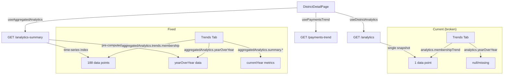

# Design Document: Trends Tab Historical Data Fix

## Overview

The Trends tab on the DistrictDetailPage currently sources its MembershipTrendChart and YearOverYearComparison data from `useDistrictAnalytics` (single-snapshot analytics), which returns only one data point for membership trends and may lack year-over-year data. The fix rewires these components to use `useAggregatedAnalytics` (time-series aggregated analytics), which is already fetched by the page for the Overview tab and returns the full historical dataset.

This is a frontend-only change in `frontend/src/pages/DistrictDetailPage.tsx`. No backend, API, or component changes are needed.

## Architecture

The existing data flow already supports the fix:



The `aggregatedAnalytics` data is already fetched and available in the component scope — the Overview tab uses it via the `overviewData` memo. The Trends tab just needs to reference the same source.

## Components and Interfaces

### Affected Component

`frontend/src/pages/DistrictDetailPage.tsx` — Trends tab section (lines ~607-650)

### Data Sources (no changes needed)

- `useAggregatedAnalytics` hook — returns `AggregatedAnalyticsResponse` with:
  - `trends.membership: Array<{ date: string; count: number }>` — full time-series
  - `yearOverYear?: { membershipChange, distinguishedChange, clubHealthChange }`
  - `summary: { totalMembership, membershipChange, clubCounts, distinguishedClubs, distinguishedProjection }`
- `usePaymentsTrend` hook — already correctly wired, no changes needed

### Child Components (no changes needed)

- `MembershipTrendChart` — accepts `membershipTrend: Array<{ date: string; count: number }>`, `isLoading?: boolean`
- `YearOverYearComparison` — accepts `yearOverYear?: { membershipChange, distinguishedChange, clubHealthChange }`, `currentYear: { totalMembership, distinguishedClubs, thrivingClubs, totalClubs }`, `isLoading?: boolean`

### Specific Changes

The Trends tab section changes from:

```tsx
{/* Current: guards on analytics (single-snapshot) */}
{analytics && (
  <MembershipTrendChart
    membershipTrend={analytics.membershipTrend}
    isLoading={isLoadingAnalytics}
  />
)}

{analytics && (
  <YearOverYearComparison
    {...(analytics.yearOverYear && { yearOverYear: analytics.yearOverYear })}
    currentYear={{
      totalMembership: analytics.totalMembership,
      distinguishedClubs: analytics.distinguishedClubs.total,
      thrivingClubs: analytics.thrivingClubs.length,
      totalClubs: analytics.allClubs.length,
    }}
    isLoading={isLoadingAnalytics}
  />
)}
```

To:

```tsx
{/* Fixed: guards on aggregatedAnalytics (time-series) */}
{aggregatedAnalytics && (
  <MembershipTrendChart
    membershipTrend={aggregatedAnalytics.trends.membership}
    isLoading={isLoadingAggregated}
  />
)}

{aggregatedAnalytics && (
  <YearOverYearComparison
    {...(aggregatedAnalytics.yearOverYear && {
      yearOverYear: aggregatedAnalytics.yearOverYear,
    })}
    currentYear={{
      totalMembership: aggregatedAnalytics.summary.totalMembership,
      distinguishedClubs: aggregatedAnalytics.summary.distinguishedClubs.total,
      thrivingClubs: aggregatedAnalytics.summary.clubCounts.thriving,
      totalClubs: aggregatedAnalytics.summary.clubCounts.total,
    }}
    isLoading={isLoadingAggregated}
  />
)}
```

## Data Models

No new data models. The existing `AggregatedAnalyticsResponse` interface (from `useAggregatedAnalytics.ts`) already provides all needed fields:

- `trends.membership` — same shape as `MembershipTrendChartProps.membershipTrend`
- `yearOverYear` — same shape as `YearOverYearComparisonProps.yearOverYear`
- `summary.clubCounts` — provides `thriving` and `total` counts (replacing `thrivingClubs.length` and `allClubs.length`)
- `summary.distinguishedClubs.total` — replaces `distinguishedClubs.total`

## Correctness Properties

*A property is a characteristic or behavior that should hold true across all valid executions of a system — essentially, a formal statement about what the system should do. Properties serve as the bridge between human-readable specifications and machine-verifiable correctness guarantees.*

After prework analysis, the testable acceptance criteria reduce to three distinct verification points. Given this is a straightforward data source wiring fix with no new logic, these are best validated as unit test examples rather than property-based tests.

Property 1: Trends tab data source wiring
*For any* rendering of the Trends tab where aggregatedAnalytics is available, the MembershipTrendChart must receive `aggregatedAnalytics.trends.membership` as its `membershipTrend` prop, and the YearOverYearComparison must receive `aggregatedAnalytics.yearOverYear` and `aggregatedAnalytics.summary`-derived metrics as its props.
**Validates: Requirements 1.1, 2.1, 2.2, 3.1**

Property 2: Trends tab guard condition
*For any* rendering of the Trends tab where aggregatedAnalytics is null/undefined, the MembershipTrendChart and YearOverYearComparison components that depend on aggregated data must not be rendered.
**Validates: Requirements 3.2**

## Error Handling

No new error handling needed. The existing patterns apply:
- When `aggregatedAnalytics` is null (loading or error), the guard conditions (`{aggregatedAnalytics && ...}`) prevent rendering
- The `isLoadingAggregated` state is passed to child components for loading indicators
- The `MembershipPaymentsChart` continues to use `paymentsTrendData` from `usePaymentsTrend` (unchanged)

## Testing Strategy

This fix is a simple data source wiring change — no new logic, no new components, no new data transformations. Per the testing steering document's principle "prefer the simplest test that provides confidence," unit tests with specific examples are the right approach here.

### Unit Tests (Vitest + React Testing Library)

1. Render the Trends tab with mock `aggregatedAnalytics` data containing multiple membership trend points. Verify the MembershipTrendChart renders with the aggregated data (not single-snapshot data).
2. Render the Trends tab with mock `aggregatedAnalytics` containing `yearOverYear` data. Verify the YearOverYearComparison renders comparison metrics.
3. Render the Trends tab with `aggregatedAnalytics` as null. Verify the MembershipTrendChart and YearOverYearComparison are not rendered.

### Property-Based Tests

Not warranted for this fix. The change is a prop wiring fix with no complex input space, no mathematical invariants, and no data transformations. 3-5 well-chosen examples fully cover the behavior. This aligns with the testing steering document: "When 3-5 specific examples fully cover the behavior, prefer the examples."
