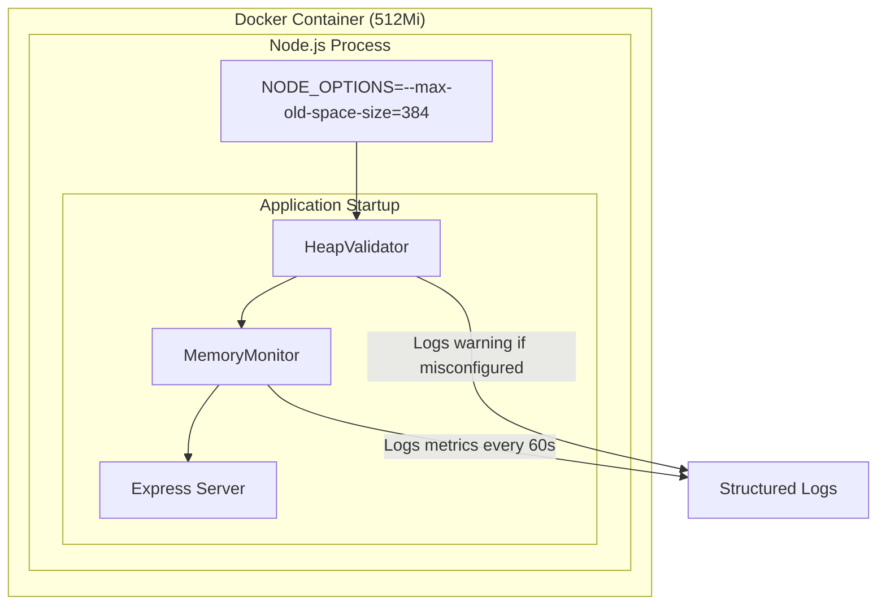

# Design Document: V8 Heap Configuration

## Overview

This design implements V8 heap memory configuration for the backend to prevent OOM crashes in production. The solution consists of three components:

1. **Dockerfile Configuration**: Setting `NODE_OPTIONS` environment variable with appropriate heap limits
2. **Heap Validator**: A startup validation module that checks heap configuration and logs warnings
3. **Memory Monitor**: Periodic memory metrics logging for operational visibility

The design follows the memory budget formula from the performance SLOs:
```
Container Memory (512Mi) = V8 Heap (384MB) + Native Memory (~100MB) + Overhead (~28MB)
```

## Architecture



## Components and Interfaces

### Component 1: Dockerfile NODE_OPTIONS Configuration

The Dockerfile will be modified to include the `NODE_OPTIONS` environment variable:

```dockerfile
# Environment variables
ENV NODE_ENV=production
ENV PORT=5001
ENV CACHE_DIR=/app/cache
ENV NODE_OPTIONS="--max-old-space-size=384"
```

This configuration:
- Sets V8 old space limit to 384MB (~75% of 512Mi container)
- Leaves ~128MB for native memory, buffers, and runtime overhead
- Is applied automatically when the container starts

### Component 2: HeapValidator Module

A new module `backend/src/utils/heapValidator.ts` that validates heap configuration at startup.

```typescript
interface HeapValidationResult {
  heapSizeLimitMB: number
  containerMemoryMB: number
  heapRatio: number
  isValid: boolean
  warning?: string
}

interface HeapValidator {
  validate(): HeapValidationResult
  logValidation(): void
}
```

**Validation Logic:**
1. Read V8 heap statistics using `v8.getHeapStatistics()`
2. Extract `heap_size_limit` and convert to MB
3. Compare against container memory (default 512MB, configurable via `CONTAINER_MEMORY_MB`)
4. Log warning if heap ratio exceeds 85%

### Component 3: MemoryMonitor Module

A new module `backend/src/utils/memoryMonitor.ts` that provides periodic memory metrics logging.

```typescript
interface MemoryMetrics {
  heapUsedMB: number
  heapTotalMB: number
  rssMB: number
  externalMB: number
  arrayBuffersMB: number
  timestamp: string
}

interface MemoryMonitor {
  logMetrics(): void
  start(intervalMs: number): void
  stop(): void
}
```

**Metrics Collection:**
- Uses `process.memoryUsage()` to collect all memory metrics
- Converts bytes to megabytes for readability
- Logs using existing logger infrastructure with structured format

### Integration with index.ts

The main entry point will be modified to:
1. Import and call `HeapValidator.logValidation()` early in startup
2. Import and start `MemoryMonitor` after server initialization
3. Stop `MemoryMonitor` during graceful shutdown

```typescript
// Early in startup sequence
import { validateHeapConfiguration } from './utils/heapValidator.js'
import { MemoryMonitor } from './utils/memoryMonitor.js'

// Before server starts
validateHeapConfiguration()

// After server starts
const memoryMonitor = new MemoryMonitor()
memoryMonitor.start(60000) // Every 60 seconds

// In shutdown handlers
process.on('SIGTERM', () => {
  memoryMonitor.stop()
  // ... existing shutdown logic
})
```

## Data Models

### HeapStatistics (from V8)

```typescript
// From v8.getHeapStatistics()
interface V8HeapStatistics {
  total_heap_size: number
  total_heap_size_executable: number
  total_physical_size: number
  total_available_size: number
  used_heap_size: number
  heap_size_limit: number  // This is what --max-old-space-size controls
  malloced_memory: number
  peak_malloced_memory: number
  does_zap_garbage: number
  number_of_native_contexts: number
  number_of_detached_contexts: number
}
```

### MemoryUsage (from process)

```typescript
// From process.memoryUsage()
interface NodeMemoryUsage {
  rss: number        // Resident Set Size - total memory allocated
  heapTotal: number  // V8's total allocated heap
  heapUsed: number   // V8's currently used heap
  external: number   // Memory used by C++ objects (Buffers)
  arrayBuffers: number // Memory for ArrayBuffer backing stores
}
```


## Correctness Properties

*A property is a characteristic or behavior that should hold true across all valid executions of a system—essentially, a formal statement about what the system should do. Properties serve as the bridge between human-readable specifications and machine-verifiable correctness guarantees.*

### Property-Based Testing Assessment

Per the `property-testing-guidance.md` steering document, property-based testing SHOULD NOT be used when:
- 3-5 well-chosen examples would provide equivalent confidence
- The input space is not genuinely complex
- The "property" would just restate the implementation

**Assessment of Candidate Properties:**

1. **Warning Threshold Validation (Req 2.3)**: The threshold check (`heapRatio > 0.85`) is a simple comparison. Well-chosen examples at boundary conditions (84%, 85%, 86%) provide equivalent confidence. **Decision: Unit tests with examples.**

2. **Bytes to MB Conversion (Req 3.3)**: The conversion (`bytes / 1024 / 1024`) is trivial arithmetic. Examples covering 0, small values, and large values provide equivalent confidence. **Decision: Unit tests with examples.**

### Conclusion

**No property-based tests are warranted for this specification.** The acceptance criteria involve:
- Simple threshold comparisons (not complex input spaces)
- Trivial arithmetic conversions (not mathematical invariants requiring PBT)
- Configuration validation (not business rules with universal properties)

Unit tests with well-chosen examples will provide equivalent confidence with better readability and maintainability.

## Error Handling

### Heap Validation Errors

| Error Condition | Handling | Severity |
|-----------------|----------|----------|
| v8 module unavailable | Log error, continue startup | Warning |
| Invalid CONTAINER_MEMORY_MB env var | Use default 512MB, log warning | Warning |
| Heap ratio > 85% | Log warning with recommendation | Warning |

The heap validator MUST NOT prevent application startup. All validation errors are logged but do not block the server from starting.

### Memory Monitor Errors

| Error Condition | Handling | Severity |
|-----------------|----------|----------|
| process.memoryUsage() fails | Log error, skip this interval | Warning |
| Logger unavailable | Fall back to console.log | Warning |
| Interval already running | No-op, log debug message | Debug |

The memory monitor MUST be resilient to transient errors and continue operating.

## Testing Strategy

### Unit Tests

Unit tests will verify specific examples and edge cases:

1. **HeapValidator Tests**
   - Validates correct reading of v8 heap statistics
   - Validates warning is logged when heap > 85% of container (e.g., 440MB heap / 512MB container = 86%)
   - Validates no warning when heap ≤ 85% of container (e.g., 384MB heap / 512MB container = 75%)
   - Validates boundary condition at exactly 85% (e.g., 435MB heap / 512MB container)
   - Validates default container memory (512MB) is used when env var not set
   - Validates custom container memory from CONTAINER_MEMORY_MB env var

2. **MemoryMonitor Tests**
   - Validates metrics are logged with correct structure (heapUsed, heapTotal, rss, external)
   - Validates bytes to MB conversion for known values (0 bytes → 0 MB, 1048576 bytes → 1 MB, 402653184 bytes → 384 MB)
   - Validates start/stop lifecycle (interval created on start, cleared on stop)
   - Validates interval cleanup on stop (no memory leak)
   - Validates idempotent stop (calling stop twice doesn't throw)

3. **Integration Tests**
   - Validates heap validator runs before server starts
   - Validates memory monitor starts after server initialization
   - Validates cleanup occurs on SIGTERM/SIGINT

### Property-Based Tests

Per the `property-testing-guidance.md` steering document:

> Property tests are a tool, not a default.
> Prefer the simplest test that provides confidence.
> When in doubt, write unit tests with good examples.

**Decision**: No property-based tests are warranted for this specification. The acceptance criteria involve simple threshold comparisons and trivial arithmetic conversions where well-chosen unit test examples provide equivalent confidence with better readability.

### Test File Locations

Following the project's test organization:

| Test Type | Location | Naming |
|-----------|----------|--------|
| HeapValidator unit tests | `backend/src/utils/__tests__/heapValidator.test.ts` | Co-located with source |
| MemoryMonitor unit tests | `backend/src/utils/__tests__/memoryMonitor.test.ts` | Co-located with source |
| Integration tests | `backend/src/__tests__/memory-integration.test.ts` | Integration test directory |
