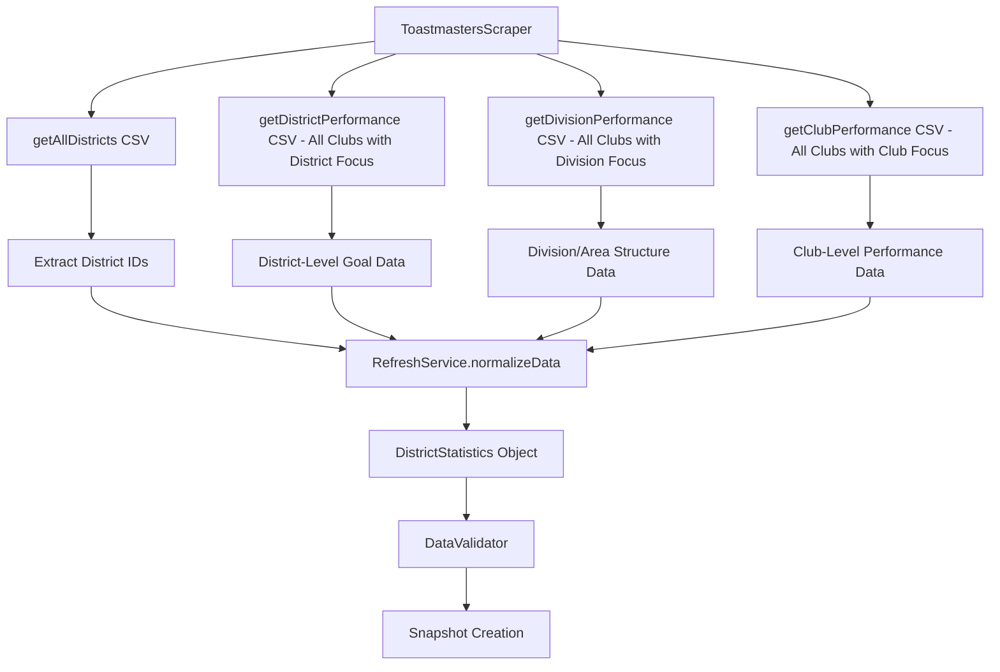

# Toastmasters Dashboard Knowledge Base

**Status:** Comprehensive Reference  
**Applies to:** Toast-Stats Application Data Sources  
**Audience:** Developers, Data Analysts, System Maintainers  
**Owner:** Development Team  
**Last Updated:** January 6, 2026

---

## Table of Contents

1. [Overview](#overview)
2. [Dashboard Structure](#dashboard-structure)
3. [CSV Data Sources](#csv-data-sources)
4. [Data Processing Pipeline](#data-processing-pipeline)
5. [Column Specifications](#column-specifications)
6. [Program Year Handling](#program-year-handling)
7. [URL Patterns](#url-patterns)
8. [Data Quality Characteristics](#data-quality-characteristics)
9. [Scraping Implementation](#scraping-implementation)
10. [Caching Strategy](#caching-strategy)
11. [Error Handling](#error-handling)
12. [Historical Data Access](#historical-data-access)

---

## Overview

The Toastmasters International dashboard at `https://dashboards.toastmasters.org` is the primary data source for the Toast-Stats application. This public dashboard provides performance metrics, membership statistics, and organizational data for all Toastmasters districts worldwide.

### Key Characteristics

- **Public Access**: No authentication required for data access
- **CSV Export Capability**: All data tables can be exported as CSV files
- **Program Year Structure**: Data organized by Toastmasters program years (July 1 - June 30)
- **Hierarchical Organization**: Data available at district, division, area, and club levels
- **Historical Data**: Supports querying specific dates within program years
- **Previous Day Data**: Dashboard always shows data for the previous calendar date (after daily refresh)
- **Month-End Closing Periods**: Extended closing periods at month-end affect data availability and timing

### Data Reliability

- **Expected Failures**: Scraping operations may fail due to network issues, site maintenance, or structure changes
- **Tolerance Design**: Application continues functioning with last-known-good data during outages
- **Change Sensitivity**: Dashboard structure and column names may change without notice
- **Rate Limiting**: No explicit rate limits, but respectful scraping practices implemented
- **Data Freshness**: Data is typically 1-2 days behind current date due to processing delays
- **Month-End Variability**: Data timing becomes unpredictable during month-end closing periods

---

## Dashboard Structure

The dashboard provides four distinct data views, each accessible via specific URLs and exportable as CSV:

### 1. All Districts Summary

- **Purpose**: High-level overview of all districts
- **Scope**: Global district performance metrics
- **Update Frequency**: Daily (shows previous day's data after refresh)
- **Primary Use**: District identification and comparative analysis

### 2. District Performance

- **Purpose**: Detailed metrics for a specific district
- **Scope**: District-level membership, clubs, and performance data
- **Update Frequency**: Daily (shows previous day's data after refresh)
- **Primary Use**: District-specific analysis and reporting

### 3. Division Performance

- **Purpose**: Division and area breakdown within a district
- **Scope**: Mid-level organizational structure and performance
- **Update Frequency**: Daily (shows previous day's data after refresh)
- **Primary Use**: Division/area leadership insights

### 4. Club Performance

- **Purpose**: Individual club details within a district
- **Scope**: Club-level membership, status, and achievement data
- **Update Frequency**: Daily (shows previous day's data after refresh)
- **Primary Use**: Club-level analysis and member tracking

---

## Data Timing and Freshness

### Daily Data Refresh Pattern

**Standard Operation**:

- Dashboard data is refreshed daily at an undetermined time
- Once refreshed, the dashboard shows data for the **previous calendar date**
- Data represents a specific month within the current program year
- Users see data that is typically 1-2 days behind the current date

**Example**: If today is January 15, 2025, the dashboard will show data "As of January 14, 2025" (or possibly January 13, depending on refresh timing)

### Month-End Closing Periods

**Closing Period Behavior**:

- At the end of each month, a **month-end closing period** begins
- This period extends into the next calendar month for an **indeterminate number of days**
- During closing periods, data timing becomes unpredictable and complex

**During Month-End Closing**:

- **Data Month**: Dashboard continues to show the **previous month's data**
- **Date Display**: Shows a date in the **current month** (usually yesterday)
- **Example**: On January 5, 2025 (during December closing), dashboard might show:
  - Data for: "December 2024" (previous month)
  - Date stamp: "As of January 4, 2025" (current month, previous day)

### Data Timing Implications

**For Application Design**:

- **Cannot predict exact data freshness**: May be 1-2 days or longer during closing periods
- **Month boundaries are complex**: Data month and date stamp may not align
- **Closing period duration varies**: No fixed schedule for when closing periods end
- **Historical queries affected**: Month-end periods may affect historical data availability

**For Users**:

- **Data freshness visibility**: Application must clearly display the actual data date from dashboard
- **Month-end awareness**: Users should understand data may be delayed during closing periods
- **Trend analysis caution**: Month-end periods may create gaps or inconsistencies in time series data

### Month-End Closing Data Handling Strategy

The application implements a specific strategy to handle month-end closing periods effectively:

**CSV Storage Strategy**:

- **Date Folder Naming**: CSV files are stored in folders named after the "As of <date>" from the dashboard
- **Example**: Dashboard showing "As of January 25, 2025" stores CSVs in `2025-01-25/` folder
- **Benefit**: Maintains accurate timestamp of when data was actually captured

**Processed Data Strategy**:

- **Last Day of Month Logic**: The last day of Month X uses the final data collected during the closing period (which occurs in Month X+1)
- **Example**: December 31, 2024 processed data uses the last CSV collected during December's closing period (captured in late January 2025)
- **Month Transition Handling**: Any day of Month X+1 may have no processed data while closing period continues

**Data Availability Expectations**:

- **Normal Days**: Processed data available 1-2 days after calendar date
- **Month-End**: Last day of month data may be delayed until closing period ends
- **Closing Period Duration**: Can extend 25+ days into the next month - no assumptions about length
- **Gap Tolerance**: Application expects and handles these natural data gaps of any duration

### Date Verification Strategy

```typescript
private async getSelectedDate(page: Page): Promise<DateInfo | null> {
  // Parse dashboard's "As of" date from dropdown
  // Store CSV files using this actual date (not requested date)
  // Handle month-end closing period discrepancies gracefully
  // Map closing period data to appropriate month boundaries
}
```

**Verification and Storage Logic**:

1. **Extract Dashboard Date**: Parse "As of DD-MMM-YYYY" from dashboard dropdown
2. **Store by Actual Date**: Use dashboard date for CSV folder naming, not requested date
3. **Month-End Mapping**: Map closing period data to the appropriate month's final day
4. **Gap Handling**: Accept data gaps during month transitions as normal behavior
5. **Processed Data Logic**: Determine which raw CSV date to use for each processed data date

---

## CSV Data Sources

### Source 1: All Districts Summary CSV

**Endpoint**: `getAllDistricts()`  
**Source URL**: `https://dashboards.toastmasters.org/[PROGRAM-YEAR]/Default.aspx`

**Purpose**: Provides high-level performance metrics for all districts worldwide

**Key Columns**:

```
DISTRICT          - District identifier (e.g., "42", "F", "61")
REGION           - Geographic region identifier
Paid Clubs       - Number of clubs with current dues payments
Paid Club Base   - Baseline club count for growth calculations
% Club Growth    - Percentage change in club count
Total YTD Payments - Year-to-date membership payments
Payment Base     - Baseline payment count for growth calculations
% Payment Growth - Percentage change in payments
Active Clubs     - Number of currently active clubs
Total Distinguished Clubs - Clubs achieving distinguished status
Select Distinguished Clubs - Clubs achieving select distinguished status
Presidents Distinguished Clubs - Clubs achieving presidents distinguished status (optional)
```

**Data Characteristics**:

- Contains all districts in a single export
- Numeric values stored as strings (require parsing)
- Growth percentages may include "%" symbol
- Some columns may be optional depending on program year

**Usage in Application**:

- Extract district IDs for subsequent detailed queries
- Calculate district rankings using Borda count algorithm
- Provide district-level comparative metrics

### Source 2: District Performance CSV

**Endpoint**: `getDistrictPerformance(districtId)`  
**Source URL**: `https://dashboards.toastmasters.org/[PROGRAM-YEAR]/District.aspx?id={districtId}`

**Purpose**: Club-level data with focus on district-wide goals and performance metrics

**Data Structure**: List of all clubs in the district with district-focused columns

**Key Column Categories**:

- Club identification (Club Number, Club Name, Division, Area)
- District-level goal tracking and achievement metrics
- Overall district performance indicators
- Membership statistics relevant to district goals
- Distinguished status from district perspective
- Educational awards contributing to district totals

**Data Characteristics**:

- Contains all clubs in the district (same club list as other CSV files)
- Columns focus on how each club contributes to district-wide goals
- May include district-specific performance calculations
- Goal tracking emphasizes district-level targets and achievements

**Usage in Application**:

- Generate `DistrictStatistics.membership` data
- Calculate `DistrictStatistics.clubs` statistics
- Populate `DistrictStatistics.education` metrics
- Track district-level performance trends
- Aggregate club contributions to district goals

### Source 3: Division Performance CSV

**Endpoint**: `getDivisionPerformance(districtId)`  
**Source URL**: `https://dashboards.toastmasters.org/[PROGRAM-YEAR]/Division.aspx?id={districtId}`

**Purpose**: Club-level data with focus on division and area goals and structure

**Data Structure**: List of all clubs in the district with division/area-focused columns

**Key Column Categories**:

- Club identification (Club Number, Club Name, Division, Area)
- Division and area assignment and structure
- Division-level goal tracking and performance metrics
- Area-specific achievement indicators
- Mid-level organizational performance data
- Division/area leadership effectiveness metrics

**Data Characteristics**:

- Contains all clubs in the district (same club list as other CSV files)
- Columns emphasize division and area organizational structure
- Performance metrics focus on mid-level leadership goals
- Useful for division and area director insights
- May include area-specific achievement breakdowns

**Usage in Application**:

- Generate division-level analytics
- Support area leadership insights
- Provide organizational structure mapping
- Calculate mid-level performance trends
- Track division and area goal achievement

### Source 4: Club Performance CSV

**Endpoint**: `getClubPerformance(districtId)`  
**Source URL**: `https://dashboards.toastmasters.org/[PROGRAM-YEAR]/Club.aspx?id={districtId}`

**Purpose**: Club-level data with focus on individual club goals and performance

**Data Structure**: List of all clubs in the district with club-focused columns

**Key Columns**:

```
Club Number                - Unique club identifier (e.g., "123456")
Club Name                 - Official club name
Division                  - Division assignment (e.g., "A", "B")
Area                     - Area assignment (e.g., "12", "34")
Active Members           - Current active membership count
Goals Met                - DCP goals achieved (e.g., "7/10")
Club Status              - Current status (Active, Suspended, Ineligible, Low)
Club Distinguished Status - Achievement level (Distinguished, Select Distinguished, Presidents Distinguished)
Mem. Base               - Baseline membership for growth calculations (optional)
Status                  - Alternative status field (optional)
Membership              - Alternative membership field (optional)
```

**Data Characteristics**:

- Contains all clubs in the district (same club list as other CSV files)
- Columns focus on individual club performance and achievements
- Most detailed club-specific metrics and status information
- Multiple possible column names for similar data (Active Members vs Membership)
- Status information in multiple formats
- Distinguished status may be empty for non-achieving clubs
- Numeric values stored as strings requiring parsing

**Usage in Application**:

- Generate `DistrictStatistics.clubDetails` array
- Calculate club-level statistics and trends
- Support club health analysis and risk assessment
- Provide member tracking and club performance metrics

---

## Data Processing Pipeline

### 1. CSV Acquisition Flow



### 2. Club Data Consolidation

Since all three CSV files contain the same clubs but with different column focuses, the normalization process consolidates this data:

**Data Consolidation Process**:

1. **District Performance CSV**: Provides district-goal-focused metrics for each club
2. **Division Performance CSV**: Provides division/area structure and mid-level goals for each club
3. **Club Performance CSV**: Provides detailed club-specific performance metrics for each club
4. **Normalization**: Combines all three perspectives into comprehensive club records

**Consolidated Club Data Structure**:

```typescript
interface ConsolidatedClubData {
  // Basic identification (consistent across all CSVs)
  clubId: string // From Club Number
  clubName: string // From Club Name
  division: string // From Division
  area: string // From Area

  // District-focused metrics (from District Performance CSV)
  districtGoalContribution: DistrictGoalMetrics
  districtPerformanceRank: number

  // Division-focused metrics (from Division Performance CSV)
  divisionGoalContribution: DivisionGoalMetrics
  areaPerformanceRank: number

  // Club-focused metrics (from Club Performance CSV)
  clubSpecificGoals: ClubGoalMetrics
  membershipDetails: MembershipMetrics
  clubStatus: ClubStatus
  distinguishedLevel: DistinguishedLevel
}
```

### 3. Data Transformation Process

**Raw CSV Records** (`ScrapedRecord[]`)

- Three CSV files each containing all clubs in the district
- Different column sets focusing on district, division, and club perspectives
- String/number values requiring parsing and validation
- Inconsistent column names across dashboard versions

**↓ Normalization Process**

**Consolidated Club Data** → **Structured District Data** (`DistrictStatistics`)

```typescript
interface DistrictStatistics {
  districtId: string // From All Districts CSV
  membership: MembershipStats // Aggregated from all club records across CSVs
  clubs: ClubStats // Calculated from consolidated club data
  education: EducationStats // From district-focused columns
  divisions: DivisionStats[] // From division-focused columns
  clubDetails: ClubDetail[] // Consolidated from all three club CSV sources
  performance: PerformanceMetrics // Calculated from multiple perspectives
}
```

**Key Consolidation Logic**:

- **Club Identification**: Use Club Number as primary key across all three CSVs
- **Data Merging**: Combine district, division, and club perspectives for each club
- **Conflict Resolution**: Prioritize club-focused CSV for basic club data (membership, status)
- **Validation**: Ensure club lists are consistent across all three CSV files
- **Aggregation**: Roll up club-level data to district and division statistics

3. **Club Performance CSV**: Provides detailed club-specific performance metrics for each club
4. **Normalization**: Combines all three perspectives into comprehensive club records

**Consolidated Club Data Structure**:

````typescript
interface ConsolidatedClubData {
  // Basic identification (consistent across all CSVs)
  clubId: string           // From Club Number
  clubName: string         // From Club Name
  division: string         // From Division
  area: string            // From Area

  // District-focused metrics (from District Performance CSV)
  districtGoalContribution: DistrictGoalMetrics
  districtPerformanceRank: number

  // Division-focused metrics (from Division Performance CSV)
  divisionGoalContribution: DivisionGoalMetrics
  areaPerformanceRank: number

  // Club-focused metrics (from Club Performance CSV)
  clubSpecificGoals: ClubGoalMetrics
  membershipDetails: MembershipMetrics
  clubStatus: ClubStatus
  distinguishedLevel: DistinguishedLevel
}

**Raw CSV Records** (`ScrapedRecord[]`)
- Dynamic key-value pairs from CSV columns
- String/number values requiring parsing and validation
- Inconsistent column names across dashboard versions

**↓ Normalization Process**

**Structured District Data** (`DistrictStatistics`)
```typescript
interface DistrictStatistics {
  districtId: string        // From All Districts CSV
  membership: MembershipStats // From District Performance CSV
  clubs: ClubStats         // From District + Club Performance CSV
  education: EducationStats // From District Performance CSV
  divisions: DivisionStats[] // From Division Performance CSV
  clubDetails: ClubDetail[] // From Club Performance CSV
  performance: PerformanceMetrics // Calculated from multiple sources
}
````

### Data Validation and Quality Assurance

**Validation Steps**:

1. **Schema Validation**: Zod schemas ensure data structure integrity
2. **Business Rule Validation**: Logical consistency checks (e.g., active clubs ≤ total clubs)
3. **Cross-Reference Validation**: Consistency between related data sources and club lists across CSVs
4. **Range Validation**: Reasonable value ranges for numeric fields
5. **Format Validation**: Proper formatting for identifiers and names
6. **Club List Consistency**: Verify same clubs appear in all three CSV files

**Quality Filters**:

- Remove "Month of" summary rows from CSV data
- Handle missing or null values gracefully
- Parse numeric strings with error handling
- Normalize status values to consistent formats
- Validate club data consistency across the three CSV perspectives

**Cross-CSV Validation**:

- **Club Count Verification**: Ensure all three CSVs contain the same number of clubs
- **Club ID Consistency**: Verify Club Numbers match across all three files
- **Basic Data Consistency**: Check that club names, divisions, and areas are consistent
- **Data Completeness**: Identify clubs missing from any of the three CSV files

---

## Column Specifications

### Common Data Types and Parsing

**Club Identifiers**:

- Format: 6-digit numeric strings (e.g., "123456")
- Parsing: Direct string usage, no numeric conversion needed
- Validation: Non-empty, typically 6 digits
- **Consistency**: Same Club Number appears in all three CSV files for each club

**Membership Counts**:

- Format: Numeric strings, may include commas (e.g., "1,234")
- Parsing: `parseInt()` after comma removal
- Validation: Non-negative integers
- Alternative columns: "Active Members", "Membership", "Active Membership"
- **CSV Variations**: Different CSVs may emphasize different membership metrics

**Status Values**:

- Club Status: "Active", "Suspended", "Ineligible", "Low"
- Distinguished Status: "Distinguished", "Select Distinguished", "Presidents Distinguished", or empty
- Parsing: Case-insensitive string matching
- Validation: Known status values only
- **CSV Focus**: Club Performance CSV typically has most detailed status information

**Goal Achievement**:

- Format: "X/Y" strings (e.g., "7/10")
- Parsing: Split on "/" and parse both numerator and denominator
- Validation: Numerator ≤ denominator, both non-negative
- **CSV Variations**:
  - District Performance CSV: Goals contributing to district targets
  - Division Performance CSV: Goals contributing to division/area targets
  - Club Performance CSV: Individual club DCP goals

**Percentage Values**:

- Format: Numeric strings, may include "%" symbol
- Parsing: Remove "%" and parse as float
- Validation: Typically 0-100 range, but growth can exceed 100%

### Column Name Variations by CSV Type

The dashboard occasionally changes column names, and different CSV files may use different column names for similar data:

**Basic Club Information** (consistent across all CSVs):

- Club Number: "Club Number", "Club ID", "ClubID"
- Club Name: "Club Name", "ClubName"
- Division: "Division", "Div"
- Area: "Area"

**Membership Columns** (may vary by CSV focus):

- District Performance CSV: May emphasize membership contributions to district goals
- Division Performance CSV: May focus on membership within division/area context
- Club Performance CSV: Most detailed membership data
- Common variations: "Active Members", "Membership", "Active Membership"

**Goal Tracking Columns** (different focus per CSV):

- District Performance CSV: "District Goals Met", "Goals Contributing to District"
- Division Performance CSV: "Division Goals Met", "Area Goals Met"
- Club Performance CSV: "Goals Met", "DCP Goals", "Club Goals Met"

**Status Columns** (most detailed in Club Performance CSV):

- Primary: "Club Status"
- Alternatives: "Status"
- Default: "active" if missing
- Distinguished Status: Most comprehensive in Club Performance CSV

### CSV-Specific Column Characteristics

**District Performance CSV Columns**:

- Focus on how each club contributes to district-wide metrics
- May include district ranking or percentile information
- Educational awards that count toward district totals
- Membership growth contributing to district goals

**Division Performance CSV Columns**:

- Emphasis on division and area organizational structure
- Division/area leadership effectiveness metrics
- Mid-level goal achievement and ranking
- Area-specific performance indicators

**Club Performance CSV Columns**:

- Most comprehensive individual club data
- Detailed membership statistics and trends
- Complete DCP goal breakdown
- Club health and status indicators
- Distinguished program achievement details

---

## Program Year Handling

### Program Year Calculation

Toastmasters operates on a program year from July 1 to June 30:

```typescript
private getProgramYear(dateString: string): string {
  const date = new Date(dateString + 'T00:00:00')
  const year = date.getFullYear()
  const month = date.getMonth() + 1 // 1-12

  // If month is July (7) or later, program year starts this year
  // If month is June (6) or earlier, program year started last year
  if (month >= 7) {
    return `${year}-${year + 1}`
  } else {
    return `${year - 1}-${year}`
  }
}
```

**Examples**:

- Date: "2024-08-15" → Program Year: "2024-2025"
- Date: "2025-03-10" → Program Year: "2024-2025"
- Date: "2025-07-01" → Program Year: "2025-2026"

### Historical Data Access

The dashboard supports querying historical data within program years using date parameters:

**URL Format**: `?month={month}&day={formattedDate}`

- `month`: Numeric month (1-12)
- `formattedDate`: "mm/dd/yyyy" format (no zero padding)

**Example**: For date "2024-11-03":

- `month=11`
- `day=11/3/2024`
- Full URL: `...Club.aspx?id=42&month=11&day=11/3/2024`

---

## URL Patterns

### Base URL Structure

**Current Data**: `https://dashboards.toastmasters.org/[PROGRAM-YEAR]/`
**Historical Data**: `https://dashboards.toastmasters.org/[PROGRAM-YEAR]/[PAGE]?[PARAMS]`

### Specific URL Patterns

**All Districts Summary**:

- Current: `https://dashboards.toastmasters.org/2024-2025/Default.aspx`
- Historical: `https://dashboards.toastmasters.org/2024-2025/Default.aspx?month=11&day=11/3/2024`

**District Performance**:

- Current: `https://dashboards.toastmasters.org/2024-2025/District.aspx?id=42`
- Historical: `https://dashboards.toastmasters.org/2024-2025/District.aspx?id=42&month=11&day=11/3/2024`

**Division Performance**:

- Current: `https://dashboards.toastmasters.org/2024-2025/Division.aspx?id=42`
- Historical: `https://dashboards.toastmasters.org/2024-2025/Division.aspx?id=42&month=11&day=11/3/2024`

**Club Performance**:

- Current: `https://dashboards.toastmasters.org/2024-2025/Club.aspx?id=42`
- Historical: `https://dashboards.toastmasters.org/2024-2025/Club.aspx?id=42&month=11&day=11/3/2024`

### URL Generation Logic

```typescript
private buildBaseUrl(dateString: string): string {
  const programYear = this.getProgramYear(dateString)
  return `${this.config.baseUrl}/${programYear}`
}
```

**Configuration**:

- Base URL: `process.env.TOASTMASTERS_DASHBOARD_URL` or `https://dashboards.toastmasters.org`
- Program year automatically calculated from date
- Parameters added for historical data queries

---

## Data Quality Characteristics

### Expected Data Issues

**Inconsistent Column Names**:

- Dashboard may change column names between versions
- Application uses fallback column name strategies
- Multiple column name variations handled gracefully

**Missing Data**:

- Some clubs may have missing membership counts
- Distinguished status may be empty for non-achieving clubs
- Optional columns may not be present in all exports

**Data Format Variations**:

- Numeric values stored as strings with potential formatting
- Percentage values may or may not include "%" symbol
- Comma-separated thousands in numeric strings

**Summary Row Contamination**:

- CSV exports may include "Month of" summary rows
- These rows are filtered out during processing
- Filter logic: `!value.includes('Month of')`

### Data Validation Strategies

**Defensive Parsing**:

```typescript
// Safe integer parsing with fallback
const memberCount =
  parseInt(
    (club['Active Members'] || club['Membership'] || '0').toString(),
    10
  ) || 0

// Safe status parsing with normalization
const status = (club['Club Status'] || 'active')
  .toString()
  .toLowerCase() as ClubStatus
```

**Cross-Validation**:

- Verify club counts match between different CSV sources
- Ensure membership totals are consistent across data sources
- Validate district IDs exist in all related data sources

**Business Rule Validation**:

- Active clubs count ≤ total clubs count
- Distinguished clubs count ≤ active clubs count
- Goal achievement numerator ≤ denominator
- Membership counts are non-negative

---

## Scraping Implementation

### Browser Automation

**Technology**: Playwright with Chromium
**Configuration**:

- Headless mode: Always enabled for production
- Timeout: 30 seconds for page operations
- Network idle: Wait for network activity to cease

**Browser Lifecycle**:

```typescript
private async initBrowser(): Promise<Browser> {
  if (!this.browser) {
    this.browser = await chromium.launch({
      headless: this.config.headless,
    })
  }
  return this.browser
}
```

### CSV Export Process

**Export Mechanism**:

1. Navigate to dashboard page
2. Wait for page load and network idle
3. Locate export dropdown (select element with id containing 'Export')
4. Select CSV option from dropdown
5. Wait for download event
6. Read downloaded file content as UTF-8 string

**Export Code**:

```typescript
private async downloadCsv(page: Page): Promise<string> {
  await page.waitForLoadState('networkidle', {
    timeout: this.config.timeout,
  })

  const exportSelect = await page.waitForSelector(
    'select[id*="Export"], select[id*="export"]',
    { timeout: this.config.timeout }
  )

  const [download] = await Promise.all([
    page.waitForEvent('download', { timeout: this.config.timeout }),
    exportSelect.selectOption({ label: 'CSV' }),
  ])

  // Read downloaded content
  const stream = await download.createReadStream()
  // ... stream processing
}
```

### Date Verification

For historical data queries, the scraper verifies the dashboard returned the requested date:

```typescript
private async getSelectedDate(page: Page): Promise<DateInfo | null> {
  // Find date dropdown with "As of" text
  // Parse selected date from dropdown
  // Validate against requested date
  // Return parsed date information or null
}
```

**Date Validation**:

- Compares requested date with dashboard-selected date
- Throws error if dates don't match (data not available)
- Logs warnings for date verification failures
- Continues processing if verification fails but logs warning

---

## Caching Strategy

### Caching Strategy

**Raw CSV Cache System**:

- **Date-Based Storage**: CSV files stored in folders named after dashboard's "As of" date
- **Month-End Handling**: Closing period CSVs stored with their actual capture dates
- **Example Structure**:

```
cache/raw-csv/
├── 2024-12-30/                    # Normal December data
├── 2024-12-31/                    # Last normal December data
├── 2025-01-03/                    # December closing period data (captured Jan 3)
├── 2025-01-04/                    # December closing period data (captured Jan 4)
├── 2025-01-05/                    # December closing period data (captured Jan 5)
└── 2025-01-15/                    # First normal January data
```

**Processed Data Mapping**:

- **Month-End Logic**: December 31 processed data uses the last CSV from December closing period
- **Gap Handling**: January 1-14 may have no processed data during December closing
- **Data Continuity**: Ensures month-end data represents the final state of that month

**Cache Types**:

```typescript
enum CSVType {
  ALL_DISTRICTS = 'all-districts',
  DISTRICT_PERFORMANCE = 'district-performance',
  DIVISION_PERFORMANCE = 'division-performance',
  CLUB_PERFORMANCE = 'club-performance',
}
```

### Cache-First Strategy

**Lookup Process**:

1. Check cache for requested CSV type, date, and district
2. If cache hit: Return cached content immediately
3. If cache miss: Download from dashboard and cache result
4. Cache failures fall back to direct download

**Cache Metadata**:

```typescript
interface RawCSVCacheMetadata {
  date: string // YYYY-MM-DD format
  timestamp: number // Cache creation time
  programYear: string // e.g., "2024-2025"
  csvFiles: {
    // Track cached files
    allDistricts: boolean
    districts: {
      [districtId: string]: {
        districtPerformance: boolean
        divisionPerformance: boolean
        clubPerformance: boolean
      }
    }
  }
  downloadStats: {
    totalDownloads: number
    cacheHits: number
    cacheMisses: number
    lastAccessed: number
  }
  integrity: {
    checksums: { [filename: string]: string }
    totalSize: number
    fileCount: number
  }
}
```

### Performance Benefits

**Cache Hit Performance**:

- Eliminates network requests to dashboard
- Reduces browser automation overhead
- Provides consistent response times
- Enables offline development and testing

**Cache Statistics Tracking**:

- Hit/miss ratios for performance monitoring
- File size and count tracking
- Access pattern analysis
- Performance optimization insights

---

## Error Handling

### Expected Failure Modes

**Network Failures**:

- Dashboard site unavailable or slow
- Network connectivity issues
- Timeout during page load or CSV download

**Dashboard Changes**:

- Export dropdown selector changes
- CSV column name modifications
- Page structure alterations
- New authentication requirements

**Data Quality Issues**:

- Malformed CSV content
- Missing expected columns
- Unexpected data formats
- Empty or corrupted downloads

### Error Recovery Strategies

**Circuit Breaker Pattern**:

- Protects against cascading failures
- Automatic recovery after failure threshold
- Exponential backoff for retry attempts
- Graceful degradation to cached data

**Retry Logic**:

```typescript
// Exponential backoff with jitter
const retryDelay = Math.min(
  baseDelay * Math.pow(2, attempt) + Math.random() * 1000,
  maxDelay
)
```

**Fallback Mechanisms**:

- Use cached data when scraping fails
- Continue with partial data if some districts fail
- Preserve last-known-good snapshots
- Detailed error logging for debugging

### Error Classification

**Transient Errors** (Retry Appropriate):

- Network timeouts
- Temporary site unavailability
- Rate limiting responses
- Browser automation failures

**Permanent Errors** (No Retry):

- Authentication failures
- Site structure changes
- Invalid district IDs
- Malformed URLs

**Data Errors** (Validation Failures):

- Missing required columns
- Invalid data formats
- Business rule violations
- Corrupted CSV content

---

## Historical Data Access

## Historical Data Access

### Date Range Limitations

**Program Year Boundaries**:

- Historical data only available within current program year
- Cross-program-year queries not supported
- Date validation ensures program year consistency

**Data Availability**:

- Not all historical dates may have data
- Dashboard may return nearest available date
- Date verification prevents incorrect data usage
- **Month-end closing periods affect historical data availability**

**Month-End Closing Impact on Historical Queries**:

- During closing periods, recent historical dates may be unavailable
- Dashboard may return data from the closing month instead of requested date
- Historical queries near month boundaries require careful date verification
- Some dates may become available only after closing period ends

### Historical Query Process

**Date Parameter Generation**:

```typescript
// Parse date string (YYYY-MM-DD)
const dateObj = new Date(dateString + 'T00:00:00')
const month = dateObj.getMonth() + 1 // 1-12
const day = dateObj.getDate()
const year = dateObj.getFullYear()

// Format as mm/dd/yyyy (no zero padding)
const formattedDate = `${month}/${day}/${year}`
```

**URL Construction**:

```typescript
const baseUrl = this.buildBaseUrl(dateString)
const url = `${baseUrl}/Club.aspx?id=${districtId}&month=${month}&day=${formattedDate}`
```

**Date Verification**:

- Parse dashboard's selected date from dropdown
- Compare with requested date
- If dates don't match, try previous month fallback (month-end reconciliation)
- Throw error only if both attempts fail
- Log warnings for verification failures

### Month-End Reconciliation Fallback

**Problem**: During month-end reconciliation periods, dates like October 1st may appear under September's data in the dashboard, not October's. The URL `?month=10&day=10/1/2025` may return November data instead of October 1st.

**Solution**: The scraper implements a fallback mechanism:

1. First, try the requested month: `?month=10&day=10/1/2025`
2. If the dashboard returns a different date, try the previous month: `?month=9&day=10/1/2025`
3. If the previous month has the correct date, use that data
4. If both attempts fail, the date is truly unavailable

**Implementation**:

```typescript
// navigateToDateWithFallback handles this automatically
const navResult = await this.navigateToDateWithFallback(
  page,
  baseUrl,
  'Club.aspx',
  dateString,
  districtId
)

if (!navResult.success) {
  throw new Error(`Date ${dateString} not available`)
}

// navResult.usedFallback indicates if previous month was used
```

**When Fallback is Used**:

- Early days of a new month (e.g., Oct 1-10) during reconciliation
- Month-end closing periods when data transitions between months
- Historical backfill requests for dates near month boundaries

### Historical Data Use Cases

**Trend Analysis**:

- Compare membership changes over time
- Track club performance evolution
- Analyze seasonal patterns (accounting for month-end closing gaps)
- Monitor goal achievement progress

**Snapshot Comparisons**:

- Before/after analysis for initiatives
- Monthly progress tracking (with awareness of closing period delays)
- Year-over-year comparisons
- Performance trend identification

**Data Validation**:

- Verify current data against historical patterns
- Identify anomalies or data quality issues (distinguishing from closing period effects)
- Cross-validate different data sources
- Ensure consistency across time periods (accounting for month-end variations)

**Month-End Closing Considerations**:

- **Trend Analysis**: Expect data gaps or delays during closing periods
- **Monthly Comparisons**: Month-end dates may not be available immediately
- **Automated Reporting**: Build tolerance for closing period delays
- **Data Quality Checks**: Distinguish between data issues and normal closing period behavior

---

## Month-End Closing Implementation Strategy

### Data Collection and Storage

**CSV Collection Process**:

1. **Scrape Dashboard**: Extract data and parse "As of <date>" from dashboard
2. **Store by Actual Date**: Save CSV files in folder named after dashboard date (not requested date)
3. **Metadata Tracking**: Record both requested date and actual dashboard date in metadata
4. **Closing Period Detection**: Identify when dashboard date doesn't match requested date

**Storage Structure**:

```
cache/raw-csv/
├── 2024-12-30/                    # Normal end-of-month data
│   ├── metadata.json              # requested: 2024-12-30, actual: 2024-12-30
│   └── [CSV files]
├── 2025-01-03/                    # Closing period data
│   ├── metadata.json              # requested: 2025-01-03, actual: 2025-01-03, month: December
│   └── [CSV files for December]
├── 2025-01-04/                    # Closing period data
│   ├── metadata.json              # requested: 2025-01-04, actual: 2025-01-04, month: December
│   └── [CSV files for December]
└── 2025-01-15/                    # Normal January data begins
    ├── metadata.json              # requested: 2025-01-15, actual: 2025-01-15, month: January
    └── [CSV files for January]
```

### Processed Data Generation

**Month-End Data Logic**:

```typescript
interface MonthEndDataStrategy {
  // For last day of month (e.g., December 31)
  getLastDayData(month: string, year: number): ProcessedData {
    // Find the last CSV collected during closing period
    // Use that data for the month's final day
    // Example: December 31 uses CSV from January 5 (last closing period data)
  }

  // For early days of new month (e.g., January 1-14)
  getEarlyMonthData(date: string): ProcessedData | null {
    // Return null if date falls during previous month's closing period
    // Indicates expected data gap, not an error
  }
}
```

**Data Mapping Rules**:

1. **Normal Days**: Use CSV from same date or 1-2 days prior
2. **Last Day of Month**: Use the final CSV collected during that month's closing period
3. **Closing Period Days**: May return null during previous month's closing period (any duration)
4. **Gap Tolerance**: Application UI handles null data gracefully during expected gaps of any length

### Implementation Components

**Enhanced CSV Cache Service**:

- Store CSVs by actual dashboard date
- Track month context in metadata
- Identify closing period data
- Provide month-end data mapping

**Processed Data Service**:

- Implement month-end data logic
- Handle expected data gaps
- Map closing period CSVs to appropriate processed dates
- Provide clear gap vs. error distinction

**API Response Strategy**:

- Return null for dates during expected closing periods
- Include metadata about data gaps vs. errors
- Provide "last available data" fallback options
- Clear user messaging about month-end delays

### User Experience Considerations

**Data Availability Messaging**:

- **Normal Delays**: "Data typically available 1-2 days after date"
- **Month-End**: "Month-end data may be delayed during closing period"
- **Closing Period**: "Data for [Month] may be unavailable during [Previous Month] closing (can extend 25+ days)"
- **Gap vs. Error**: Clear distinction between expected gaps and system errors

**Fallback Strategies**:

- Show last available data with clear timestamp
- Provide month-end summary when daily data unavailable
- Offer historical comparison during gap periods
- Maintain user confidence during normal closing periods

---

## Integration with Toast-Stats Application

### Data Flow Integration

**Scraper → RefreshService → Snapshot Store**:

1. ToastmastersScraper fetches CSV data from dashboard
2. RefreshService normalizes CSV records to DistrictStatistics
3. DataValidator ensures data quality and consistency
4. Snapshot store persists immutable snapshots
5. API layer serves data from current snapshot

### Configuration Management

**Environment Variables**:

```bash
# Dashboard URL (default: https://dashboards.toastmasters.org)
TOASTMASTERS_DASHBOARD_URL=https://dashboards.toastmasters.org

# Mock data toggle for development
USE_MOCK_DATA=false
```

**Service Factory Integration**:

```typescript
const rawCSVCacheService = serviceFactory.createRawCSVCacheService()
const scraper = new ToastmastersScraper(rawCSVCacheService)
const apiService = new RealToastmastersAPIService(scraper)
```

### Monitoring and Observability

**Scraping Metrics**:

- Success/failure rates by CSV type
- Response time distributions
- Cache hit/miss ratios
- Error categorization and frequency

**Data Quality Metrics**:

- Column name variation tracking
- Missing data frequency
- Validation failure patterns
- Data consistency scores

**Operational Metrics**:

- Refresh operation duration
- Snapshot creation success rates
- API response times
- Cache performance statistics

---

## Future Considerations

### Potential Dashboard Changes

**Authentication Requirements**:

- Dashboard may require login in the future
- Application designed to handle authentication gracefully
- Credential management prepared for secure storage

**API Availability**:

- Toastmasters may provide official APIs
- Current scraping approach provides fallback capability
- Architecture supports multiple data source integration

**Data Structure Evolution**:

- Column names and formats may continue changing
- Flexible parsing handles most variations
- Schema versioning supports data model evolution

### Scalability Considerations

**Rate Limiting**:

- Respectful scraping practices implemented
- Configurable delays between requests
- Circuit breaker prevents overwhelming dashboard

**Caching Optimization**:

- Raw CSV cache reduces dashboard load
- Snapshot-based architecture minimizes refresh frequency
- Performance monitoring guides optimization efforts

**Error Recovery Enhancement**:

- Improved failure detection and classification
- Enhanced retry strategies with better backoff
- More sophisticated fallback mechanisms

---

## Conclusion

The Toastmasters dashboard at dashboards.toastmasters.org provides comprehensive organizational data through four distinct CSV export capabilities. The Toast-Stats application successfully integrates with this data source through robust scraping, caching, and error handling mechanisms.

Key success factors include:

- **Defensive Programming**: Handles data format variations and missing information
- **Performance Optimization**: Multi-level caching reduces external dependencies
- **Error Resilience**: Circuit breakers and fallback mechanisms ensure reliability
- **Data Quality**: Validation and normalization ensure consistent application data
- **Historical Support**: Date-based queries enable trend analysis and comparisons

This knowledge base serves as the definitive reference for understanding the dashboard integration and should be updated as the dashboard evolves or new integration patterns emerge.
