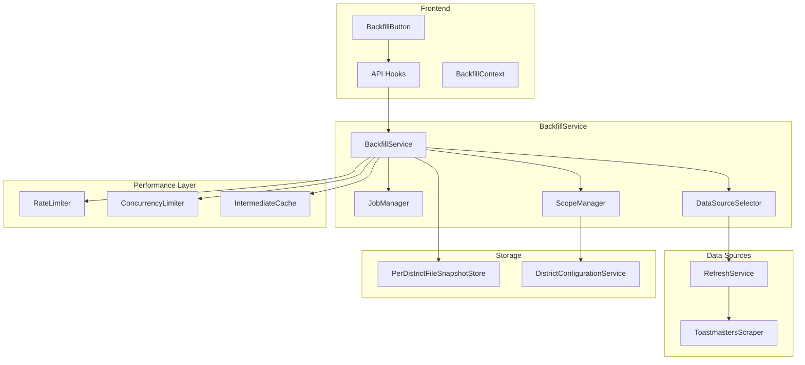

# Unified BackfillService - Complete Documentation

## Quick Start

The Unified BackfillService is a modern, comprehensive solution for historical data collection that replaces both the legacy BackfillService and DistrictBackfillService.

### Basic Usage

```typescript
import { BackfillService } from './services/UnifiedBackfillService.js'

// Initialize service
const service = new BackfillService(
  refreshService,
  snapshotStore,
  configService
)

// Start a simple backfill
const backfillId = await service.initiateBackfill({
  startDate: '2024-01-01',
  endDate: '2024-01-30',
})

// Monitor progress
const status = service.getBackfillStatus(backfillId)
console.log(`Progress: ${status.progress.completed}/${status.progress.total}`)
```

### HTTP API Usage

```bash
# Start backfill
curl -X POST http://localhost:5001/api/districts/backfill \
  -H "Content-Type: application/json" \
  -d '{"startDate": "2024-01-01", "endDate": "2024-01-30"}'

# Check status
curl http://localhost:5001/api/districts/backfill/your-backfill-id

# Cancel backfill
curl -X DELETE http://localhost:5001/api/districts/backfill/your-backfill-id
```

## Documentation Index

### Core Documentation

- **[Unified BackfillService Documentation](./unified-backfill-service.md)** - Complete service overview, architecture, and features
- **[API Reference](./unified-backfill-api-reference.md)** - Detailed HTTP API documentation with request/response formats
- **[Usage Examples](./unified-backfill-examples.md)** - Comprehensive examples for various scenarios

### Key Features

#### 🔄 RefreshService Integration

- Direct use of proven RefreshService methods for reliable data acquisition
- Seamless integration with existing data collection infrastructure
- Maintains compatibility with RefreshService snapshot formats

#### 🧠 Intelligent Collection

- Automatic selection of optimal collection strategies based on scope and requirements
- System-wide, per-district, and targeted collection modes
- Efficiency optimization based on district count and data requirements

#### 📊 Unified Job Management

- Single job queue for all backfill types with unified progress tracking
- Comprehensive error tracking with district-level granularity
- Real-time progress monitoring with detailed status information

#### 🛡️ Enhanced Error Handling

- District-level error tracking with partial snapshot creation
- Automatic retry logic with exponential backoff for transient failures
- Graceful degradation - individual district failures don't stop entire operations

#### 🚀 Performance Optimization

- Built-in rate limiting to protect external data sources
- Configurable concurrency controls for optimal resource utilization
- Intermediate result caching to avoid redundant operations

#### 🎯 Modern API Design

- Clean, RESTful API interface with comprehensive error handling
- Flexible request configuration with intelligent defaults
- Detailed response formats with actionable error information

## Architecture Overview



## Collection Strategies

The service automatically selects the optimal collection strategy:

### System-Wide Collection

- **When**: No target districts specified or all configured districts requested
- **Method**: Uses `RefreshService.executeRefresh()` for comprehensive data collection
- **Efficiency**: High (single operation covers all districts)
- **Best For**: Regular system-wide data refresh, initial data population

### Per-District Collection

- **When**: Single district or small number of districts with detailed data needs
- **Method**: Uses RefreshService scraper methods for district-specific data
- **Efficiency**: Medium (multiple operations but detailed data)
- **Best For**: Detailed analysis of specific districts, troubleshooting data issues

### Targeted Collection

- **When**: Multiple specific districts requested
- **Method**: Hybrid approach - system-wide with filtering or per-district based on count
- **Efficiency**: Variable (optimized based on district count)
- **Best For**: Batch operations on specific district subsets, regional analysis

## Error Handling

### Error Types and Handling

```typescript
// Error types automatically classified by the service
type ErrorType =
  | 'fetch_failed' // Network or API errors
  | 'validation_failed' // Data validation errors
  | 'processing_failed' // Processing logic errors
  | 'scope_violation' // District not in configured scope
  | 'network_error' // Network connectivity issues
  | 'timeout_error' // Request timeout
  | 'rate_limit_error' // Rate limiting triggered
  | 'data_unavailable' // Data not available for date/district
  | 'snapshot_creation_failed' // Snapshot storage failed
```

### Retry Logic

- **Automatic Classification**: Errors are automatically classified as retryable or permanent
- **Exponential Backoff**: Retryable errors use exponential backoff (2s, 4s, 8s, etc.)
- **Partial Success**: Operations continue even when some districts fail

## Performance Optimization

### Rate Limiting

```typescript
// Default configuration
{
  maxRequests: 10,      // Max 10 requests per minute
  windowMs: 60000,      // 1 minute window
  minDelayMs: 2000,     // Minimum 2 seconds between requests
  maxDelayMs: 30000,    // Maximum 30 seconds backoff
  backoffMultiplier: 2  // Exponential backoff
}
```

### Concurrency Control

```typescript
// Default configuration
{
  maxConcurrent: 3,     // Max 3 concurrent district operations
  timeoutMs: 300000,    // 5 minute timeout for acquiring slot
  queueLimit: 20        // Max 20 operations in queue
}
```

### Intermediate Caching

```typescript
// Default configuration
{
  defaultTtlMs: 3600000,    // 1 hour TTL for intermediate results
  maxEntries: 1000,         // Max 1000 cached results
  maxSizeBytes: 50 * 1024 * 1024, // 50MB cache size limit
  useLruEviction: true,     // Use LRU eviction policy
  cleanupIntervalMs: 300000 // Cleanup every 5 minutes
}
```

## Common Use Cases

### 1. Daily Data Refresh

```typescript
// Backfill yesterday's data for all districts
const backfillId = await service.initiateBackfill({
  startDate: new Date(Date.now() - 24 * 60 * 60 * 1000)
    .toISOString()
    .split('T')[0],
})
```

### 2. Historical Data Gap Filling

```typescript
// Fill missing data for specific date range
const backfillId = await service.initiateBackfill({
  startDate: '2024-01-01',
  endDate: '2024-01-31',
  skipExisting: true, // Only fill missing dates
})
```

### 3. District-Specific Analysis

```typescript
// Detailed data collection for specific districts
const backfillId = await service.initiateBackfill({
  targetDistricts: ['42', '15'],
  startDate: '2024-07-01',
  endDate: '2024-12-31',
  collectionType: 'per-district',
})
```

### 4. High-Performance Batch Processing

```typescript
// Optimized for speed with higher concurrency
const backfillId = await service.initiateBackfill({
  startDate: '2024-01-01',
  endDate: '2024-03-31',
  concurrency: 8,
  rateLimitDelayMs: 1000,
  enableCaching: true,
})
```

### 5. Conservative Processing

```typescript
// Optimized for reliability over speed
const backfillId = await service.initiateBackfill({
  startDate: '2024-01-01',
  endDate: '2024-12-31',
  concurrency: 1,
  rateLimitDelayMs: 5000,
  retryFailures: true,
})
```

## Monitoring and Debugging

### Real-Time Monitoring

```typescript
// Monitor job progress with detailed information
const status = service.getBackfillStatus(backfillId)

console.log(`Status: ${status.status}`)
console.log(`Progress: ${status.progress.completed}/${status.progress.total}`)
console.log(`Errors: ${status.progress.totalErrors}`)

// Performance metrics
const perf = service.getPerformanceStatus()
console.log(
  `Cache hit rate: ${Math.round(perf.intermediateCache.hitRate * 100)}%`
)
```

### Error Analysis

```typescript
// Analyze errors and partial snapshots
if (status.errorSummary) {
  console.log(`Total errors: ${status.errorSummary.totalErrors}`)
  console.log(
    `Affected districts: ${status.errorSummary.affectedDistricts.join(', ')}`
  )
  console.log(`Retryable: ${status.errorSummary.retryableErrors}`)
  console.log(`Permanent: ${status.errorSummary.permanentErrors}`)
}

// Review partial snapshots
if (status.partialSnapshots) {
  for (const partial of status.partialSnapshots) {
    console.log(
      `Snapshot ${partial.snapshotId}: ${Math.round(partial.successRate * 100)}% success`
    )
  }
}
```

## Migration from Legacy Services

### API Changes

- **Unified Endpoint**: Single `/api/districts/backfill` endpoint replaces multiple endpoints
- **Enhanced Request Format**: More flexible targeting and configuration options
- **Improved Response Format**: Comprehensive progress tracking and error information

### Behavioral Changes

- **RefreshService Integration**: Uses RefreshService methods instead of direct scraping
- **Enhanced Error Handling**: District-level error tracking with partial snapshots
- **Performance Optimization**: Built-in rate limiting, concurrency control, and caching

### Migration Steps

1. Update API clients to use new endpoint format
2. Update request/response handling for new data structures
3. Remove references to legacy BackfillService and DistrictBackfillService
4. Test with new error handling and progress tracking features

## Best Practices

### Request Configuration

- **Use Auto Collection Type**: Let the service select the optimal strategy
- **Set Reasonable Concurrency**: Start with default (3) and adjust based on performance
- **Enable Caching**: Improves performance for repeated operations
- **Configure Retry Logic**: Enable retries for better resilience

### Error Handling

- **Monitor Partial Snapshots**: Review partial results for data completeness
- **Check Error Summaries**: Use error summaries to identify systemic issues
- **Review District Progress**: Monitor district-level progress for targeted troubleshooting

### Performance Tuning

- **Monitor Cache Hit Rates**: High hit rates indicate effective caching
- **Adjust Rate Limits**: Balance speed with external service protection
- **Scale Concurrency Carefully**: Higher concurrency may overwhelm external services

## Troubleshooting

### Common Issues

#### "No valid districts to process"

- **Cause**: All target districts are out of configured scope
- **Solution**: Check district configuration service, verify target districts are valid
- **Debug**: Review district validation logs for detailed error information

#### High failure rates

- **Cause**: Network issues, rate limiting, or external service problems
- **Solution**: Check connectivity, review rate limiting settings, examine external service status
- **Debug**: Analyze error breakdown by type, check performance metrics

#### Slow processing

- **Cause**: Conservative settings, low cache hit rates, or external service latency
- **Solution**: Increase concurrency (carefully), check cache performance, review rate limiting
- **Debug**: Monitor performance status, analyze processing times per district

#### Partial snapshots

- **Cause**: Some districts failing while others succeed
- **Solution**: Review district-level errors in the error summary
- **Debug**: Examine error summaries, review district progress details

### Debug Commands

```bash
# Check service health
curl http://localhost:5001/api/admin/snapshot-store/health

# List recent snapshots
curl http://localhost:5001/api/admin/snapshots?limit=10

# Check performance metrics
curl http://localhost:5001/api/admin/snapshot-store/performance
```

## Support and Resources

### Documentation

- [Complete Service Documentation](./unified-backfill-service.md)
- [API Reference Guide](./unified-backfill-api-reference.md)
- [Comprehensive Examples](./unified-backfill-examples.md)

### Getting Help

1. Check the application logs for detailed error messages
2. Use the status endpoint to understand current job state
3. Review error summaries for patterns and systemic issues
4. Analyze performance metrics for optimization opportunities

### Contributing

When contributing to the Unified BackfillService:

1. Follow the existing code patterns and documentation standards
2. Add comprehensive tests for new features
3. Update documentation for any API changes
4. Consider backward compatibility and migration paths

---

_The Unified BackfillService provides a modern, reliable, and efficient solution for historical data collection. Its comprehensive error handling, performance optimization, and detailed monitoring capabilities make it suitable for both simple daily refreshes and complex historical data analysis projects._
