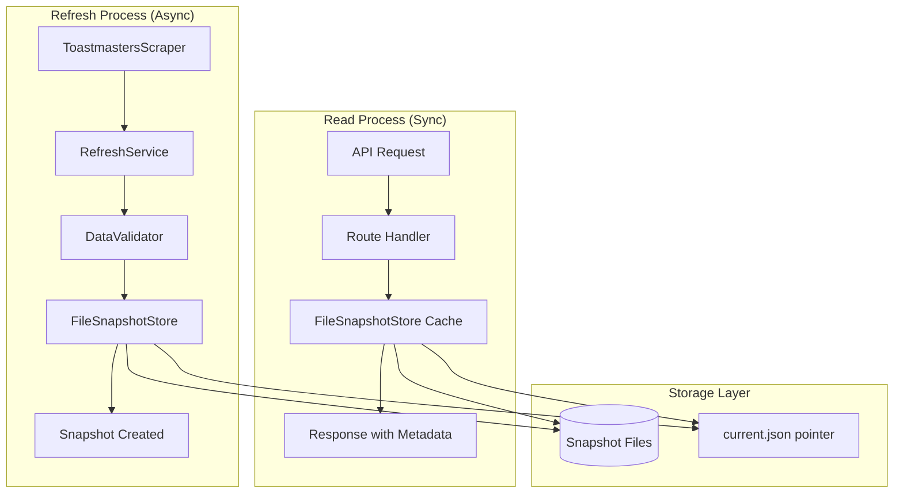
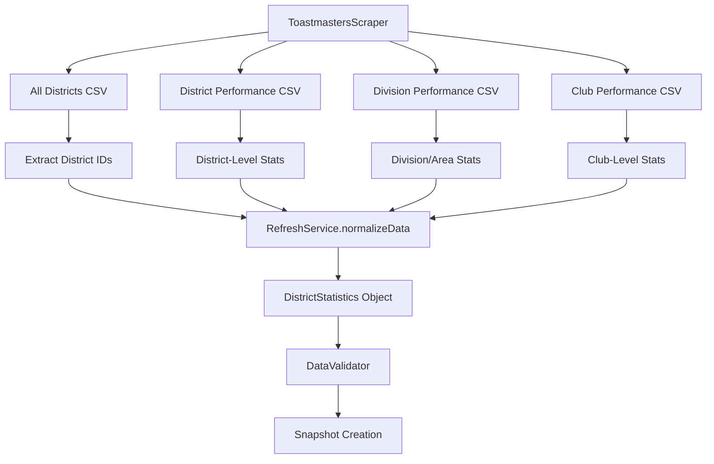
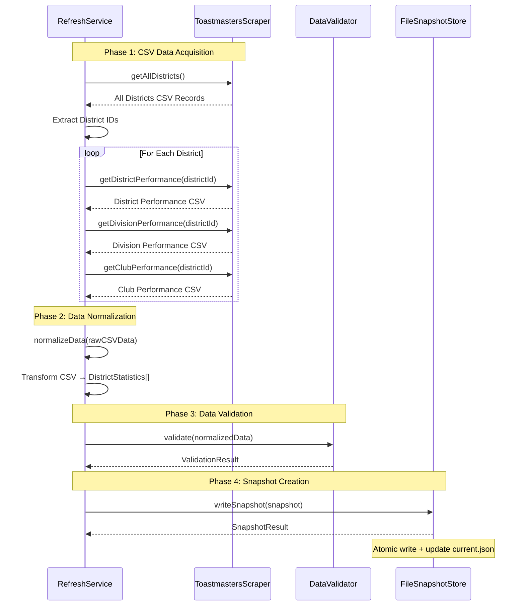

# Toastmasters Statistics Backend Architecture

**Status:** Authoritative  
**Applies to:** Toastmasters Statistics Application Backend  
**Audience:** Developers, System Architects, Future Maintainers  
**Owner:** Development Team  
**Last Updated:** January 6, 2026

---

## Table of Contents

1. [Overview](#overview)
2. [Core Architectural Pattern](#core-architectural-pattern)
3. [Service Architecture](#service-architecture)
4. [Data Flow Architecture](#data-flow-architecture)
5. [Storage Layer](#storage-layer)
6. [API Layer](#api-layer)
7. [Data Model](#data-model)
8. [Dependency Injection System](#dependency-injection-system)
9. [Performance Optimizations](#performance-optimizations)
10. [Error Handling & Resilience](#error-handling--resilience)
11. [Testing Infrastructure](#testing-infrastructure)
12. [Technology Stack](#technology-stack)
13. [Directory Structure](#directory-structure)
14. [Operational Characteristics](#operational-characteristics)

---

## Overview

The Toastmasters Statistics backend implements a **snapshot-based data architecture** that fundamentally separates data acquisition from data access. This design ensures consistent performance and reliability for users while handling the inherent unreliability of web scraping operations.

### Key Design Principles

1. **Process Separation**: Refresh and read operations are completely independent
2. **Immutability**: Snapshots are immutable once created
3. **Versioning**: Schema and calculation versions enable safe evolution
4. **Resilience**: Circuit breakers, retry logic, and error recovery
5. **Performance**: In-memory caching and concurrent read optimization
6. **Observability**: Comprehensive logging and metrics tracking
7. **Testability**: Integration tests validate end-to-end workflows
8. **Maintainability**: Clear separation of concerns and modular design

---

## Core Architectural Pattern

The system operates on two completely independent processes that never interfere with each other:

### Refresh Operations (Asynchronous)

- Scrape data from Toastmasters dashboard
- Normalize and validate the data
- Create immutable snapshots
- **Never block read operations**

### Read Operations (Synchronous)

- Serve data from the latest successful snapshot
- Provide consistent sub-10ms response times
- **Independent of refresh status or failures**



---

## Data Flow Architecture

### 1. Data Acquisition Layer

#### ToastmastersScraper

**Purpose**: Primary data source integration  
**Technology**: Playwright for browser automation  
**Responsibilities**:

- Automate browser interactions with Toastmasters dashboard
- Handle program year calculations and URL generation
- Export CSV data from dashboard tables
- Manage browser lifecycle and error recovery

**Key Methods**:

```typescript
getAllDistricts(): Promise<ScrapedRecord[]>
getDistrictPerformance(districtId: string): Promise<ScrapedRecord[]>
getDivisionPerformance(districtId: string): Promise<ScrapedRecord[]>
getClubPerformance(districtId: string): Promise<ScrapedRecord[]>
```

#### CSV Data Sources and Flow

The scraper acquires **four distinct CSV files** from the Toastmasters dashboard, each containing different levels of organizational data:

**1. All Districts Summary CSV** (`getAllDistricts()`)

- **Source URL**: `https://dashboards.toastmasters.org/[PROGRAM-YEAR]/Default.aspx`
- **Content**: High-level performance metrics for all districts
- **Typical Columns**: District ID, District Name, Total Clubs, Total Members, Goals Met, Performance Metrics
- **Usage**: Provides district-level overview and identifies which districts exist
- **Data Destination**: Used to extract district IDs and populate district-level statistics

**2. District Performance CSV** (`getDistrictPerformance()`)

- **Source URL**: `https://dashboards.toastmasters.org/[PROGRAM-YEAR]/District.aspx?id={districtId}`
- **Content**: Detailed district-level performance and membership data
- **Typical Columns**: Membership statistics, club counts by status, educational awards, goal progress
- **Usage**: Primary source for district-level metrics and performance calculations
- **Data Destination**: Transforms into `DistrictStatistics.membership`, `DistrictStatistics.clubs`, `DistrictStatistics.education`

**3. Division Performance CSV** (`getDivisionPerformance()`)

- **Source URL**: `https://dashboards.toastmasters.org/[PROGRAM-YEAR]/Division.aspx?id={districtId}`
- **Content**: Division and area-level performance within a district
- **Typical Columns**: Division ID, Area ID, Total Clubs, Total Members, Goals Met, Performance Metrics
- **Usage**: Provides mid-level organizational structure and performance
- **Data Destination**: Transforms into `DistrictStatistics.divisions[]` and area-level analytics

**4. Club Performance CSV** (`getClubPerformance()`)

- **Source URL**: `https://dashboards.toastmasters.org/[PROGRAM-YEAR]/Club.aspx?id={districtId}`
- **Content**: Individual club performance and membership data
- **Typical Columns**: Club Number, Club Name, Division, Area, Active Members, Goals Met, Club Status, Distinguished Status
- **Usage**: Most granular data for club-level analysis and member tracking
- **Data Destination**: Transforms into `DistrictStatistics.clubs[]` array with detailed club information

#### CSV Processing Pipeline



#### Data Transformation Flow

**Raw CSV Records** (`ScrapedRecord[]`)

- Dynamic key-value pairs from CSV columns
- String/number values requiring parsing and validation
- Inconsistent column names across different dashboard versions

**↓ Normalization Process**

**Structured District Data** (`DistrictStatistics`)

```typescript
interface DistrictStatistics {
  districtId: string // From All Districts CSV
  membership: MembershipStats // From District Performance CSV
  clubs: ClubStats // From District + Club Performance CSV
  education: EducationStats // From District Performance CSV
  divisions: DivisionStats[] // From Division Performance CSV
  clubDetails: ClubDetail[] // From Club Performance CSV
  performance: PerformanceMetrics // Calculated from multiple sources
}
```

#### Program Year Handling

The scraper automatically calculates the correct program year for URLs:

- **Toastmasters Program Year**: July 1 to June 30
- **URL Format**: `https://dashboards.toastmasters.org/2024-2025/`
- **Logic**: If current month ≥ July, use current year; otherwise use previous year
- **Historical Data**: Supports fetching data for specific dates with `dateString` parameter

#### RefreshService

**Purpose**: Orchestrates the complete refresh workflow  
**Responsibilities**:

- Integrate scraping with circuit breaker protection
- Implement retry logic with exponential backoff
- Coordinate four phases: scraping → normalization → validation → snapshot creation
- Record comprehensive metadata about each refresh attempt

**Workflow Phases**:

1. **Scraping Phase**: Fetch raw data with circuit breaker protection
   - Calls `getAllDistricts()` to get district overview and extract district IDs
   - For each district ID, calls:
     - `getDistrictPerformance(districtId)` - District-level metrics
     - `getDivisionPerformance(districtId)` - Division/area breakdown
     - `getClubPerformance(districtId)` - Individual club details
   - Each call protected by circuit breaker and retry logic
   - Results stored as `RawData` with separate CSV record arrays

2. **Normalization Phase**: Transform raw CSV data into structured DistrictStatistics
   - Processes each district's four CSV datasets
   - Parses string values to numbers, handles missing data
   - Combines related data (e.g., club counts from multiple sources)
   - Calculates derived metrics and performance indicators
   - Creates structured `DistrictStatistics[]` array

3. **Validation Phase**: Validate normalized data against Zod schemas
   - Ensures data integrity and business rule compliance
   - Validates cross-references between clubs, divisions, and districts
   - Checks for reasonable value ranges and consistency

4. **Snapshot Creation Phase**: Persist validated data as immutable snapshots
   - Creates versioned snapshot with metadata
   - Atomically updates current pointer if successful
   - Records errors and warnings for debugging

### 2. Data Processing Pipeline

The complete data flow from CSV acquisition to snapshot storage:



#### CSV Data Transformation Details

**Raw CSV Structure** (from dashboard exports):

```typescript
// Example records from each CSV source
type AllDistrictsRecord = {
  District: '42'
  'District Name': 'District 42'
  'Total Clubs': '156'
  'Total Members': '3,247'
  'Goals Met': '8/10'
  // ... additional performance columns
}

type ClubPerformanceRecord = {
  'Club Number': '123456'
  'Club Name': 'Example Toastmasters'
  Division: 'A'
  Area: '12'
  'Active Members': '23'
  'Goals Met': '7/10'
  'Club Status': 'Active'
  'Club Distinguished Status': 'Distinguished'
  // ... additional club metrics
}
```

**↓ Normalization Process**

**Structured Application Data**:

```typescript
interface DistrictStatistics {
  districtId: string // "42" (from All Districts CSV)
  membership: {
    total: number // 3247 (parsed from District Performance CSV)
    change: number // Calculated from historical data
    changePercent: number // Derived calculation
    byClub: ClubMembership[] // Aggregated from Club Performance CSV
  }
  clubs: {
    total: number // 156 (from All Districts CSV)
    active: number // Count from Club Performance CSV where Status="Active"
    suspended: number // Count where Status="Suspended"
    distinguished: number // Count where Distinguished Status="Distinguished"
    // ... other calculated counts
  }
  education: EducationStats // From District Performance CSV
  divisions: DivisionStats[] // From Division Performance CSV
  clubDetails: ClubDetail[] // From Club Performance CSV (normalized)
}
```

---

## Service Architecture

The backend implements a **modular, dependency-injected service architecture** with clear separation of concerns and proper lifecycle management.

### Core Service Categories

#### Data Acquisition & Processing Services

**RefreshService** (Orchestration Hub)

- **Purpose**: Coordinates the complete refresh workflow with circuit breaker protection
- **Dependencies**: ToastmastersScraper, DataValidator, SnapshotStore, DistrictConfigurationService, RankingCalculator
- **Features**: Four-phase workflow (scraping → normalization → validation → snapshot creation)
- **Error Handling**: District-level error tracking with partial snapshot creation
- **Integration**: Works with both FileSnapshotStore and PerDistrictSnapshotStore

**ToastmastersScraper** (Data Source Integration)

- **Purpose**: Browser automation for Toastmasters dashboard data acquisition
- **Technology**: Playwright for reliable browser automation
- **Data Sources**: Four distinct CSV exports (All Districts, District Performance, Division Performance, Club Performance)
- **Features**: Program year calculation, URL generation, browser lifecycle management

**DataValidator** (Quality Assurance)

- **Purpose**: Ensures data integrity using Zod schemas
- **Validation**: Business rules, consistency checks, format validation
- **Error Handling**: Distinguishes critical errors from warnings
- **Integration**: Used by RefreshService before snapshot creation

**RankingCalculator** (BordaCountRankingCalculator)

- **Purpose**: Sophisticated Borda count ranking algorithm for district performance
- **Categories**: Club growth, payment growth, distinguished club percentages
- **Features**: Tie handling, Borda point calculation, aggregate scoring
- **Integration**: Embedded in RefreshService workflow for snapshot creation

#### Storage & Persistence Services

**FileSnapshotStore** (Legacy Snapshot Storage)

- **Purpose**: File-based snapshot storage with atomic operations
- **Performance**: In-memory caching (5-minute TTL), concurrent read optimization
- **Features**: Atomic writes using temp files, integrity validation, recovery services
- **Storage**: Single JSON files per snapshot with current.json pointer

**PerDistrictFileSnapshotStore** (Modern Snapshot Storage)

- **Purpose**: Directory-based per-district snapshot storage
- **Structure**: Each snapshot as directory with individual district JSON files
- **Features**: Manifest tracking, district-level error handling, selective access
- **Performance**: Optimized for per-district data access patterns

**DistrictDataAggregator** (Data Access Optimization)

- **Purpose**: Efficient per-district data access with caching
- **Features**: LRU cache for district files, performance metrics, selective loading
- **Integration**: Works with PerDistrictSnapshotStore for API responses

**SnapshotIntegrityValidator** & **SnapshotRecoveryService**

- **Purpose**: Validates snapshot consistency and automatic recovery
- **Features**: Corruption detection, automatic repair, backup creation
- **Integration**: Used by both snapshot store implementations

#### Analytics & Caching Services

**AnalyticsEngine** (Data Processing)

- **Purpose**: Processes cached district data to generate insights and analytics
- **Features**: Club trends, division analytics, membership analytics, leadership insights
- **Performance**: In-memory caching with TTL, optimized data access patterns

**CacheManager** & **DistrictCacheManager**

- **Purpose**: Multi-level caching for performance optimization
- **Features**: TTL-based expiration, memory management, cache statistics
- **Integration**: Used across multiple services for performance optimization

**CacheConfigService** (Configuration Management)

- **Purpose**: Centralized cache directory configuration with security validation
- **Features**: Path security validation, write permission verification, automatic directory creation
- **Security**: Prevents path traversal attacks, validates system directory access

#### Backfill & Reconciliation Services

**UnifiedBackfillService** (Historical Data Collection)

- **Purpose**: Modern backfill orchestration using RefreshService methods
- **Features**: Intelligent collection strategy selection, job management, progress tracking
- **Performance**: Rate limiting, concurrency controls, intermediate caching
- **Integration**: Direct use of RefreshService for reliable data acquisition

**ReconciliationOrchestrator** (Month-End Processing)

- **Purpose**: Month-end data reconciliation and validation
- **Features**: Change detection, storage optimization, progress tracking
- **Dependencies**: ReconciliationStorageManager, ReconciliationCacheService, ChangeDetectionEngine

**ReconciliationStorageManager** & **ReconciliationCacheService**

- **Purpose**: Reconciliation-specific data persistence and caching
- **Features**: Optimized storage patterns, performance monitoring, cleanup automation

#### Infrastructure & Utility Services

**CircuitBreakerManager** (Failure Protection)

- **Purpose**: Protects external service calls from cascading failures
- **Features**: Configurable thresholds, automatic recovery, exponential backoff
- **Integration**: Used by ToastmastersScraper and external API calls

**RetryManager** (Resilience)

- **Purpose**: Exponential backoff retry logic with jitter
- **Features**: Configurable retry policies, operation-specific settings
- **Integration**: Used across all external service interactions

**AlertManager** & **ProgressTracker**

- **Purpose**: System monitoring and job progress tracking
- **Features**: Alert categorization, progress visualization, metrics collection

### Service Factory Pattern

**ProductionServiceFactory** (Service Creation)

- **Purpose**: Factory for creating production service instances with proper DI
- **Features**: Lifecycle management, configuration injection, mock support
- **Integration**: Central point for service instantiation and dependency resolution

**ServiceContainer** (Dependency Injection)

- **Purpose**: Generic DI container with lifecycle management
- **Features**: Singleton/scoped/transient lifecycles, circular dependency detection, disposal pattern
- **Testing**: Mock registration support for test isolation

---

## Storage Layer

### Snapshot-Based Storage Model

```
CACHE_DIR/
├── snapshots/
│   ├── 1704067200000.json    # Immutable snapshots (timestamp IDs)
│   ├── 1704153600000.json
│   └── 1704240000000.json
└── current.json              # Atomic pointer to latest successful snapshot
```

### Storage Characteristics

**Atomic Operations**:

- Uses temporary files + rename for crash safety
- Current pointer updated only after successful snapshot creation
- No partial writes or corrupted states

**Performance Features**:

- In-memory cache for current snapshot metadata and content
- Concurrent read deduplication (multiple requests share single file operation)
- Automatic cleanup of old snapshots (configurable age/count limits)
- Optional compression support (currently disabled)

**Integrity & Recovery**:

- **SnapshotIntegrityValidator**: Validates snapshot store consistency
- **SnapshotRecoveryService**: Automatic recovery from corrupted files
- **Pointer Recovery**: Scans directory to find latest successful snapshot if pointer corrupted
- **Backup Support**: Can create backups before recovery operations

### Storage Implementations

#### FileSnapshotStore (Legacy Format)

```
CACHE_DIR/
├── snapshots/
│   ├── 1704067200000.json    # Immutable snapshots (timestamp IDs)
│   ├── 1704153600000.json
│   └── 1704240000000.json
└── current.json              # Atomic pointer to latest successful snapshot
```

**Characteristics**:

- Single JSON file per snapshot containing all district data
- Optimized for system-wide data access
- In-memory caching with 5-minute TTL
- Concurrent read optimization with request deduplication

#### PerDistrictFileSnapshotStore (Modern Format)

```
CACHE_DIR/
├── snapshots/
│   ├── 1704067200000/                    # Snapshot directory
│   │   ├── metadata.json                 # Snapshot-level metadata
│   │   ├── manifest.json                 # List of district files
│   │   ├── district_42.json              # District 42 data
│   │   ├── district_15.json              # District 15 data
│   │   └── district_F.json               # District F data
│   └── 1704153600000/                    # Another snapshot
│       ├── metadata.json
│       ├── manifest.json
│       └── district_*.json
├── current.json                          # Points to latest successful snapshot
└── config/
    └── districts.json                    # District configuration
```

**Characteristics**:

- Directory-based storage with individual district files
- Manifest tracking for district-level status
- Optimized for per-district data access
- Enhanced error tracking and partial snapshot support
- Selective file loading for improved performance

### Configuration

```typescript
interface SnapshotStoreConfig {
  cacheDir: string // Base directory for snapshots
  maxSnapshots?: number // Max snapshots to retain (default: 100)
  maxAgeDays?: number // Max age in days (default: 30)
  enableCompression?: boolean // Enable gzip compression (default: false)
}
```

---

## API Layer

### District Data Endpoints (`/api/districts`)

| Endpoint                           | Method | Purpose                                     |
| ---------------------------------- | ------ | ------------------------------------------- |
| `/`                                | GET    | List all available districts                |
| `/rankings`                        | GET    | Get all districts with performance rankings |
| `/:districtId/statistics`          | GET    | Fetch district statistics                   |
| `/:districtId/membership-history`  | GET    | Membership trends                           |
| `/:districtId/clubs`               | GET    | List clubs in district                      |
| `/:districtId/educational-awards`  | GET    | Educational awards history                  |
| `/:districtId/daily-reports`       | GET    | Daily reports for date range                |
| `/:districtId/daily-reports/:date` | GET    | Specific daily report                       |

#### Rankings Endpoint Details

**GET `/api/districts/rankings`**

Returns comprehensive district rankings data from the all-districts-rankings.json file.

**Purpose**: Provides BordaCount-based performance rankings for all districts worldwide, regardless of which districts are configured for detailed data collection.

**Response Structure**:

```json
{
  "rankings": [
    {
      "districtId": "42",
      "districtName": "District 42",
      "region": "Region 5",
      "paidClubs": 245,
      "paidClubBase": 240,
      "clubGrowthPercent": 2.08,
      "totalPayments": 12500,
      "paymentBase": 12000,
      "paymentGrowthPercent": 4.17,
      "activeClubs": 243,
      "distinguishedClubs": 180,
      "selectDistinguished": 45,
      "presidentsDistinguished": 12,
      "distinguishedPercent": 74.07,
      "clubsRank": 15,
      "paymentsRank": 8,
      "distinguishedRank": 3,
      "aggregateScore": 342.5
    }
    // ... more districts
  ],
  "date": "2025-01-07",
  "_snapshot_metadata": {
    "snapshot_id": "2025-01-07",
    "created_at": "2025-01-07T10:30:00.000Z",
    "data_source": "all-districts-rankings-file",
    "from_cache": false,
    "calculation_version": "2.0.0",
    "ranking_version": "borda-count-v1"
  }
}
```

**Response Fields**:

_Rankings Array_ - Each district object contains:

- `districtId`: Unique district identifier (e.g., "42", "F")
- `districtName`: Human-readable district name
- `region`: Toastmasters International region designation
- `paidClubs`: Current number of paid clubs
- `paidClubBase`: Baseline number of paid clubs for growth calculation
- `clubGrowthPercent`: Percentage growth in paid clubs
- `totalPayments`: Current total member payments
- `paymentBase`: Baseline payments for growth calculation
- `paymentGrowthPercent`: Percentage growth in member payments
- `activeClubs`: Number of active clubs
- `distinguishedClubs`: Number of clubs achieving Distinguished status
- `selectDistinguished`: Number of clubs achieving Select Distinguished status
- `presidentsDistinguished`: Number of clubs achieving President's Distinguished status
- `distinguishedPercent`: Percentage of clubs achieving Distinguished or higher
- `clubsRank`: Rank based on club growth (1 = best)
- `paymentsRank`: Rank based on payment growth (1 = best)
- `distinguishedRank`: Rank based on distinguished club percentage (1 = best)
- `aggregateScore`: BordaCount aggregate score (higher = better overall performance)

_Metadata Fields_ (`_snapshot_metadata`):

- `snapshot_id`: ISO date format (YYYY-MM-DD) identifying the snapshot
- `created_at`: ISO 8601 timestamp when the snapshot was created
- `data_source`: Always "all-districts-rankings-file" - indicates data is read from the dedicated rankings file rather than aggregated from individual district files
- `from_cache`: Boolean indicating whether the source CSV data was retrieved from the Raw CSV Cache (true) or freshly downloaded (false)
- `calculation_version`: Semantic version of the data processing and normalization logic used (e.g., "2.0.0")
- `ranking_version`: Version identifier of the ranking algorithm used (e.g., "borda-count-v1")

**Data Source Details**:

The rankings endpoint reads from the `all-districts-rankings.json` file within each snapshot directory. This file is created during the refresh process and contains:

1. **Pre-calculated Rankings**: BordaCount rankings are calculated once during refresh, not on-demand
2. **Comprehensive Coverage**: Includes all districts from the "All Districts" CSV (~126 districts worldwide)
3. **Independent of Configuration**: Rankings include all districts regardless of which districts are configured for detailed data collection
4. **Cached Source Data**: The `from_cache` field indicates whether the source CSV was retrieved from cache, improving refresh performance

**Performance Characteristics**:

- Response time: Sub-10ms (served from snapshot file)
- Cache TTL: 15 minutes (HTTP cache middleware)
- Data freshness: Reflects latest successful snapshot (check `created_at` timestamp)

**Error Responses**:

_503 Service Unavailable_ - No snapshot available:

```json
{
  "error": {
    "code": "NO_SNAPSHOT_AVAILABLE",
    "message": "No data snapshot available yet",
    "details": "Run a refresh operation to create the first snapshot"
  }
}
```

_500 Internal Server Error_ - Rankings file missing:

```json
{
  "error": {
    "code": "RANKINGS_DATA_NOT_FOUND",
    "message": "Rankings data not found in snapshot",
    "details": "The snapshot does not contain all-districts-rankings data"
  }
}
```

**Usage Notes**:

- Rankings are sorted by `aggregateScore` in descending order (best performers first)
- The `date` field indicates the data-as-of date for the rankings
- Rankings are immutable once created - they reflect the calculation version at snapshot creation time
- For historical rankings, query specific snapshot IDs through admin endpoints

### Admin Endpoints (`/api/admin`)

| Endpoint                            | Method | Purpose                       |
| ----------------------------------- | ------ | ----------------------------- |
| `/snapshots`                        | GET    | List snapshots with filtering |
| `/snapshots/:snapshotId`            | GET    | Inspect specific snapshot     |
| `/snapshots/:snapshotId/payload`    | GET    | Get full snapshot payload     |
| `/snapshot-store/health`            | GET    | Health check                  |
| `/snapshot-store/integrity`         | GET    | Integrity validation          |
| `/snapshot-store/performance`       | GET    | Performance metrics           |
| `/snapshot-store/performance/reset` | POST   | Reset metrics                 |
| `/process-separation/validate`      | GET    | Validate process separation   |
| `/process-separation/monitor`       | GET    | Monitor concurrent operations |
| `/process-separation/compliance`    | GET    | Compliance metrics            |
| `/process-separation/independence`  | GET    | Read performance independence |

### Reconciliation Endpoints (`/api/reconciliation`)

| Endpoint                    | Method | Purpose                       |
| --------------------------- | ------ | ----------------------------- |
| `/jobs`                     | GET    | List reconciliation jobs      |
| `/jobs`                     | POST   | Create new reconciliation job |
| `/jobs/:jobId`              | GET    | Get job status and details    |
| `/jobs/:jobId`              | DELETE | Cancel running job            |
| `/jobs/:jobId/progress`     | GET    | Get detailed progress info    |
| `/performance/metrics`      | GET    | Performance metrics           |
| `/performance/optimization` | POST   | Trigger optimization          |

### Assessment Endpoints (`/api/assessment`)

| Endpoint                             | Method | Purpose                       |
| ------------------------------------ | ------ | ----------------------------- |
| `/monthly/:districtId`               | GET    | Get monthly assessments       |
| `/monthly/:districtId`               | POST   | Create monthly assessment     |
| `/monthly/:districtId/:month`        | GET    | Get specific month assessment |
| `/monthly/:districtId/:month`        | PUT    | Update monthly assessment     |
| `/monthly/:districtId/:month`        | DELETE | Delete monthly assessment     |
| `/district-leader-goals/:districtId` | GET    | Get district leader goals     |
| `/district-leader-goals/:districtId` | POST   | Create district leader goals  |
| `/reports/:districtId/:month`        | GET    | Generate assessment report    |

### Cache Management Endpoints (`/api/districts/cache`)

| Endpoint                | Method | Purpose                       |
| ----------------------- | ------ | ----------------------------- |
| `/cache/dates`          | GET    | All cached dates              |
| `/cache/statistics`     | GET    | Cache statistics and metadata |
| `/cache/metadata/:date` | GET    | Metadata for specific date    |
| `/cache/version`        | GET    | Cache version information     |
| `/cache/stats`          | GET    | Detailed cache statistics     |
| `/cache`                | DELETE | Clear all cache               |

### Response Pattern

All API responses include snapshot metadata for transparency:

```json
{
  "data": {
    /* actual response data */
  },
  "_snapshot_metadata": {
    "snapshot_id": "1704067200000",
    "created_at": "2024-01-01T00:00:00Z",
    "data_as_of": "2023-12-31",
    "schema_version": "1.0.0",
    "calculation_version": "2.1.0"
  }
}
```

### Rankings Endpoint Metadata

The `/api/districts/rankings` endpoint includes additional metadata fields beyond the standard snapshot metadata:

**Standard Metadata** (present in all endpoints):

- `snapshot_id`: Unique identifier for the snapshot (ISO date format for modern snapshots)
- `created_at`: ISO 8601 timestamp when the snapshot was created
- `schema_version`: Version of the data structure format
- `calculation_version`: Version of the data processing and normalization logic

**Rankings-Specific Metadata** (unique to `/api/districts/rankings`):

- `data_source`: Always "all-districts-rankings-file" - indicates the data is read from a dedicated rankings file rather than aggregated from individual district files
- `from_cache`: Boolean indicating whether the source CSV data was retrieved from the Raw CSV Cache (true) or freshly downloaded from Toastmasters dashboard (false)
- `ranking_version`: Version identifier of the ranking algorithm used (e.g., "borda-count-v1")

**Purpose of Rankings Metadata**:

- `data_source`: Provides transparency about where the rankings data originates, helping developers understand the data flow
- `from_cache`: Indicates refresh performance optimization - cached data means faster refresh times and reduced load on Toastmasters servers
- `ranking_version`: Enables tracking of ranking algorithm changes over time, supporting historical analysis and algorithm validation

**Example Rankings Response**:

```json
{
  "rankings": [
    /* array of district rankings */
  ],
  "date": "2025-01-07",
  "_snapshot_metadata": {
    "snapshot_id": "2025-01-07",
    "created_at": "2025-01-07T10:30:00.000Z",
    "data_source": "all-districts-rankings-file",
    "from_cache": false,
    "calculation_version": "2.0.0",
    "ranking_version": "borda-count-v1"
  }
}
```

---

## Data Model

### Snapshot Structure

Each snapshot is an immutable, versioned container of application data:

```typescript
interface Snapshot {
  snapshot_id: string // Timestamp-based unique ID
  created_at: string // ISO timestamp
  schema_version: string // Data structure version
  calculation_version: string // Scoring logic version
  status: 'success' | 'partial' | 'failed'
  errors: string[] // Error details if failed
  payload: {
    districts: DistrictStatistics[]
    metadata: {
      source: string
      fetchedAt: string
      dataAsOfDate: string
      districtCount: number
      processingDurationMs: number
    }
  }
}
```

### District Statistics Model

```typescript
interface DistrictStatistics {
  districtId: string
  districtName: string
  membership: MembershipStats
  clubs: ClubStats
  education: EducationStats
  performance: PerformanceMetrics
  // ... additional fields
}
```

### Data Lifecycle

1. **Refresh Triggered** → Scrape raw data from Toastmasters dashboard
2. **Normalize** → Transform CSV records to structured DistrictStatistics
3. **Validate** → Check against Zod schemas and business rules
4. **Create Snapshot** → Persist with status (success/partial/failed)
5. **Update Pointer** → If successful, atomically update current.json
6. **Serve Reads** → API endpoints read from current snapshot
7. **Preserve History** → Failed snapshots retained for debugging

## Dependency Injection System

The backend implements a comprehensive dependency injection system for proper service lifecycle management and test isolation.

### Service Container Architecture

**DefaultServiceContainer** (Core DI Container)

- **Purpose**: Manages service registration, resolution, and lifecycle
- **Features**: Circular dependency detection, disposal pattern, mock support
- **Lifecycles**: Singleton, scoped, transient service instances

**Service Registration Pattern**:

```typescript
// Service token definition
const ServiceToken = createServiceToken<IService>('ServiceName')

// Service factory with disposal
const serviceFactory = createServiceFactory(
  container => new ServiceImpl(container.resolve(DependencyToken)),
  instance => instance.dispose?.()
)

// Registration
container.register(ServiceToken, serviceFactory, 'singleton')
```

**Service Resolution**:

```typescript
// Type-safe resolution
const service = container.resolve(ServiceToken)

// Automatic dependency injection
class ServiceImpl {
  constructor(
    private dependency: IDependency,
    private logger: ILogger
  ) {}
}
```

### Service Lifecycle Management

**Singleton Services** (Application-wide instances)

- RefreshService, SnapshotStore, CacheConfigService
- Created once per container, shared across all consumers
- Disposed in reverse creation order during container cleanup

**Scoped Services** (Request/operation-scoped)

- AnalyticsEngine, DistrictDataAggregator
- Single instance per scope, disposed at scope end
- Useful for request-specific caching and state

**Transient Services** (New instance per resolution)

- Utility services, validators, temporary processors
- No lifecycle management, garbage collected normally

### Production Service Factory

**ProductionServiceFactory** (Service Creation Hub)

- **Purpose**: Creates production-ready service instances with proper configuration
- **Features**: Environment-specific configuration, service registration automation
- **Integration**: Central point for all service instantiation

```typescript
const factory = getProductionServiceFactory()
const container = factory.createProductionContainer()
const refreshService = container.resolve(RefreshServiceToken)
```

### Configuration Management

**ProductionConfigurationProvider** (Environment Configuration)

- **Purpose**: Provides environment-specific configuration with validation
- **Features**: Environment variable integration, configuration validation, override support

**Configuration Structure**:

```typescript
interface ServiceConfiguration {
  cacheDirectory: string
  environment: 'test' | 'development' | 'production'
  logLevel: 'debug' | 'info' | 'warn' | 'error'
  // Additional service-specific configuration
}
```

### Test Integration

**Mock Registration** (Test Isolation)

- Services can be mocked for testing without affecting production code
- Container supports mock overrides for specific test scenarios
- Proper disposal ensures test isolation and resource cleanup

```typescript
// Test setup
container.registerMock(ServiceToken, mockService)
const testService = container.resolve(ServiceToken) // Returns mock
```

---

## Performance Optimizations

The backend implements multiple layers of performance optimization to ensure consistent sub-10ms response times for read operations.

### Multi-Level Caching Strategy

**In-Memory Caching**:

- **Current Snapshot Cache**: 5-minute TTL for latest snapshot data
- **Pointer Cache**: 30-second TTL for current.json pointer
- **District Data Cache**: 5-minute TTL for frequently accessed districts
- **Analytics Cache**: Configurable TTL for computed analytics results

**Cache Hierarchy**:

```
Request → In-Memory Cache → File System → External Source
    ↓         ↓                ↓            ↓
  ~1ms      ~5ms           ~10ms        ~5000ms
```

**Concurrent Read Optimization**:

- Request deduplication for identical snapshot requests
- Shared cache entries across concurrent requests
- Lock-free read operations with atomic updates

### File System Optimizations

**Atomic Operations**:

- Temporary file + rename pattern for crash safety
- No partial writes or corrupted states
- Consistent read performance during writes

**Access Pattern Optimization**:

- Stat caching for file metadata
- Selective file loading for per-district access
- Optimized directory scanning for snapshot listing

### Performance Monitoring

**Built-in Metrics Collection**:

```typescript
interface ReadPerformanceMetrics {
  totalReads: number
  cacheHits: number
  cacheMisses: number
  averageReadTime: number
  concurrentReads: number
  maxConcurrentReads: number
}
```

**Performance Endpoints**:

- `/api/admin/snapshot-store/performance` - Real-time metrics
- `/api/admin/process-separation/independence` - Read/write independence validation
- Performance metrics reset and monitoring capabilities

---

## Error Handling & Resilience

The system implements comprehensive error handling and resilience patterns to ensure reliable operation despite external service failures.

### Circuit Breaker Pattern

**CircuitBreakerManager** (Failure Protection)

- **Purpose**: Prevents cascading failures from external service issues
- **States**: Closed (normal), Open (failing), Half-Open (testing recovery)
- **Configuration**: Configurable failure thresholds, timeout periods, recovery testing

**Integration Points**:

- ToastmastersScraper dashboard interactions
- External API calls and data source access
- File system operations with potential for failure

### Retry Logic

**RetryManager** (Resilience)

- **Strategy**: Exponential backoff with jitter to prevent thundering herd
- **Configuration**: Operation-specific retry policies and maximum attempts
- **Integration**: Used across all external service interactions

**Retry Configuration**:

```typescript
interface RetryOptions {
  maxAttempts: number
  baseDelayMs: number
  maxDelayMs: number
  backoffMultiplier: number
  jitterMs: number
}
```

### Error Recovery

**Snapshot Recovery System**:

- **SnapshotIntegrityValidator**: Detects corrupted or invalid snapshots
- **SnapshotRecoveryService**: Automatic recovery from corrupted files
- **Pointer Recovery**: Scans directory to rebuild current.json if corrupted
- **Backup Creation**: Creates backups before recovery operations

**District-Level Error Handling**:

- Individual district failures don't stop processing of other districts
- Partial snapshots created when some districts fail
- Detailed error tracking for retry logic and debugging

### Graceful Degradation

**Last-Known-Good Data Pattern**:

- Application continues serving data from last successful snapshot
- Users see data freshness timestamp for transparency
- Refresh failures don't affect read operation availability

**Error Response Patterns**:

- Consistent error response format across all endpoints
- Detailed error information for debugging without exposing internals
- Proper HTTP status codes and error categorization

---

## Testing Infrastructure

The backend implements comprehensive testing infrastructure aligned with the testing steering documents.

### Test Configuration

**Vitest Configuration** (Test Runner)

- **Execution**: Sequential execution with `pool: 'forks'` and `singleFork: true`
- **Isolation**: Each test file runs in isolated environment
- **Timeouts**: 30-second test timeout, 10-second hook timeout
- **Setup**: Dedicated setup files for test environment initialization

**Test Categories**:

- **Unit Tests**: Core logic and business rules validation
- **Integration Tests**: End-to-end workflow validation
- **Property Tests**: Universal correctness properties using fast-check
- **Golden Tests**: Snapshot-based testing for stable outputs

### Test Isolation Patterns

**Resource Isolation**:

- **Unique Directories**: Each test uses timestamp-based unique directories
- **Port Management**: Dynamic port allocation for concurrent test execution
- **Environment Variables**: Scoped environment variables per test
- **Service Instances**: Fresh service instances via dependency injection

**Cleanup Patterns**:

```typescript
// Test setup with proper cleanup
afterEach(async () => {
  await testService.dispose()
  await fs.rm(testDirectory, { recursive: true, force: true })
  // Verify cleanup completion
})
```

### Dependency Injection in Tests

**Test Service Factory**:

- **TestServiceFactory**: Creates test-specific service instances
- **Mock Registration**: Easy mock service registration for isolation
- **Resource Management**: Automatic cleanup of test resources

**Test Container Pattern**:

```typescript
// Test-specific container with mocks
const testContainer = createTestContainer()
testContainer.registerMock(ExternalServiceToken, mockService)
const serviceUnderTest = testContainer.resolve(ServiceToken)
```

### Property-Based Testing

**Fast-Check Integration**:

- Universal correctness properties for ranking calculations
- Data validation property tests for edge cases
- Snapshot consistency property tests
- Performance property tests for response time guarantees

---

## Technology Stack

### Core Technologies

- **Runtime**: Node.js with TypeScript (ES modules)
- **Web Framework**: Express.js with middleware support
- **Web Scraping**: Playwright (headless browser automation)
- **Validation**: Zod (schema validation and type safety)
- **Testing**: Vitest (unit, integration, and property-based tests)
- **Property Testing**: fast-check for universal correctness properties

### Supporting Libraries

- **Logging**: Custom structured logger with operation IDs
- **Retry Logic**: Custom RetryManager with exponential backoff and jitter
- **Circuit Breaker**: Custom CircuitBreaker implementation with state management
- **CORS**: cors middleware for cross-origin requests
- **Environment**: dotenv for configuration management
- **Rate Limiting**: express-rate-limit for API protection
- **CSV Processing**: csv-parse for dashboard data processing
- **UUID Generation**: uuid for unique identifier generation
- **Caching**: node-cache for in-memory caching with TTL

### Development Tools

- **TypeScript**: Full type safety and IDE support with strict configuration
- **ESLint**: Code quality and consistency with TypeScript integration
- **Prettier**: Code formatting with consistent style
- **Husky**: Git hooks for quality gates and pre-commit validation
- **TSX**: TypeScript execution for development and scripts

---

## Directory Structure

```
backend/
├── src/
│   ├── index.ts                 # Express server entry point
│   ├── config/                  # Configuration management
│   │   └── index.ts            # Environment-based configuration
│   ├── routes/                  # API route handlers
│   │   ├── districts.ts         # District data endpoints
│   │   ├── admin.ts            # Admin and debugging endpoints
│   │   ├── reconciliation.ts   # Reconciliation job management
│   │   └── assessment.ts       # Assessment module endpoints
│   ├── services/               # Core business logic
│   │   ├── RefreshService.ts   # Refresh orchestration
│   │   ├── ToastmastersScraper.ts # Data acquisition
│   │   ├── DataValidator.ts    # Data validation
│   │   ├── FileSnapshotStore.ts # Legacy snapshot persistence
│   │   ├── PerDistrictSnapshotStore.ts # Modern per-district storage
│   │   ├── DistrictDataAggregator.ts # Efficient data access
│   │   ├── RankingCalculator.ts # Borda count ranking algorithm
│   │   ├── AnalyticsEngine.ts  # Data processing and insights
│   │   ├── UnifiedBackfillService.ts # Historical data collection
│   │   ├── ReconciliationOrchestrator.ts # Month-end processing
│   │   ├── CacheConfigService.ts # Cache configuration
│   │   ├── ServiceContainer.ts # Dependency injection
│   │   ├── ProductionServiceFactory.ts # Service factory
│   │   └── TestServiceFactory.ts # Test service factory
│   ├── types/                  # TypeScript type definitions
│   │   ├── snapshots.ts        # Snapshot-related types
│   │   ├── districts.ts        # District data types
│   │   ├── analytics.ts        # Analytics types
│   │   ├── serviceContainer.ts # DI container types
│   │   └── serviceInterfaces.ts # Service interface definitions
│   ├── utils/                  # Shared utilities
│   │   ├── logger.ts           # Structured logging
│   │   ├── RetryManager.ts     # Retry logic
│   │   ├── CircuitBreaker.ts   # Circuit breaker pattern
│   │   ├── AlertManager.ts     # Alert management
│   │   ├── transformers.ts     # Data transformation
│   │   └── cacheKeys.ts        # Cache key generation
│   ├── middleware/             # Express middleware
│   │   └── cache.ts           # Caching middleware
│   ├── scripts/               # Utility scripts
│   │   ├── refresh-cli.ts     # Manual refresh script
│   │   ├── validate-snapshot-integrity.ts # Snapshot validation
│   │   └── snapshot-debug.ts  # Snapshot debugging
│   └── __tests__/             # Test files
│       ├── vitest.setup.ts    # Test setup configuration
│       ├── integration/        # Integration tests
│       ├── unit/              # Unit tests
│       └── property/          # Property-based tests
├── cache/                     # Default snapshot storage
│   ├── snapshots/            # Snapshot files/directories
│   ├── current.json          # Current snapshot pointer
│   └── config/               # Configuration files
├── scripts/                  # Build and utility scripts
│   └── cleanup-test-dirs.sh  # Test cleanup script
├── package.json              # Dependencies and scripts
├── tsconfig.json            # TypeScript configuration
├── tsconfig.all.json        # Extended TypeScript configuration
├── vitest.config.ts         # Test configuration
└── eslint.config.js         # Linting configuration
```

---

## Operational Characteristics

### Reliability Features

- **Process Separation**: Refresh and read operations are completely independent
- **Last-Known-Good Data**: Failed refreshes don't affect current data availability
- **Circuit Breaker Protection**: Prevents cascading failures from external service issues
- **Automatic Recovery**: Corrupted snapshots are automatically detected and recovered
- **Comprehensive Error Logging**: Structured logging with operation IDs for debugging
- **District-Level Error Handling**: Individual district failures don't stop overall processing

### Performance Features

- **Sub-10ms Read Operations**: Cached responses regardless of refresh status
- **Multi-Level Caching**: In-memory, file system, and application-level caching
- **Concurrent Read Optimization**: Request deduplication and shared cache entries
- **Selective Data Loading**: Per-district access patterns for improved performance
- **Performance Monitoring**: Built-in metrics collection and monitoring endpoints
- **Zero Downtime**: Read operations continue during refresh activities

### Maintainability Features

- **Schema and Calculation Versioning**: Safe evolution of data structures and algorithms
- **Historical Data Preservation**: All snapshots retained for analysis and comparison
- **Comprehensive Admin Endpoints**: Debugging and monitoring capabilities
- **Dependency Injection**: Proper service lifecycle management and test isolation
- **Integration Test Coverage**: End-to-end workflow validation
- **Clear Separation of Concerns**: Modular architecture with defined interfaces

### Monitoring & Observability

**Structured Logging**:

- All operations include operation IDs for distributed tracing
- Performance metrics for read/write operations with timing data
- Error details with context for debugging without exposing sensitive information
- Request/response logging with sanitized data

**Health Checks**:

- `/health` endpoint provides comprehensive system status
- Snapshot store integrity validation with detailed reporting
- Process separation compliance monitoring and validation
- Service dependency health checking

**Performance Metrics**:

- Cache hit/miss ratios across all caching layers
- Concurrent read statistics and peak usage tracking
- Refresh operation timing and success rates
- Error rates and patterns with categorization
- Resource utilization monitoring (memory, disk, CPU)

**Alert Management**:

- Configurable alert thresholds for system metrics
- Alert categorization (info, warning, critical)
- Integration points for external monitoring systems

### Security Features

- **Path Traversal Protection**: Cache directory validation prevents unsafe paths
- **Input Validation**: Comprehensive validation using Zod schemas
- **Rate Limiting**: API endpoint protection against abuse
- **Error Sanitization**: Error responses don't expose internal system details
- **Environment-Based Configuration**: Sensitive configuration via environment variables

### Scalability Considerations

- **Horizontal Read Scaling**: Read operations can be load balanced across instances
- **Storage Abstraction**: Clear interfaces enable database backend replacement
- **Caching Layer Replacement**: In-memory caching can be replaced with Redis/Memcached
- **Service Decomposition**: Modular architecture supports microservice extraction
- **Configuration Management**: Environment-based configuration supports multiple deployments

---

## Integration with Steering Documents

This architecture directly implements the principles outlined in the steering documents:

### Production Maintenance Alignment

- **Single-user deployment**: Optimized for low operational overhead with file-based storage
- **Last-known-good data**: Current pointer always references latest successful snapshot
- **Discrete snapshots**: Time-ordered, immutable data representations with metadata
- **Operational simplicity**: File-based storage with minimal dependencies and clear interfaces
- **Explicit refresh operations**: Refresh and read operations are completely separated
- **Snapshot-based data handling**: Immutable snapshots with schema and calculation versioning

### Testing Strategy Alignment

- **Behavior over structure**: Tests validate data flow and business rules rather than implementation details
- **Integration tests**: End-to-end workflow validation with real service interactions
- **Golden tests**: Snapshot-based testing for stable outputs and regression detection
- **Future protection**: Tests preserve understanding over time with clear naming and documentation
- **Test isolation**: Proper resource isolation with unique directories and dependency injection
- **Concurrent safety**: Tests designed to run safely in parallel without interference

### Brand Compliance Integration

- **API responses**: Include proper metadata and versioning for transparency
- **Error handling**: Consistent error response formats across all endpoints
- **Performance**: Fast response times for optimal user experience
- **Reliability**: Consistent availability regardless of refresh status or external failures

---

## Future Considerations

### Scalability Paths

- **Database migration**: Clear interfaces enable database backend replacement without API changes
- **Distributed storage**: Snapshot model supports distributed storage systems (S3, distributed filesystems)
- **Caching layers**: In-memory caching can be replaced with Redis/Memcached for horizontal scaling
- **Load balancing**: Read operations can be horizontally scaled across multiple instances
- **Microservice decomposition**: Modular architecture supports service extraction

### Monitoring Enhancements

- **Metrics collection**: Built-in metrics ready for Prometheus/Grafana integration
- **Alerting**: Health check endpoints support external monitoring systems
- **Distributed tracing**: Operation IDs enable distributed tracing implementation
- **Performance analysis**: Built-in metrics support detailed performance analysis
- **Business metrics**: Analytics engine provides business-level monitoring capabilities

### Security Considerations

- **Authentication**: Admin endpoints ready for token-based authentication
- **Authorization**: Role-based access control can be implemented at service layer
- **Data protection**: Snapshot immutability provides comprehensive audit trail
- **Secrets management**: Environment-based configuration supports external secret management
- **Input validation**: Comprehensive validation prevents injection attacks

### Operational Enhancements

- **Automated deployment**: Clear separation enables CI/CD pipeline implementation
- **Blue-green deployment**: Snapshot-based architecture supports zero-downtime deployments
- **Disaster recovery**: Snapshot storage enables point-in-time recovery
- **Multi-environment support**: Configuration management supports multiple deployment environments

---

## Conclusion

The Toastmasters Statistics backend architecture provides a robust, maintainable, and performant foundation that fully implements the snapshot-based data architecture principles outlined in the steering documents. The comprehensive service architecture with dependency injection ensures proper lifecycle management and test isolation, while the multi-level caching and performance optimizations deliver consistent sub-10ms response times.

Key architectural achievements:

- **Complete Process Separation**: Refresh and read operations are fully independent, ensuring reliable user experience
- **Comprehensive Service Architecture**: Modular design with proper dependency injection and lifecycle management
- **Advanced Storage Patterns**: Both legacy and modern per-district snapshot storage implementations
- **Robust Error Handling**: Circuit breakers, retry logic, and automatic recovery ensure system resilience
- **Extensive Testing Infrastructure**: Property-based testing, integration tests, and proper test isolation
- **Performance Optimization**: Multi-level caching, concurrent read optimization, and built-in monitoring

The architecture successfully balances the needs of a single-user deployment with the flexibility to evolve toward more complex deployment scenarios, while maintaining the operational simplicity and low overhead emphasized in the production maintenance steering document.

---

**Document Maintenance**: This document reflects the current implementation as of January 6, 2026. It should be updated when significant architectural changes are made, new services are added, or major refactoring occurs. The document serves as the authoritative reference for understanding the system architecture and should be consulted before making structural changes.
