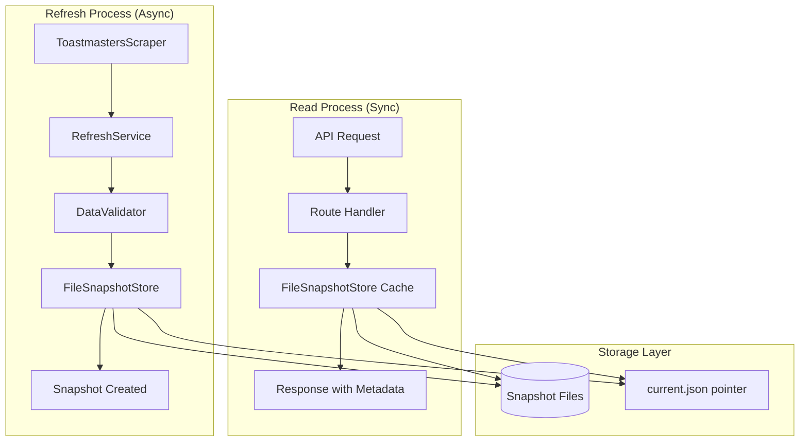
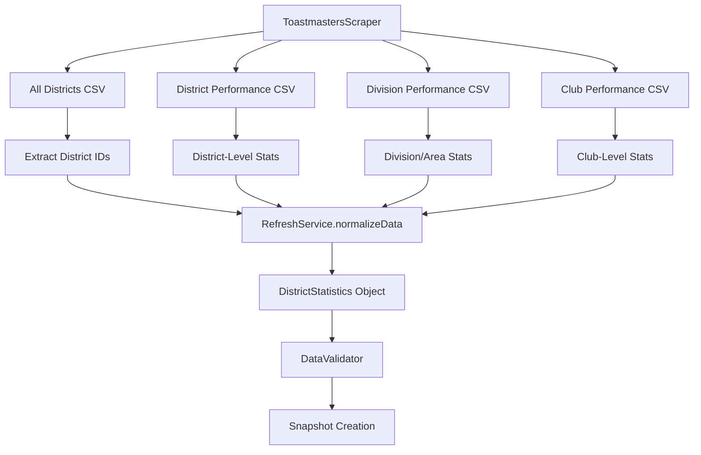
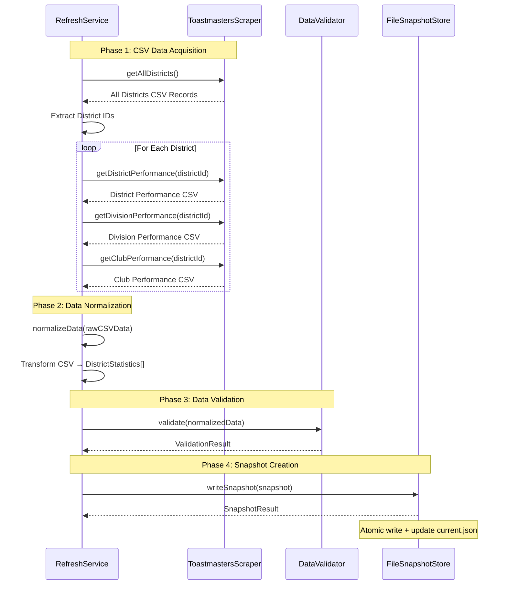

# Toastmasters Statistics Backend Architecture

**Status:** Authoritative  
**Applies to:** Toastmasters Statistics Application Backend  
**Audience:** Developers, System Architects, Future Maintainers  
**Owner:** Development Team  
**Last Updated:** January 4, 2026

---

## Table of Contents

1. [Overview](#overview)
2. [Core Architectural Pattern](#core-architectural-pattern)
3. [Data Flow Architecture](#data-flow-architecture)
4. [Service Layer](#service-layer)
5. [Storage Layer](#storage-layer)
6. [API Layer](#api-layer)
7. [Data Model](#data-model)
8. [Operational Characteristics](#operational-characteristics)
9. [Technology Stack](#technology-stack)
10. [Directory Structure](#directory-structure)

---

## Overview

The Toastmasters Statistics backend implements a **snapshot-based data architecture** that fundamentally separates data acquisition from data access. This design ensures consistent performance and reliability for users while handling the inherent unreliability of web scraping operations.

### Key Design Principles

1. **Process Separation**: Refresh and read operations are completely independent
2. **Immutability**: Snapshots are immutable once created
3. **Versioning**: Schema and calculation versions enable safe evolution
4. **Resilience**: Circuit breakers, retry logic, and error recovery
5. **Performance**: In-memory caching and concurrent read optimization
6. **Observability**: Comprehensive logging and metrics tracking
7. **Testability**: Integration tests validate end-to-end workflows
8. **Maintainability**: Clear separation of concerns and modular design

---

## Core Architectural Pattern

The system operates on two completely independent processes that never interfere with each other:

### Refresh Operations (Asynchronous)

- Scrape data from Toastmasters dashboard
- Normalize and validate the data
- Create immutable snapshots
- **Never block read operations**

### Read Operations (Synchronous)

- Serve data from the latest successful snapshot
- Provide consistent sub-10ms response times
- **Independent of refresh status or failures**



---

## Data Flow Architecture

### 1. Data Acquisition Layer

#### ToastmastersScraper

**Purpose**: Primary data source integration  
**Technology**: Playwright for browser automation  
**Responsibilities**:

- Automate browser interactions with Toastmasters dashboard
- Handle program year calculations and URL generation
- Export CSV data from dashboard tables
- Manage browser lifecycle and error recovery

**Key Methods**:

```typescript
getAllDistricts(): Promise<ScrapedRecord[]>
getDistrictPerformance(districtId: string): Promise<ScrapedRecord[]>
getDivisionPerformance(districtId: string): Promise<ScrapedRecord[]>
getClubPerformance(districtId: string): Promise<ScrapedRecord[]>
```

#### CSV Data Sources and Flow

The scraper acquires **four distinct CSV files** from the Toastmasters dashboard, each containing different levels of organizational data:

**1. All Districts Summary CSV** (`getAllDistricts()`)

- **Source URL**: `https://dashboards.toastmasters.org/[PROGRAM-YEAR]/Default.aspx`
- **Content**: High-level performance metrics for all districts
- **Typical Columns**: District ID, District Name, Total Clubs, Total Members, Goals Met, Performance Metrics
- **Usage**: Provides district-level overview and identifies which districts exist
- **Data Destination**: Used to extract district IDs and populate district-level statistics

**2. District Performance CSV** (`getDistrictPerformance()`)

- **Source URL**: `https://dashboards.toastmasters.org/[PROGRAM-YEAR]/District.aspx?id={districtId}`
- **Content**: Detailed district-level performance and membership data
- **Typical Columns**: Membership statistics, club counts by status, educational awards, goal progress
- **Usage**: Primary source for district-level metrics and performance calculations
- **Data Destination**: Transforms into `DistrictStatistics.membership`, `DistrictStatistics.clubs`, `DistrictStatistics.education`

**3. Division Performance CSV** (`getDivisionPerformance()`)

- **Source URL**: `https://dashboards.toastmasters.org/[PROGRAM-YEAR]/Division.aspx?id={districtId}`
- **Content**: Division and area-level performance within a district
- **Typical Columns**: Division ID, Area ID, Total Clubs, Total Members, Goals Met, Performance Metrics
- **Usage**: Provides mid-level organizational structure and performance
- **Data Destination**: Transforms into `DistrictStatistics.divisions[]` and area-level analytics

**4. Club Performance CSV** (`getClubPerformance()`)

- **Source URL**: `https://dashboards.toastmasters.org/[PROGRAM-YEAR]/Club.aspx?id={districtId}`
- **Content**: Individual club performance and membership data
- **Typical Columns**: Club Number, Club Name, Division, Area, Active Members, Goals Met, Club Status, Distinguished Status
- **Usage**: Most granular data for club-level analysis and member tracking
- **Data Destination**: Transforms into `DistrictStatistics.clubs[]` array with detailed club information

#### CSV Processing Pipeline



#### Data Transformation Flow

**Raw CSV Records** (`ScrapedRecord[]`)

- Dynamic key-value pairs from CSV columns
- String/number values requiring parsing and validation
- Inconsistent column names across different dashboard versions

**↓ Normalization Process**

**Structured District Data** (`DistrictStatistics`)

```typescript
interface DistrictStatistics {
  districtId: string // From All Districts CSV
  membership: MembershipStats // From District Performance CSV
  clubs: ClubStats // From District + Club Performance CSV
  education: EducationStats // From District Performance CSV
  divisions: DivisionStats[] // From Division Performance CSV
  clubDetails: ClubDetail[] // From Club Performance CSV
  performance: PerformanceMetrics // Calculated from multiple sources
}
```

#### Program Year Handling

The scraper automatically calculates the correct program year for URLs:

- **Toastmasters Program Year**: July 1 to June 30
- **URL Format**: `https://dashboards.toastmasters.org/2024-2025/`
- **Logic**: If current month ≥ July, use current year; otherwise use previous year
- **Historical Data**: Supports fetching data for specific dates with `dateString` parameter

#### RefreshService

**Purpose**: Orchestrates the complete refresh workflow  
**Responsibilities**:

- Integrate scraping with circuit breaker protection
- Implement retry logic with exponential backoff
- Coordinate four phases: scraping → normalization → validation → snapshot creation
- Record comprehensive metadata about each refresh attempt

**Workflow Phases**:

1. **Scraping Phase**: Fetch raw data with circuit breaker protection
   - Calls `getAllDistricts()` to get district overview and extract district IDs
   - For each district ID, calls:
     - `getDistrictPerformance(districtId)` - District-level metrics
     - `getDivisionPerformance(districtId)` - Division/area breakdown
     - `getClubPerformance(districtId)` - Individual club details
   - Each call protected by circuit breaker and retry logic
   - Results stored as `RawData` with separate CSV record arrays

2. **Normalization Phase**: Transform raw CSV data into structured DistrictStatistics
   - Processes each district's four CSV datasets
   - Parses string values to numbers, handles missing data
   - Combines related data (e.g., club counts from multiple sources)
   - Calculates derived metrics and performance indicators
   - Creates structured `DistrictStatistics[]` array

3. **Validation Phase**: Validate normalized data against Zod schemas
   - Ensures data integrity and business rule compliance
   - Validates cross-references between clubs, divisions, and districts
   - Checks for reasonable value ranges and consistency

4. **Snapshot Creation Phase**: Persist validated data as immutable snapshots
   - Creates versioned snapshot with metadata
   - Atomically updates current pointer if successful
   - Records errors and warnings for debugging

### 2. Data Processing Pipeline

The complete data flow from CSV acquisition to snapshot storage:



#### CSV Data Transformation Details

**Raw CSV Structure** (from dashboard exports):

```typescript
// Example records from each CSV source
type AllDistrictsRecord = {
  District: '42'
  'District Name': 'District 42'
  'Total Clubs': '156'
  'Total Members': '3,247'
  'Goals Met': '8/10'
  // ... additional performance columns
}

type ClubPerformanceRecord = {
  'Club Number': '123456'
  'Club Name': 'Example Toastmasters'
  Division: 'A'
  Area: '12'
  'Active Members': '23'
  'Goals Met': '7/10'
  'Club Status': 'Active'
  'Club Distinguished Status': 'Distinguished'
  // ... additional club metrics
}
```

**↓ Normalization Process**

**Structured Application Data**:

```typescript
interface DistrictStatistics {
  districtId: string // "42" (from All Districts CSV)
  membership: {
    total: number // 3247 (parsed from District Performance CSV)
    change: number // Calculated from historical data
    changePercent: number // Derived calculation
    byClub: ClubMembership[] // Aggregated from Club Performance CSV
  }
  clubs: {
    total: number // 156 (from All Districts CSV)
    active: number // Count from Club Performance CSV where Status="Active"
    suspended: number // Count where Status="Suspended"
    distinguished: number // Count where Distinguished Status="Distinguished"
    // ... other calculated counts
  }
  education: EducationStats // From District Performance CSV
  divisions: DivisionStats[] // From Division Performance CSV
  clubDetails: ClubDetail[] // From Club Performance CSV (normalized)
}
```

---

## Service Layer

### RefreshService (Orchestration Hub)

- **Purpose**: Coordinates the entire refresh workflow
- **Dependencies**: ToastmastersScraper, DataValidator, SnapshotStore
- **Features**: Circuit breaker protection, retry logic, error handling
- **Output**: Creates versioned, immutable snapshots

### DataValidator (Quality Assurance)

- **Purpose**: Ensures data integrity using Zod schemas
- **Validation**: Business rules, consistency checks, format validation
- **Error Handling**: Distinguishes critical errors from warnings
- **Integration**: Used by RefreshService before snapshot creation

**Validation Rules**:

- Club membership counts must be non-negative
- Club status counts must sum to total clubs
- Distinguished clubs cannot exceed active clubs
- Award counts must be non-negative
- District data consistency checks

### FileSnapshotStore (Persistence Layer)

- **Purpose**: Manages snapshot storage and retrieval
- **Performance**: In-memory caching, concurrent read optimization
- **Reliability**: Atomic writes, integrity validation, recovery services
- **Interface**: Implements SnapshotStore interface for testability

**Performance Optimizations**:

- In-memory caching of current snapshot (5-minute TTL)
- Concurrent read request deduplication
- File system access optimization with stat caching
- Read performance monitoring and metrics

### ProcessSeparationValidator (Architecture Compliance)

- **Purpose**: Ensures refresh and read operations remain independent
- **Monitoring**: Tracks performance metrics and concurrent operations
- **Validation**: Confirms read performance isn't degraded by refresh activity

---

## Storage Layer

### Snapshot-Based Storage Model

```
CACHE_DIR/
├── snapshots/
│   ├── 1704067200000.json    # Immutable snapshots (timestamp IDs)
│   ├── 1704153600000.json
│   └── 1704240000000.json
└── current.json              # Atomic pointer to latest successful snapshot
```

### Storage Characteristics

**Atomic Operations**:

- Uses temporary files + rename for crash safety
- Current pointer updated only after successful snapshot creation
- No partial writes or corrupted states

**Performance Features**:

- In-memory cache for current snapshot metadata and content
- Concurrent read deduplication (multiple requests share single file operation)
- Automatic cleanup of old snapshots (configurable age/count limits)
- Optional compression support (currently disabled)

**Integrity & Recovery**:

- **SnapshotIntegrityValidator**: Validates snapshot store consistency
- **SnapshotRecoveryService**: Automatic recovery from corrupted files
- **Pointer Recovery**: Scans directory to find latest successful snapshot if pointer corrupted
- **Backup Support**: Can create backups before recovery operations

### Configuration

```typescript
interface SnapshotStoreConfig {
  cacheDir: string // Base directory for snapshots
  maxSnapshots?: number // Max snapshots to retain (default: 100)
  maxAgeDays?: number // Max age in days (default: 30)
  enableCompression?: boolean // Enable gzip compression (default: false)
}
```

---

## API Layer

### District Data Endpoints (`/api/districts`)

| Endpoint                           | Method | Purpose                                     |
| ---------------------------------- | ------ | ------------------------------------------- |
| `/`                                | GET    | List all available districts                |
| `/rankings`                        | GET    | Get all districts with performance rankings |
| `/:districtId/statistics`          | GET    | Fetch district statistics                   |
| `/:districtId/membership-history`  | GET    | Membership trends                           |
| `/:districtId/clubs`               | GET    | List clubs in district                      |
| `/:districtId/educational-awards`  | GET    | Educational awards history                  |
| `/:districtId/daily-reports`       | GET    | Daily reports for date range                |
| `/:districtId/daily-reports/:date` | GET    | Specific daily report                       |

### Cache Management Endpoints (`/api/districts/cache`)

| Endpoint                | Method | Purpose                       |
| ----------------------- | ------ | ----------------------------- |
| `/cache/dates`          | GET    | All cached dates              |
| `/cache/statistics`     | GET    | Cache statistics and metadata |
| `/cache/metadata/:date` | GET    | Metadata for specific date    |
| `/cache/version`        | GET    | Cache version information     |
| `/cache/stats`          | GET    | Detailed cache statistics     |
| `/cache`                | DELETE | Clear all cache               |

### Admin Endpoints (`/api/admin`)

| Endpoint                            | Method | Purpose                       |
| ----------------------------------- | ------ | ----------------------------- |
| `/snapshots`                        | GET    | List snapshots with filtering |
| `/snapshots/:snapshotId`            | GET    | Inspect specific snapshot     |
| `/snapshots/:snapshotId/payload`    | GET    | Get full snapshot payload     |
| `/snapshot-store/health`            | GET    | Health check                  |
| `/snapshot-store/integrity`         | GET    | Integrity validation          |
| `/snapshot-store/performance`       | GET    | Performance metrics           |
| `/snapshot-store/performance/reset` | POST   | Reset metrics                 |
| `/process-separation/validate`      | GET    | Validate process separation   |
| `/process-separation/monitor`       | GET    | Monitor concurrent operations |
| `/process-separation/compliance`    | GET    | Compliance metrics            |
| `/process-separation/independence`  | GET    | Read performance independence |

### Response Pattern

All API responses include snapshot metadata for transparency:

```json
{
  "data": {
    /* actual response data */
  },
  "_snapshot_metadata": {
    "snapshot_id": "1704067200000",
    "created_at": "2024-01-01T00:00:00Z",
    "data_as_of": "2023-12-31",
    "schema_version": "1.0.0",
    "calculation_version": "2.1.0"
  }
}
```

---

## Data Model

### Snapshot Structure

Each snapshot is an immutable, versioned container of application data:

```typescript
interface Snapshot {
  snapshot_id: string // Timestamp-based unique ID
  created_at: string // ISO timestamp
  schema_version: string // Data structure version
  calculation_version: string // Scoring logic version
  status: 'success' | 'partial' | 'failed'
  errors: string[] // Error details if failed
  payload: {
    districts: DistrictStatistics[]
    metadata: {
      source: string
      fetchedAt: string
      dataAsOfDate: string
      districtCount: number
      processingDurationMs: number
    }
  }
}
```

### District Statistics Model

```typescript
interface DistrictStatistics {
  districtId: string
  districtName: string
  membership: MembershipStats
  clubs: ClubStats
  education: EducationStats
  performance: PerformanceMetrics
  // ... additional fields
}
```

### Data Lifecycle

1. **Refresh Triggered** → Scrape raw data from Toastmasters dashboard
2. **Normalize** → Transform CSV records to structured DistrictStatistics
3. **Validate** → Check against Zod schemas and business rules
4. **Create Snapshot** → Persist with status (success/partial/failed)
5. **Update Pointer** → If successful, atomically update current.json
6. **Serve Reads** → API endpoints read from current snapshot
7. **Preserve History** → Failed snapshots retained for debugging

---

## Operational Characteristics

### Reliability Features

- **Failed refreshes don't affect current data availability**
- **Circuit breakers prevent cascading failures**
- **Automatic recovery from corrupted snapshots**
- **Comprehensive error logging and debugging tools**
- **Last-known-good data always available**

### Performance Features

- **Read operations: ~1-10ms (cached) regardless of refresh status**
- **Concurrent read deduplication**
- **Automatic cleanup of old snapshots**
- **Performance metrics tracking**
- **Zero downtime during refresh operations**

### Maintainability Features

- **Schema and calculation versioning for safe evolution**
- **Historical snapshots preserved for analysis**
- **Comprehensive admin endpoints for debugging**
- **Integration tests validate end-to-end workflows**
- **Clear separation of concerns**

### Monitoring & Observability

**Structured Logging**:

- All operations include operation IDs for tracing
- Performance metrics for read/write operations
- Error details with context for debugging

**Health Checks**:

- `/health` endpoint provides system status
- Snapshot store integrity validation
- Process separation compliance monitoring

**Performance Metrics**:

- Cache hit/miss ratios
- Concurrent read statistics
- Refresh operation timing
- Error rates and patterns

---

## Technology Stack

### Core Technologies

- **Runtime**: Node.js with TypeScript
- **Web Framework**: Express.js
- **Web Scraping**: Playwright (headless browser automation)
- **Validation**: Zod (schema validation)
- **Testing**: Vitest (unit and integration tests)

### Supporting Libraries

- **Logging**: Custom structured logger
- **Retry Logic**: Custom RetryManager with exponential backoff
- **Circuit Breaker**: Custom CircuitBreaker implementation
- **CORS**: cors middleware for cross-origin requests
- **Environment**: dotenv for configuration management

### Development Tools

- **TypeScript**: Full type safety and IDE support
- **ESLint**: Code quality and consistency
- **Prettier**: Code formatting
- **Husky**: Git hooks for quality gates

---

## Directory Structure

```
backend/
├── src/
│   ├── index.ts                 # Express server entry point
│   ├── routes/                  # API route handlers
│   │   ├── districts.ts         # District data endpoints
│   │   ├── admin.ts            # Admin and debugging endpoints
│   │   └── reconciliation.ts   # Legacy reconciliation endpoints
│   ├── services/               # Core business logic
│   │   ├── RefreshService.ts   # Refresh orchestration
│   │   ├── ToastmastersScraper.ts # Data acquisition
│   │   ├── DataValidator.ts    # Data validation
│   │   ├── FileSnapshotStore.ts # Snapshot persistence
│   │   ├── ProcessSeparationValidator.ts # Architecture compliance
│   │   └── ProductionServiceFactory.ts # Service factory
│   ├── types/                  # TypeScript type definitions
│   │   ├── snapshots.ts        # Snapshot-related types
│   │   ├── districts.ts        # District data types
│   │   └── analytics.ts        # Analytics types
│   ├── utils/                  # Shared utilities
│   │   ├── logger.ts           # Structured logging
│   │   ├── RetryManager.ts     # Retry logic
│   │   ├── CircuitBreaker.ts   # Circuit breaker pattern
│   │   └── transformers.ts     # Data transformation
│   ├── middleware/             # Express middleware
│   │   └── cache.ts           # Caching middleware
│   └── __tests__/             # Test files
│       ├── integration/        # Integration tests
│       └── unit/              # Unit tests
├── cache/                     # Default snapshot storage
│   ├── snapshots/            # Snapshot files
│   └── current.json          # Current snapshot pointer
├── package.json              # Dependencies and scripts
├── tsconfig.json            # TypeScript configuration
├── vitest.config.ts         # Test configuration
└── eslint.config.js         # Linting configuration
```

---

## Integration with Steering Documents

This architecture directly implements the principles outlined in the steering documents:

### Production Maintenance Alignment

- **Single-user deployment**: Optimized for low operational overhead
- **Last-known-good data**: Current pointer always references latest successful snapshot
- **Discrete snapshots**: Time-ordered, immutable data representations
- **Operational simplicity**: File-based storage with minimal dependencies

### Testing Strategy Alignment

- **Behavior over structure**: Tests validate data flow and business rules
- **Integration tests**: End-to-end workflow validation
- **Golden tests**: Snapshot-based testing for stable outputs
- **Future protection**: Tests preserve understanding over time

### Brand Compliance Integration

- **API responses**: Include proper metadata and versioning
- **Error handling**: Consistent error response formats
- **Performance**: Fast response times for user experience
- **Reliability**: Consistent availability regardless of refresh status

---

## Future Considerations

### Scalability Paths

- **Database migration**: Clear interfaces enable database backend replacement
- **Distributed storage**: Snapshot model supports distributed storage systems
- **Caching layers**: Redis or similar can replace in-memory caching
- **Load balancing**: Read operations can be horizontally scaled

### Monitoring Enhancements

- **Metrics collection**: Prometheus/Grafana integration ready
- **Alerting**: Health check endpoints support monitoring systems
- **Tracing**: Operation IDs enable distributed tracing
- **Performance analysis**: Built-in metrics support detailed analysis

### Security Considerations

- **Authentication**: Admin endpoints include token validation
- **Authorization**: Role-based access control ready for implementation
- **Data protection**: Snapshot immutability provides audit trail
- **Secrets management**: Environment-based configuration

---

## Conclusion

The Toastmasters Statistics backend architecture provides a robust, maintainable, and performant foundation for the application. The snapshot-based approach ensures data consistency and availability while the process separation pattern guarantees reliable user experience regardless of external dependencies.

The architecture successfully balances the needs of a single-user deployment with the flexibility to evolve toward more complex deployment scenarios in the future.

---

**Document Maintenance**: This document should be updated when significant architectural changes are made or new services are added to the system.
